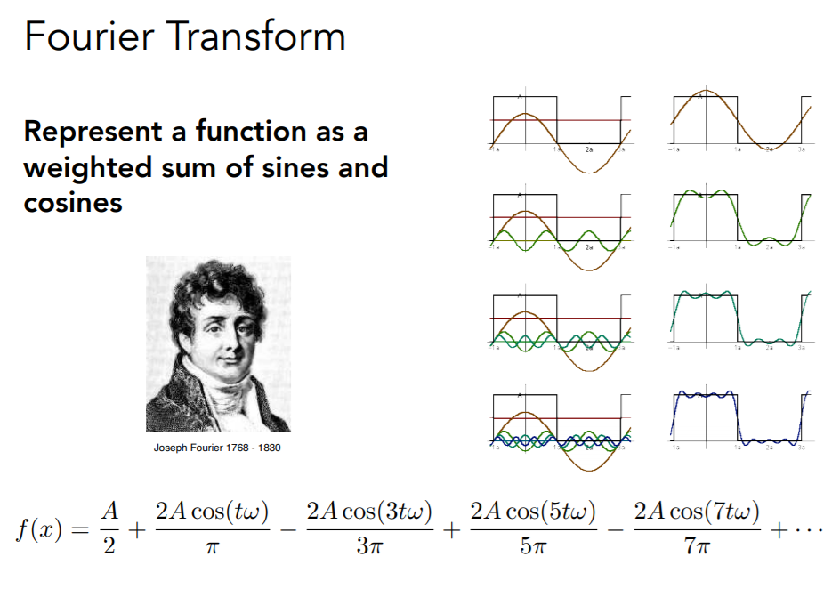
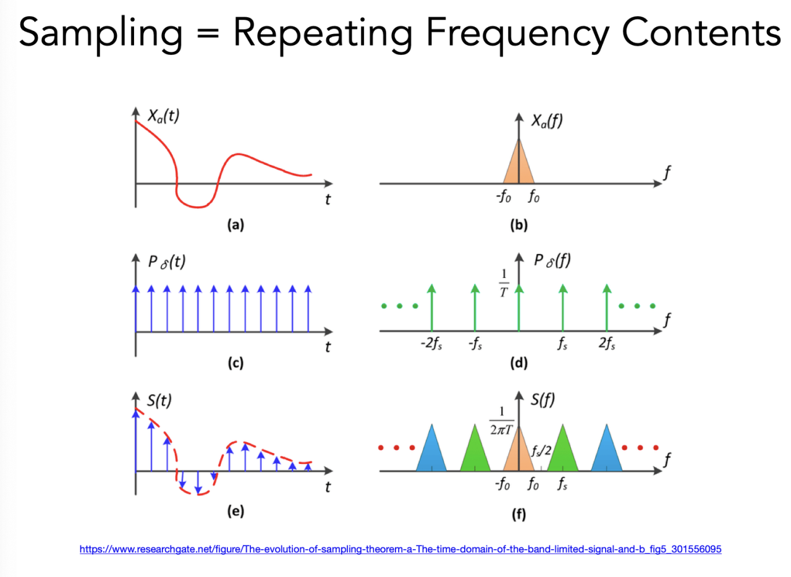
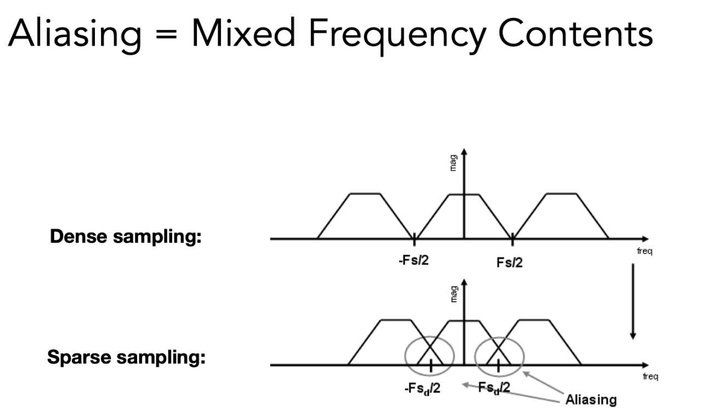
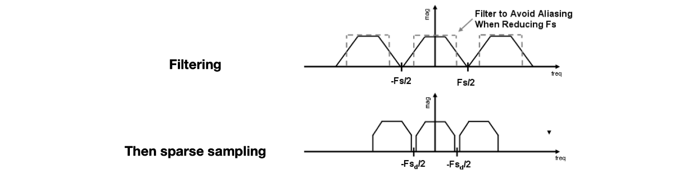
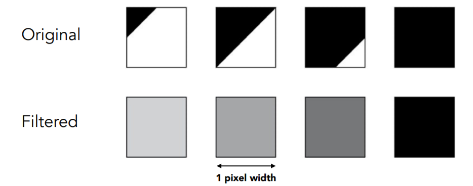

屏幕是一个二维数组的标准数据集，是离散的，是一个典型的光栅成像设备

# 光栅化

光栅化即把图像呈现在屏幕上的过程

**像素**是“最小的”图像单元，一个像素内的颜色，由r，g，b三个参数控制

由裁剪空间映射到屏幕空间（视口变换）公式如下：
$$
\displaylines{
M_{viewport}=
\left[\begin{matrix}
\frac{width}{2}	&	0	&	0	&	\frac{width}{2}\\\\
0	&	\frac{height}{2}	&	0	&	\frac{height}{2}\\\\
0	&	0	&	1	&	0\\\\
0	&	0	&	0	&	1\\\\
\end{matrix}\right]
}
$$
经过矩阵变换后，再把屏幕空间中的多边形打散成三角形，成像到屏幕上，这就是光栅化的大致流程

计算机生成图像中，最基本的二维元素是xl三角形

三角形的特质：① 保证是平面；内外定义清晰；	② 具有成熟的顶点插值方法

# 不同的光栅化设备

**示波器oscilloscope**

**CRT屏幕：**

早期成像原理：阴极射线管

早期电视：光栅化的CRT屏幕，隔行扫描技术

**当今成像设备：平板显示设备**

**LCD液晶显示器：**液晶会通过自己的不同排布，影响光的极化

**LED显示器：**发光二极管点阵列

**电子水墨屏：**电泳成像，刷新频率低

**OLED显示器：**有机发光半导体

# 最简单的光栅化方法：采样

采样，就是把函数离散化的一个过程

```
for(int i = 0; i < imax; i++)
	output[i] = f(i);
```

为判断该为哪块像素着色，我们定义一个二进制函数：inside(tri,x,y)
$$
\displaylines{
inside(tri,x,y)=
\left\{\begin {array}{rcl}
1&point(x,y)\ in\ △t\\
2&otherwise
\end {array}\right.
}
$$

```
for(int i = 0; i < imax; i++){
	for(int j = 0; j < jmax; j++){
		image[i][j] = inside(tri, i+0.5, j+0.5);
	}
}
```

# 采样优化

Axis-Aligned Bounding Box：包围盒

在光栅化前先行判断像素点是否在三角形所在包围盒内，若不在，则直接忽略，不进光栅化的循环判断

Incremental Triangle Traversal：增量三角形遍历

看似更快，实则实现起来有一定难度，适用于细长的三角形

采样率不够高 -> 锯齿，走样

# 抗锯齿与深度缓冲

## 采样伪影

锯齿（空间采样上的错误）

摩尔纹（如，采样时跳过奇数行奇数列）

马车轮效应：人眼在时间上的采样跟不上运动速度

采样伪影的原因：信号频率太快，采样速度跟不上

## 信号处理

傅里叶级数展开：任何一个周期函数，都可以表示为一系列sin和cos函数的线性组合加一个常数项的形式



傅里叶变换，可以把图像从时域（空间域）变换到频域

关于傅里叶变换网上已经有很多资料了，在这里随便贴几个


另外快速傅里叶变换经常被用来做离线的水渲染，在Bloom后处理等一系列图像处理算法也会经常用到，这部分冈萨雷斯的《数字图像处理》第四章最后也有详细的推导，非常值得一看

*用信号处理解释走样：同样一种采样方法，采样两种不同频率的函数，得出的结果无法被区分*

### 滤波

在频域内去除某一特定频率的函数

高通滤波器，低通滤波器，具体处理过程：



滤波=平均=卷积

卷积核越大，保留的高频信息越少，低频信息越多，对应到频域图上，高频区域的亮度就降低

## 走样的本质

| 采样的本质                                                   | 走样的本质                                                   |
| ------------------------------------------------------------ | ------------------------------------------------------------ |
|  |  |

采样率变低，采样间隔变大，波长变大，频率变小

Dense sampling，稠密采样，图中信号已经首尾相接，意味着当前的采样频率Fs是不发生走样的最低限值

Sparse sampling，稀疏采样，意味着频率Fs变大，间隔变小，就会产生混叠（近视也是因为这种混叠，可以类比一下）

所以，像素越低，采样率越低，采样频率越小，采样越稀疏，更容易走样

## 反走样技术思路

1、增加屏幕分辨率，增加采样频率（成本高）

2、在采样之前，进行模糊（/滤波）处理，<u>（注意，先模糊处理在采样，反过来是不可行的）</u>，模糊以后，将图像的边界弱化了，采样的时候，该区域对应的像素值可以起到过度缓冲的效果（低通滤波降低信号最高频率，使得可以用更低的采样频率完成采样）



先采样后模糊之所以不可行，就是因为波形重叠的情况下截断依然会有重叠

通过像素做平均（卷积）来达到反走样：



如何计算图形在某一像素内覆盖的比例？

一种近似方法：MSAA（muti-sample anti-aliasing）

每个像素多次采样，求平均，像素的颜色值为负责的区域内取样多次颜色值的平均

MSAA并没有通过物理上增加分辨率达到抗锯齿效果，这些网格只是为了检测覆盖率而已，并且现实应用并非用网格，而是用一些其他图形来达到效果，涉及一些随机数分布（怎样分布样本达到最好的覆盖效果）

那么，代价是什么？太浪费性能！		优化：采样复用

3、其他抗锯齿方案

- FXAA (Fast Approximate AA)：先获得有锯齿的图，再后处理去除锯齿（很快）
    - 找到边界，换成没有锯齿的边界，（图像匹配）非常快
    - 方法和采样无关，采样虽然有误，但是这种方法可以弥补
- TAA (Tem‘poral AA) ：时序信息，借助前面帧的信息
    - 最近刚刚兴起
    - 静态场景，相邻两帧同一像素用不同的位置来sample
    - 把MSAA的Sampling分布在时间上
    - 运动情况下怎么办？

Super resolution / super sampling 超分辨率

低分辨率显示器还原高分辨率图片，归根结底依旧是”样本不足“，解决方案举例：DLSS (Deep Learning Super Sampling) 


## 深度缓存 -Zbuffering

Painter's Algorithm：画家算法，由远及近画画，近处画面覆盖远处画面

无法处理复杂的深度判断，例如三个三角形互相重叠

深度计算排序 算法复杂度：$O(log\ n)$

Z-buffer：对每个像素多存一个深度

实际编程中，z值越小表示越远，但为方便理解，下述伪代码中z越远越大

```
for(each Triangle T)
	for(each sample(x,y,z) in T)
		if(z<zbuffer[x,y])
			framebuffer[x,y]=rgb;
			zbuffer[x,y]=z;
		else
			do nothing, this sample is occluded;
```

复杂度：O(n) for n triangles 并不是排序，而是求最值，需要保证三角形进入顺序和结果无关

tips：无法处理透明物体，详情参考《入门精要》第八章