# Blinn-Phong光照模型

## 漫反射

要知道物体表面多亮，就要知道从光源到物体表面发射的能量光是多少，单位的能量光在单位球上的能量表示为 I，同一个点上的能量随着光不断向外传播而逐渐减少， 根据能量守恒定律，每一个球面上的总能量都是相同的（这在之后辐射度量学会有补充）

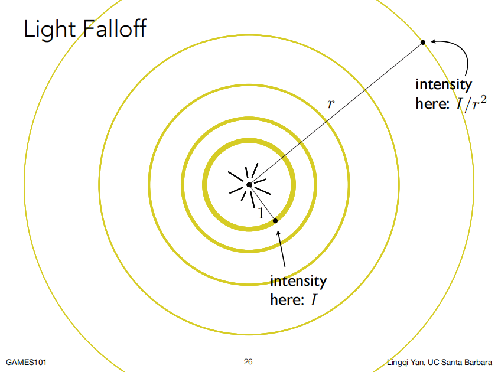

由此可以得到关系式：
$$
1^24πI=r^24πI'
$$
再计算物体表面着色点反射多少能量光给摄像机接收

用一个系数$K_d$表示该着色点的光吸收率，范围是$[0,1]$，如果该系数是 0，证明该着色点完全吸收能量，反之，如果是 1，代表该点完全不吸收能量

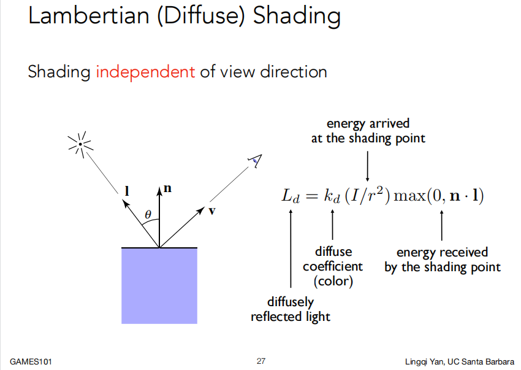

把这个系数看作是==RGB颜色值==，当$K_d=0$时，此时对应着RGB值是：[0, 0, 0]，在计算机里表示为黑色，黑色正是完全吸收光的颜色，反之，当$K_d=1$时，对应着 [255, 255, 255]，在计算机里表示为白色，白色正是完全反射光的颜色

最终公式为公式：
$$
L_d=k_d(\frac{I}{r^2})max(0,n·l)
$$

## 镜面反射

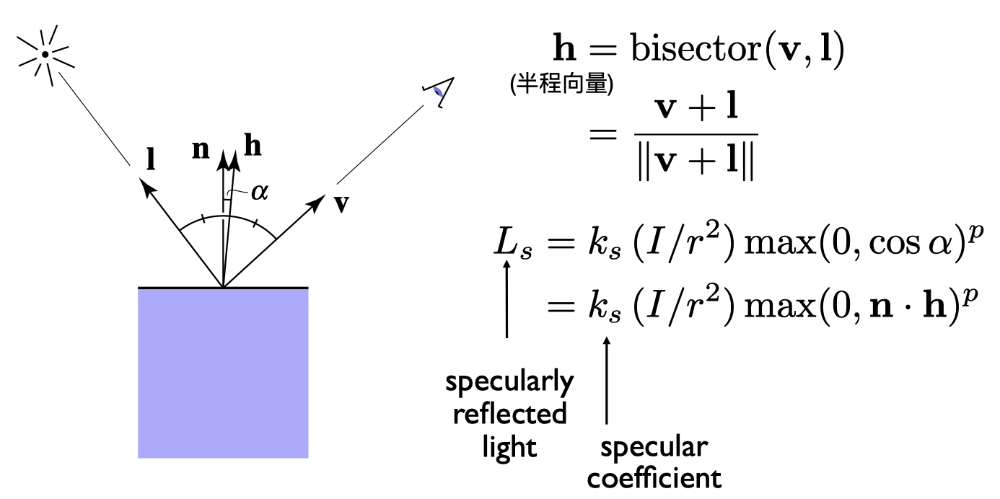

 $h$ 为 $l$ 和 $v$ 的半程向量， $n$ 为法线向量， $v$ 为观测角度，

假设前提：观测向量 $v$ 与镜面反射向量 $r$ 的夹角 与  $n$ 和 $h$ 的夹角相等( $R$ 在图中未标明）

why：计算机计算 $v$ 与 $r$ 的角度非常麻烦，考虑到大量像素的性能开销，因此使用较简单的半程向量进行计算

| 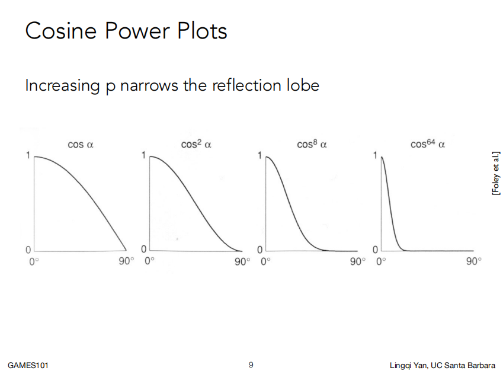 |  |
| ------------------------------------------------------------ | ------------------------------------------------------------ |

左图：指数p是为了进一步缩小高光范围所提供的的参数，通常取值大于100

右图：不同光照强度和p的取值对高光效果的影响

## 环境光照

Blinn-Phone光照模型中，假设从四面八方反射而来的光的光强都是相等的，也就是说可以认为环境光强为一个常数（实际上全局光照的计算要复杂的多），公式为$L_a=K_aI_a$

## 叠加效果

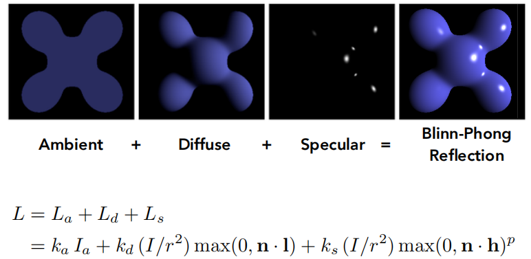

# 着色频率

## Flat Shading（平面着色）

以三角面为单位进行着色，对于光滑的几何体效果很差

## Gouraud Shading（高洛德着色）

以顶点为单位进行着色，通过插值计算，实现点与点之间颜色的平滑过渡

## Phone Shading（冯氏着色）

以片元为单位进行着色，对每个点计算一次光照，点的法向量是通过顶点法向量插值得到的，冯氏着色最接近现实，可以在减少三角面数的情况下达到相同的效果（插值后法向量会光滑变化），当然，性能开销也非常大

# 图形管线（实时渲染管线）

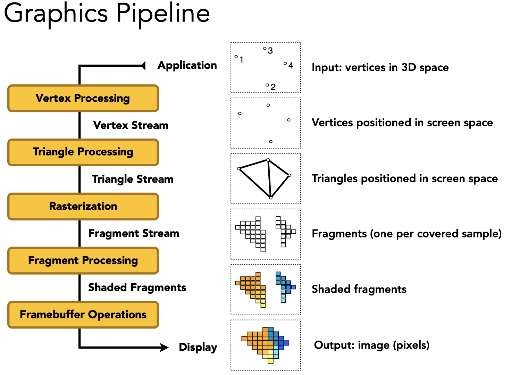

顶点处理 -> 三角形处理 -> 光栅化 -> 片元处理 -> 逐片元操作

其中，Vertex和Fragment阶段是可编程的

由于翻译问题，具体可以参考《unity shader入门精要》p9 内容

**GPUs：**可并行的图形管线处理器

当下的图形实时处理技术可以实时的处理200-400万面的复杂场景数据，并以30-60的帧率动态处理（VR的帧率会更加夸张）

# 纹理

## Texture Mapping 纹理映射

想要在三维物体的不同表面生成不同的纹理，就需要将三维图形的表面映射至二维表面（展UV）

三维图形的每个三角面顶点都可以对应一个uv坐标系下的坐标，uv坐标范围约定在$[0,1]$之间

可复用纹理：纹理本身可以被设计为无缝衔接（tilable）,Wang-Tiling是其中一种方法

## 重心坐标

注意和重心概念的区别！对于三角形所在平面上的任意一点的坐标，都可以用三角形的三个顶点坐标的线性表达式表示
$$
(x,y)=\alpha A+\beta B+\gamma C
$$
则$(\alpha,\beta,\gamma)$被称为该点的重心坐标，定理：$\alpha+\beta+\gamma=1$

对于三角形内的点，$\alpha,\beta,\gamma>0$，更特殊的情况，三角形==重心的重心坐标==为$(\frac{1}{3},\frac{1}{3},\frac{1}{3})$

求$\alpha,\beta,\gamma$公式：
$$
\displaylines{
\begin{aligned}
&\alpha = \frac{-(x-x_B)(y_C-y_B)+(y-y_B)(x_C-x_B)}
			  {-(x_A-x_B)(y_C-y_B)+(y_A-y_B)(x_C-x_B)}\\\\
&\beta = \frac{-(x-x_C)(y_A-y_C)+(y-y_C)(x_A-x_C)}
			  {-(x_B-x_C)(y_A-y_C)+(y_B-y_C)(x_A-x_C)}\\\\
&\gamma = 1-\alpha -\beta
\end{aligned}
}
$$
推导：


几何意义：$(x,y)$与三角形的三个顶点构成三个三角形，顶点==所对==的三角形的面积与三角形总面积的比值，即为对应的重心坐标值

利用重心坐标实现线性插值：

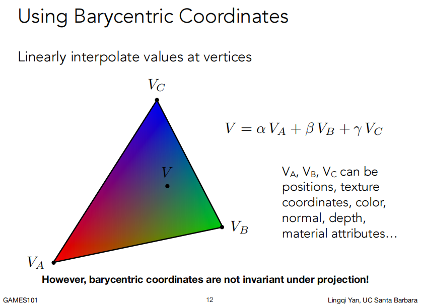

注意，==重心坐标在映射过程中并非保持不变==，所以需要在对应时间计算对应的重心坐标来做插值，不能随意复用！

映射过程伪代码如下：

```
foreach rasterized screen sample(x,y) //通常来说是一个像素的中心
	(u,v) = evaluate texture coordinate at (x,y) //用重心坐标插值
	texcolor = texture,sample(u,v);
	set sample's color to texture; //作为漫反射系数
```

## 纹理过小 or. 纹理过大？

# 纹理太小

可以理解为多个pixel映射到了同一个texel

解决方案：

1、水平+竖直做两次插值，即==双线性插值== Lerp

2、对周围16个点做三次插值，==双三次插值== Bicubic，运算量更大，结果更好

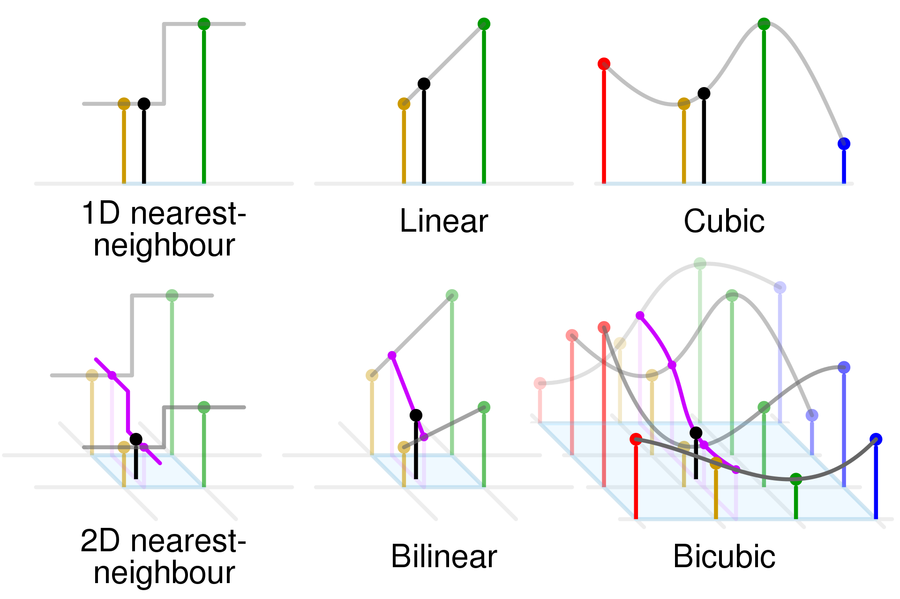

# 纹理太大

可以理解为一个pixel对应了多个纹素，因采样频率不足而导致摩尔纹+锯齿（走样）

解决方案：

Supersampling多重采样，性能开销过大，所以干脆舍弃超级采样的思路

==Mipmap算法：==

事先准备多张不同级别（D）的纹理贴图，每升一个级别，横纵纹素各减小一半，最后显存消耗仅为原来的$\frac{4}{3}$，如此分级之后，设屏幕空间下采样像素与相邻像素中心点之间的距离为L，在u-v坐标系找到这些像素的中心点对应的坐标，求出L在u-v坐标系下对应的纹素数量，做对数运算求得对应像素的纹理细节的级别，再以对应级别做==双线性插值==

由于这种方法中，D是整数，而并非连续的值，为了得到连续的效果，在做对数运算后对小数部分算一下权重，并取向下取整的D值与D+1两个级别，对着两个级别分别做一次双线性插值，最后对插值结果再进行一次插值，我们称这种方法为==三线性插值==

| 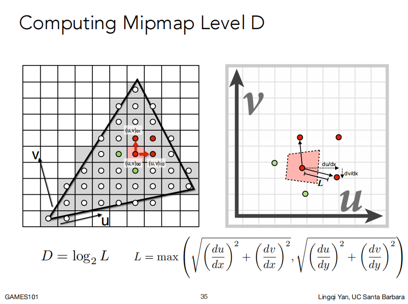 | 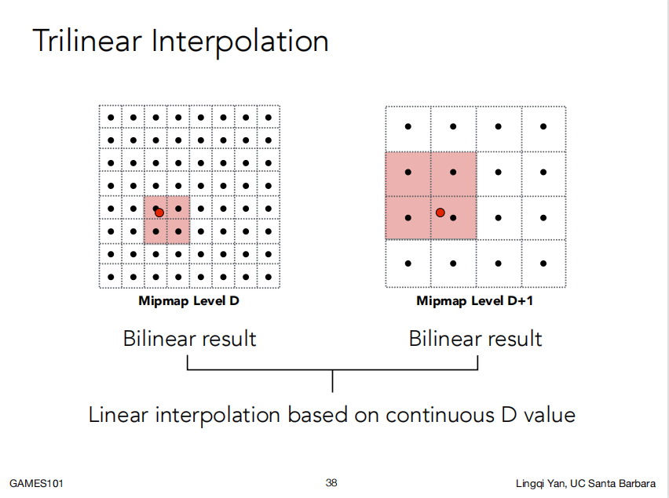 |
| ------------------------------------------------------------ | ------------------------------------------------------------ |

**MipMap算法的局限**：只能在u-v坐标系下做方块查询，有时候会造成过度模糊的情况

为了避免这种情况，引入==各向异性过滤==，在准备不同级别的纹理贴图时，不再是简简单单横纵纹素各减小一半进行分级，而是长减半宽不变 or 宽减半长不变 or 长和宽各减半三种情况各进行一次分级，显存消耗为原来的三倍，但性能方面并没有多少影响，这种方法就可以实现在u-v坐标系下进行矩形查询。

比各向异性更进一步的过滤，如EWA filtering 椭圆取样，则利用多次查询求平均值的方法来处理不规则区域，相应的性能开销就会比较大了

由上可知，在显存足够的情况下，各向异性过滤级别开越高越好

这块内容显然特别抽象，具体细节可以参考：



## 各种纹理贴图

# 环境光贴图

假设光源无限远，只记录光照的方向信息，这种贴图被称作环境光贴图

e.g. Utah Teaport 犹他茶壶；Stanford Bunny 斯坦福兔子

* 球面环境映射 Spherical Environment Map

  球心为世界中心。类比地球仪展开铺平，存在纹理的拉升扭曲问题，解决方法：Cube Map

* 立方体贴图 Cube Map

  将环境光照信息记录在一个立方体表面上，但会需要额外判断某一方向上的光照应该记录在立方体的哪个面上，计算量更大

# 凹凸贴图

记录了纹理的高度移动，并不改变原来模型的几何信息，通过法线扰动，得到模拟出来的着色效果，以假乱真

**计算法线的方法：**

| 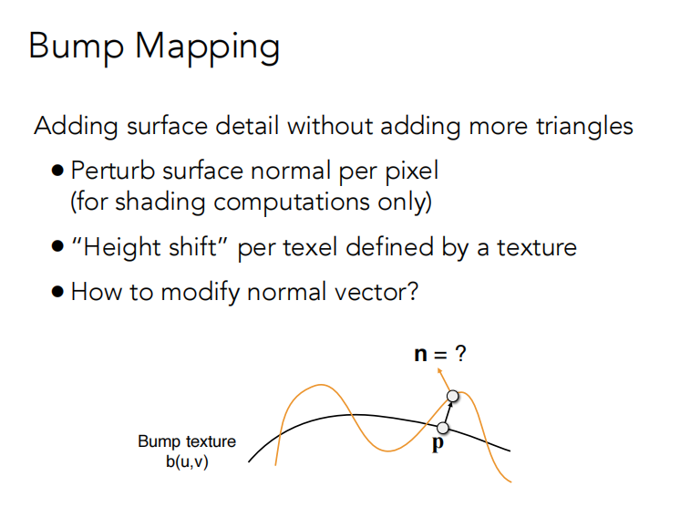 | 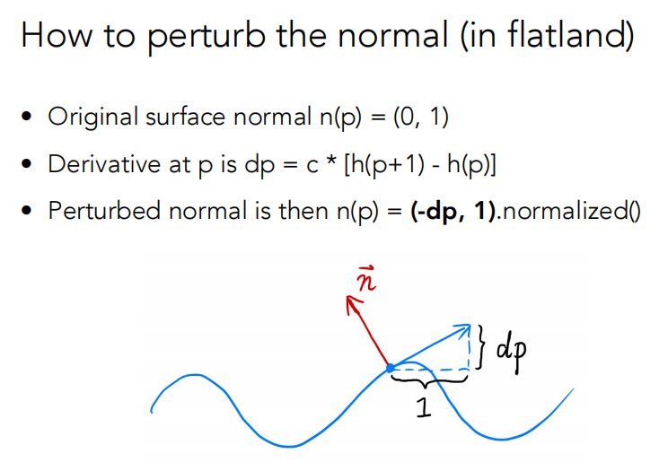 |
| ------------------------------------------------------------ | ------------------------------------------------------------ |

**UV下的法线算法：**

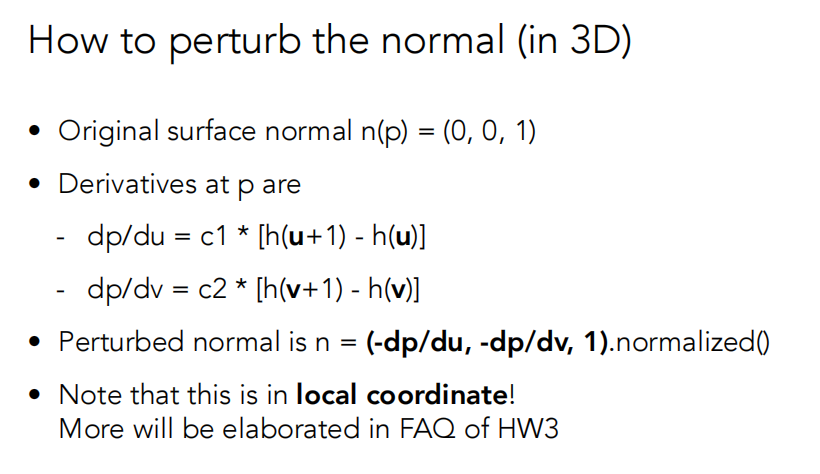

局部坐标下，$n=\text{normalize}(\text{float3}(-\frac{dp}{du},-\frac{dp}{dv},1))$

# 置换贴图

与凹凸贴图类似，但置换贴图是真的改变了几何信息，去对模型的顶点做位移，会比凹凸贴图更加逼真，但对模型的精度（三角面数量）要求更高，并且运算量也会随之上升

DirectX有Dynamic的插值法，根据需要对模型做插值，看情况决定模型的细致程度

凹凸贴图vs.置换贴图：

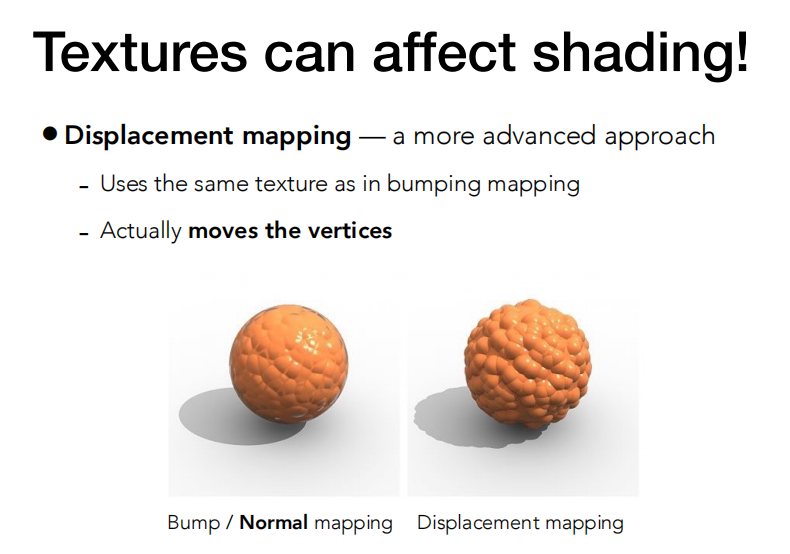

# 程序纹理

三维的纹理，并非真正生成了纹理的图，而是定义空间中任意点的颜色

定义三维空间中的噪声函数，再通过映射，得到预想的效果

# 预计算着色

将环境光进行预计算处理，再附在原先纹理上做一层遮蔽（AO），再将纹理贴到模型上

# 实体建模 / 体渲染

Solid Modeling &. Volume Rendering

广泛应用于物体渲染，如核磁共振等扫描后得到的体积信息，通过这些信息进行渲染，得到结果

| 程序纹理                                                     | 预计算着色                                                   | 实体建模 / 体渲染                                                     |
| ------------------------------------------------------------ | ------------------------------------------------------------ | ------------------------------------------------------------ |
| 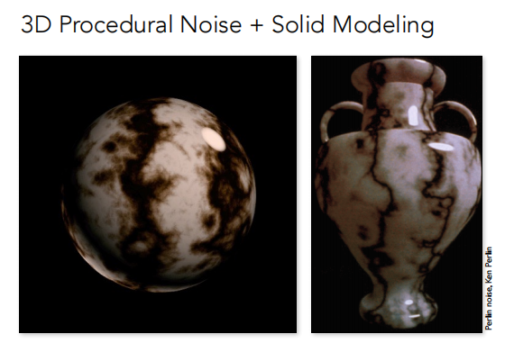 | 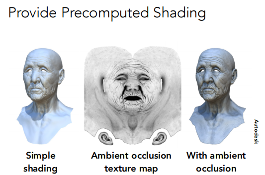 | 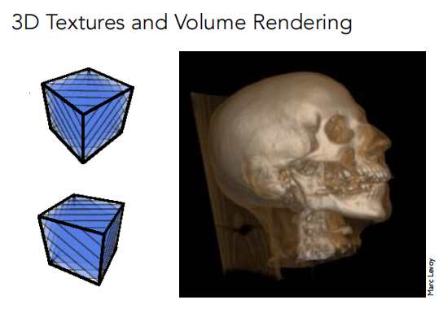 |