# 几何的表达方式

## 隐式几何

用空间中的满足一定条件的点的集合来表示面，隐式几何不会表示点的具体位置信息，而是告诉我们这些点满足的函数关系

我们很难看出隐式想表达的形状是什么，但对于判断点的位置关系（在内，在外还是在表面）会很方便

* **代数曲面**
  
  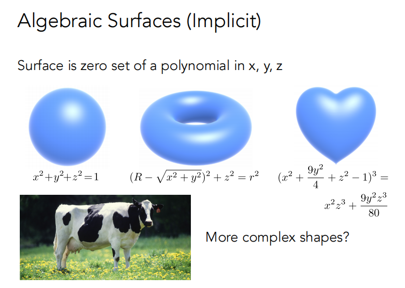

* **CSG构造实体几何**

  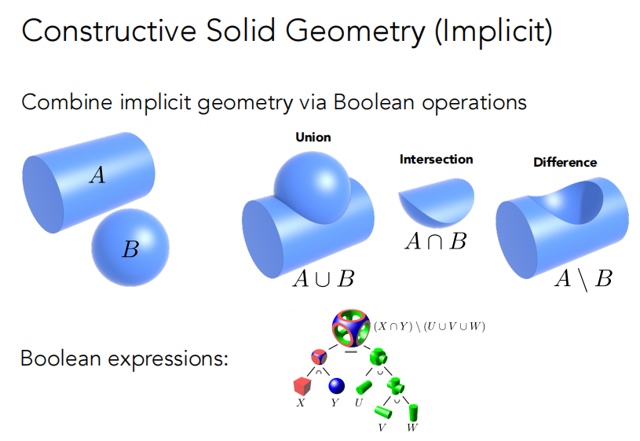

* **※ 距离函数**

  对于任意一个几何，不直接描述其表面，而是描述空间中任意一点到这个表面的距离，如此一来空间中所有点都会被定义出一个距离值，把距离函数做出来，在做个belnding就可以达到融合效果

  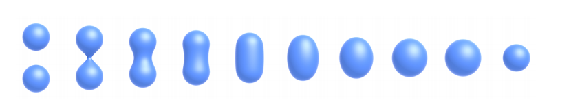

  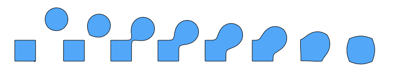

  距离函数应用：SDF

  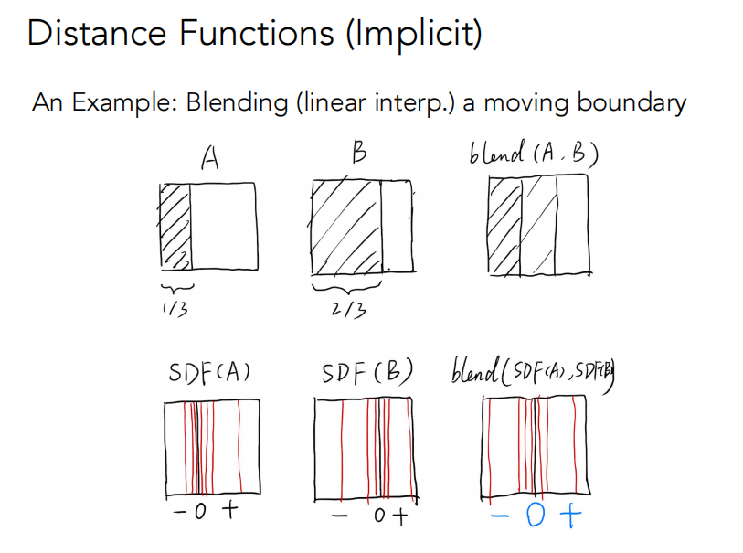

  得到距离函数后，函数值为0的地方就是表面。类似的，水平集也用了同样的思想，在地理上类似定义是等高线，用等高线的思想确定表面位置

  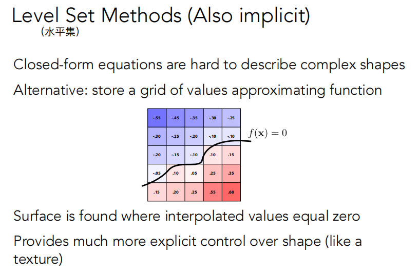

  水平集应用：CT扫描

* **分形几何**

  《计算机图形学基础教程》P220
  分形（Fractal）是以非规则物体为研究对象的几何学，是研究无限复杂具备自相似结构的几何学
一般认为，满足下列条件的图形称为分形集：
  1. 具有任意尺度下的比例细节，或者说具有精细结构
  2. 不规则，无法用传统的几何语言来描述
  3. 具有自相似性（近似的或统计意义下的）
  4. 在某种方式下定义的“分维数”大于它的拓扑维数
  5. 定义简单，或者可以被简单地递归表示、

  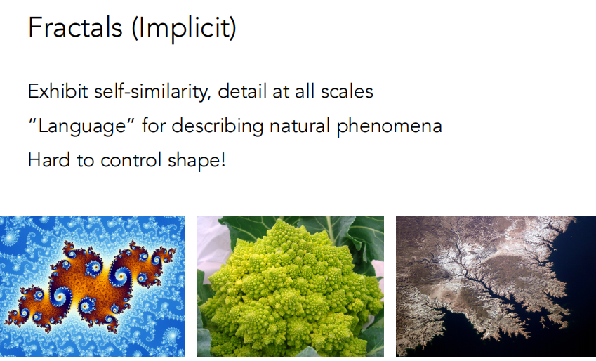

## 显式几何

直接给出点的位置，或者可以进行参数映射；然而想要判断内外时，显式的表达就很难进行表示

**点云**

用空间中一堆点的集合来表示物体，只要点足够密集，就看不到点与点之间的空隙，理论上可以表示任何几何，通常三维扫描得到的结果就是点云（点云可以转变为三角形）

**多边形网格**

或许是目前最为广为流传的三维几何表达方式

# 曲线

## 贝塞尔曲线
《计算机图形学基础教程》P194-197

德卡斯特里奥（de Casteljau）算法  生成<u>二次贝塞尔曲线</u>

定义三个点 -> 根据任意的 t 插值出点 -> 不断重复 t在[0,1]间不断取值 -> 得到曲线

.png>)

<u>二次贝塞尔曲线</u>：**递归**

| .png>) | .png>) |
| ------------------------------------------------------------ | ------------------------------------------------------------ |

### 贝塞尔曲线的代数表示

在每两个之间找一个时间t，相当于每两个之间线性插值

.png>)

把算法过程写成代数的形式（如图）

.png>)

推广到n阶，不难发现这其实是一个符合二项分布的多项式

.png>)

三次贝塞尔曲线的代数表示：

.png>)

### 贝塞尔曲线的性质

* 端点性质：顶点$P_0$和$P_n$分别在曲线段的起点和终点
* 一阶导数：$p'(t)=n\sum\limits_{i=1}^{n}(P_i-P_{i-1})B_{i-1,n-1}(t)$，曲线起点和终点的切线方向和特征多边形的第一条边和最后一条边的走向一致
* 二阶导数：$p''(t)=n(n-1)\sum\limits_{i=1}^{n}(P_i-2P_{i-1}+P_{i-2})B_{i-2,n-2}(t)$，$r$阶导数只和$r+1$个相邻控制点有关，与其他控制点无关
* 对称性：控制点位置不变次序颠倒，曲线形状不变但走向相反；曲线在控制多边形的起点和终点具有相同的性质
* 凸包性：曲线被包含在特征多边形构成的凸包内
* 几何不变性：曲线几何特性不随坐标变化而变化
* 仿射不变性：对曲线做仿射变换等价于先对控制点做仿射变换
* 变差缩减性：若曲线为平面图形，则直线和曲线的交点不多于直线和特征多边形的交点

### 逐段贝塞尔曲线

控制点多了以后，贝塞尔曲线并不直观，很难控制，于是我们想到可以每次定义一段贝塞尔曲线，然后连起来

普遍习惯每四个控制点定义一段，并略去中间两点间的连线

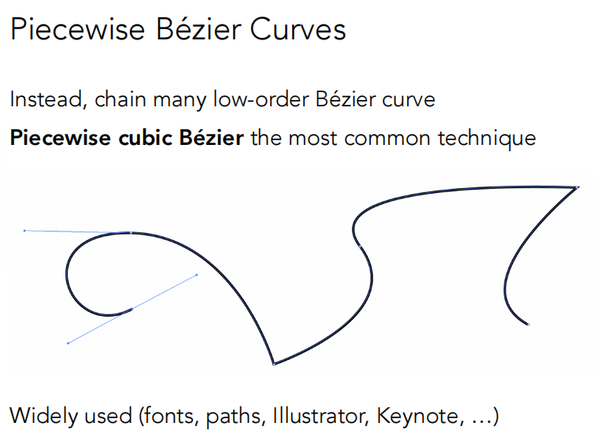

## 连续性

| $C_0$连续：连接点处点坐标相同                                            | $C_1$连续：连接点处切线相同                                          |
| ------------------------------------------------------------ | ------------------------------------------------------------ |
| 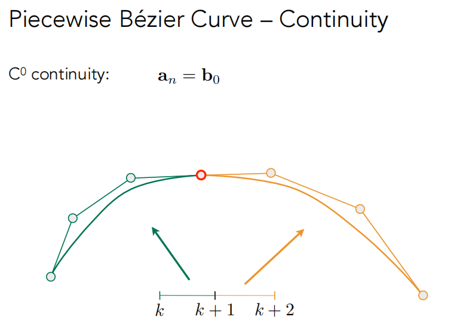 | 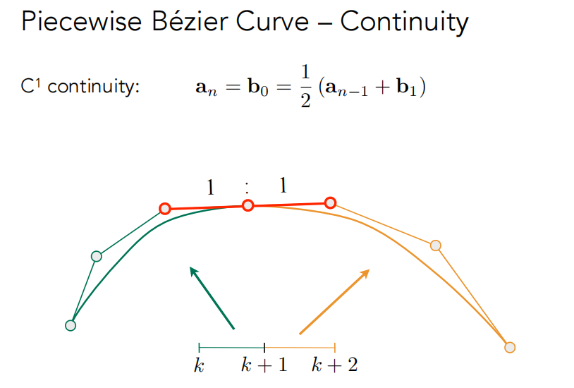 |

## 样条曲线

**样条**：连续的曲线，由一系列控制点控制，满足一定的连续性，即可控的曲线

**B样条曲线**：有关信息可以参考：



或者看我的也行233



# 曲面

## 贝塞尔曲面

u方向上画出四条贝塞尔曲线后，在这四个线上再取四个点，并认为这是个点是一组新的贝塞尔曲线的控制点，这些点在空间内向v方向扫描，便形成了贝塞尔曲面

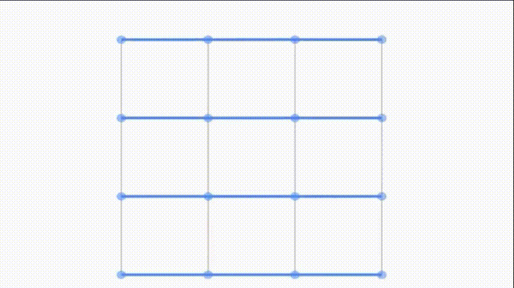

# 几何处理

## 曲面细分

### Loop细分（涡轮平滑）

连接各边中点，并重新改变各个顶点位置，从而创造出更多三角形面，使得表面更加光滑（命名并不是因为算法与循环有关，而是该算法创始人的名字叫loop）

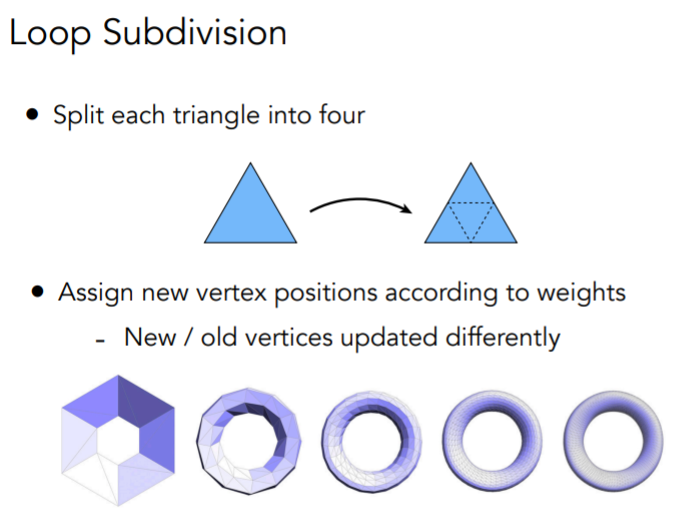

该算法规定，一般情况下（不考虑边缘情况），对于新顶点，位置由下左图规定，而对于旧顶点，需要由旧顶点和新顶点位置共同确定

下右图中，n为该顶点的度（依附于某个顶点的边的条数），u为一个和n有关的数

| 新顶点                                                       | 旧顶点                                                       |
| ------------------------------------------------------------ | ------------------------------------------------------------ |
| 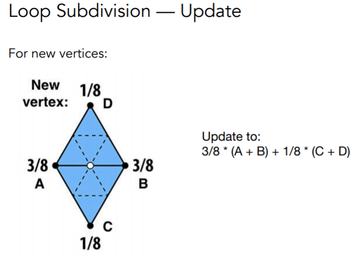 | 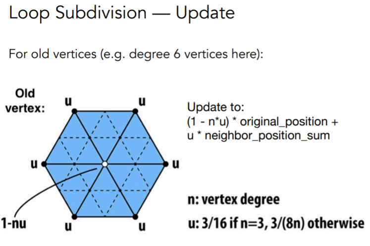 |

### Catmull-Clark 细分

loop细分有一个前提，即只适用于三角形网格，而对于非三角形网格的细分，就需要借助catmull-clark算法

该算法定义面分为两种——四边面和非四边面，并定义度为4的顶点为非奇异点，其余点均为奇异点

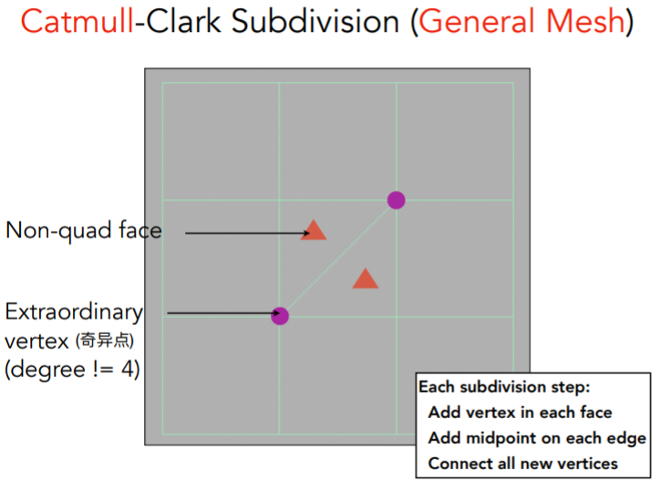

具体做法是，对每个非四边面都取其中的一个点（重心或者其他点），将其与该面的其他边的中点分别连接，在这个过程中，会引入一个新的奇异点，并且在一次细分后，所有非四边面都变为了四边面，在后续的细分中，将不会引入新的奇异点

| 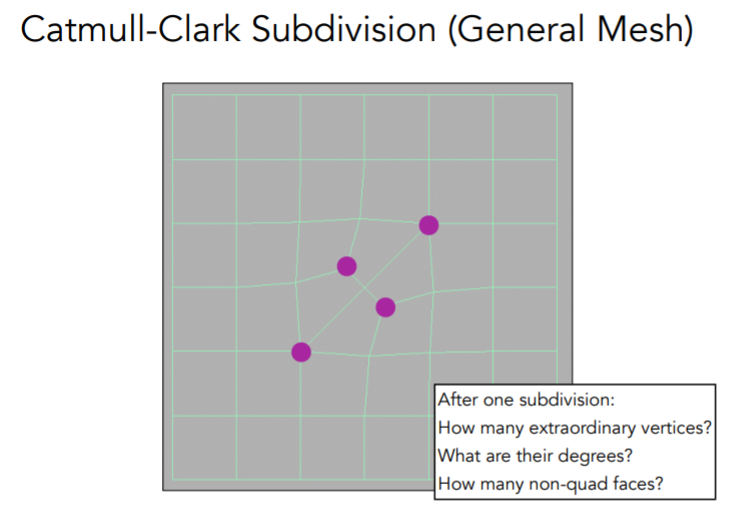 | 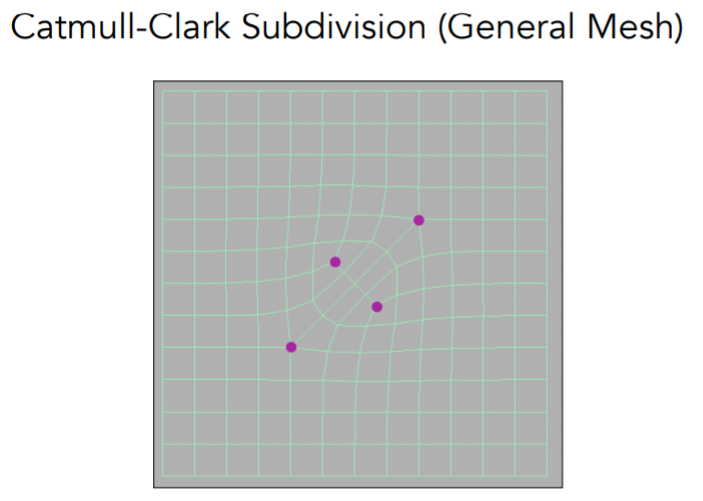 |
| ------------------------------------------------------------ | ------------------------------------------------------------ |

对于细分后顶点位置的调整，先将顶点分为三大类

①新的在面上的点；②新的在边上的点；③旧的点

如下计算：

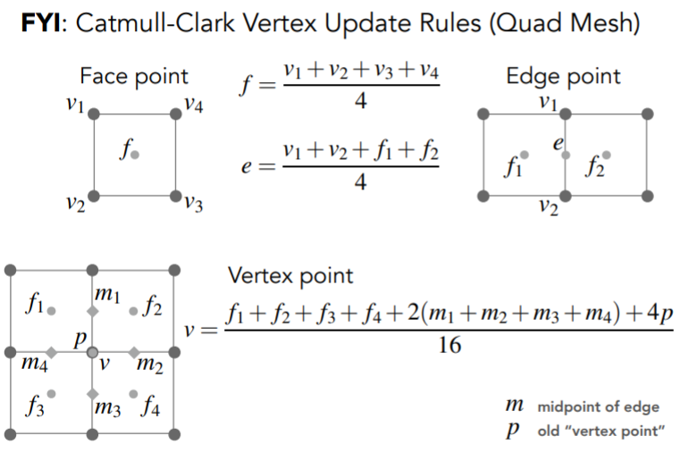

loop细分与catmull-clark细分不同的处理效果：

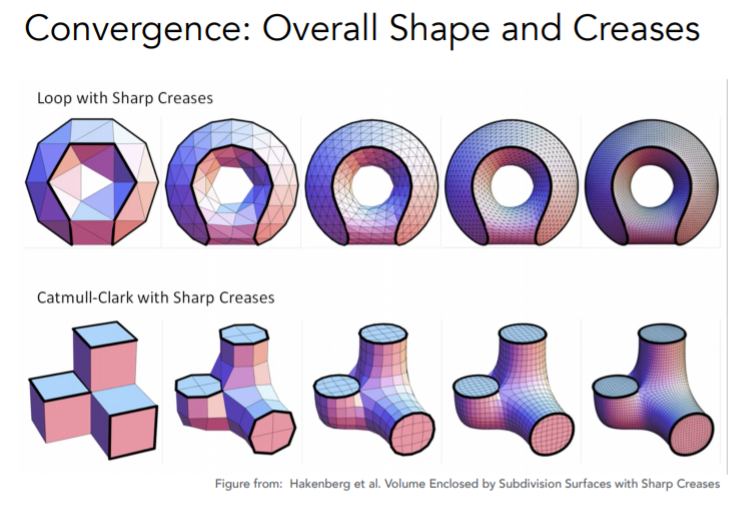

具体推导过程可以参考：



## 网格简化

### 边坍缩

如何保证坍缩前后轮廓基本保持一致？	——二次误差

二次误差度量：坍缩后的点和原本几个边（面）的距离的平方和最小

| 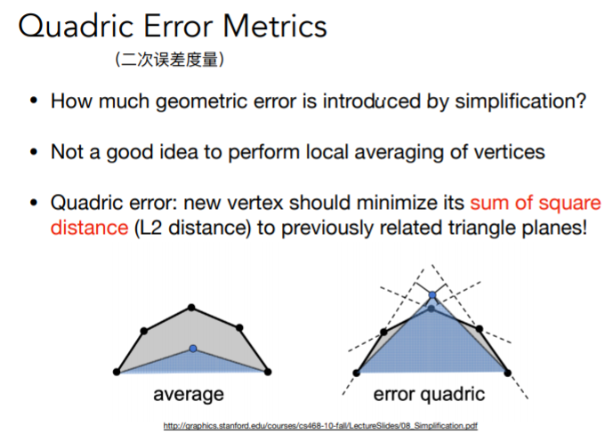 | 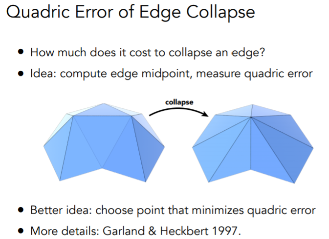 |
| ------------------------------------------------------------ | ------------------------------------------------------------ |

对每一条边都先计算一下二次误差，随后从二次误差最小的开始坍缩，由小到大

但这么做会引入一些问题：做一次坍缩后，其他边也跟着变了，他们的二次误差必须被重新计算

所以需要从二次度量误差中选最小的，取完最小的之后，我们要对它们的二次误差做一次更新，于是我们就要用到==优先队列 / 堆==这种数据结构，这种数据结构能让我们能取得二次误差最小值的同时也能动态更新其他受影响的元素

另外，这种通过对局部计算最优解，试图找到全局的最优解，是一个典型的贪心算法

