光栅化的着色是一种局部的现象，在其着色的过程中只会考虑着色点自己的信息，而不会考虑其他物体，甚至不会考虑物资自身的其他部分对着色点的影响。事实上这些都是会有遮挡的关系的，是会产生阴影的，为了解决这个问题，就有了光线追踪

# 引入

## Shadow Mapping 阴影贴图

核心思想：如果一个点不在阴影里，那么这个点可以被摄像机和光源都看到

局限：硬阴影，走样，只能处理点光源

具体实现细节：

① 先从光源看向场景，做一遍光栅化，不进行着色，只记录深度

② 再从摄像机看向场景，再做一遍光栅化，记录深度

③ 比较两次深度值，如果不相等，则说明该点在阴影中

**问题1**：渲染出来的阴影比较脏

**原因**：深度值的比较位浮点数比较，而判断浮点数相等势必会产生误差，虽然处理精度的方法有很多种，但并不能从本质上解决问题

**问题2**：走样

**原因**：本身储存的深度图存在分辨率限制，与渲染时的分辨率搭配不好的话，就会产生走样


关于硬软阴影：本质是本影和半影的问题，只要存在软阴影，那么光源一定具有一定的体积

## Why Ray-Tracing？

由上可知，光栅化并做不好全局的效果，如软阴影，反射，环境光照

光栅化很快速，但渲染的质量不高；光线追踪的处理速度慢，但渲染的很准确

光栅化很容易做到实时，而光线追踪更多的应用于离线渲染（暂不提实时光追）

首先定义光线——沿直线传播，不会发生碰撞，从光源到人眼

由光路的可逆性，在光线追踪的具体应用中，采用从人眼（认为是一个针孔摄像机）到光源的方法

**光线投射**：人眼，成像平面，光源，物体

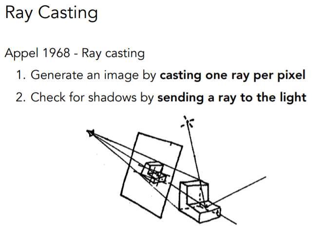

<u>从相机出发投射一条光线</u>，穿过成像平面，与着色点相连，如果光源能看见着色点（着色点不在阴影中），那么就生成一条有效光路，计算能量并着色（我们很容易知道这个着色点的法线，入射方向等信息，这时候可以用各种各样的着色模型（如Blinn Phong））

对于场景中的物体，我们假设光打到它之后会发生完美的折射与反射，而对于着色点，我们取光路与物体最近的交点（涉及深度测试）

总的来说，光线投射其实就是每个像素投射出去一条光线，求到和场景内物体的最近交点，通过该交点和光源连线来判定是否可见，然后算着色，写回像素的值

这个方法依旧只是弹射一次，但事实上光线是能在物体间弹射很多次，这时候就需要用到whitted光线追踪

# Whitted（递归）风格光线追踪

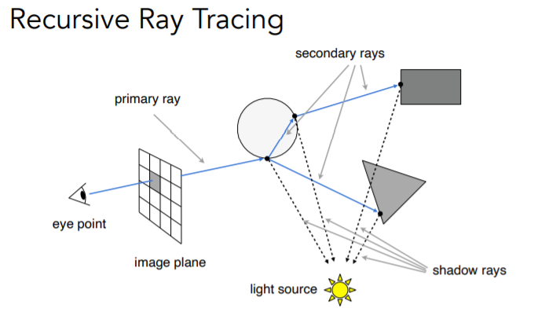

如果图中的球是玻璃材质，那么之前从像素投射出去的光线，除了会在玻璃球表面发生发射，还有一部分会进入玻璃球发生折射，而whitted光线追踪，除了计算第一次光线投射的着色点外，对每个弹射点也进行了着色计算（损失多少能量，颜色值等）

# 光线与物体求交

无论是之前的光线投射还是whitted风格光线追踪，都涉及到光线与物体求交问题

为了研究这个问题，我们需要先定义光线

一个光线可以有一个点（光源）和一个方向（光线方向）确定，则可设光线表达式：$r(t)=O+td$

## 和隐式表面求交

光线在t时间后到达的着色点：$r(t)=O+td$

隐式表面：$f(p)=0$	 `//p是着色点`

将$r(t)$代入，$f(r(t))=f(O+td)=0$

要判断是否与隐式表面相交，只要判断上面这个方程是否有解即可

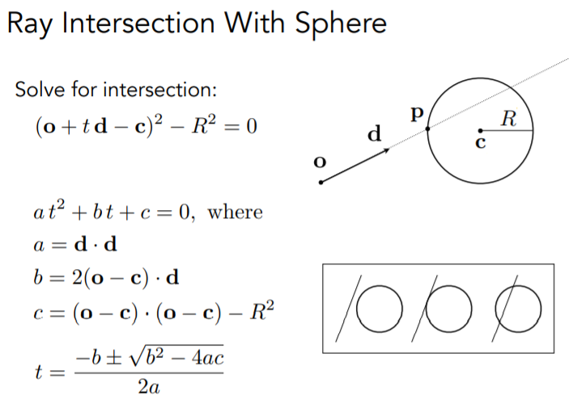

## 和显式表面求交

核心：点如果在封闭形状内，向外打一条光线，得到的交点数量一定是奇数；如果在封闭形状外，则交点数一定是偶数

那么对于显示表面求交，最简单的做法就是遍历物体的所有三角形面，求交点数量，那么问题就简化为如何判断光线与三角形面求交（这种方法很慢，之后会提到包围盒的加速算法）

## 与三角面求交

平面可以由一个点和一个法线定义，三角面也不例外，在求交问题中，设光线和三角面交点位p，p满足：$(p-p')·N=0$

复杂的做法是，将光线方程带入三角面方程，求得交点（下图），在用向量积判断交点是否在三角面内

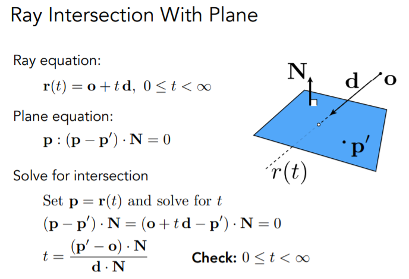

简便的做法，把求交点和判断这两步并作一步，即Möller-Trumbore算法

## Möller-Trumbore算法

如下图，左边是光线上的点，右边是用重心坐标表示的三角形内的点

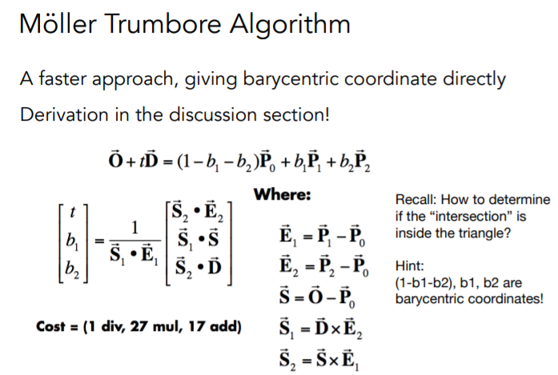

解出来之后要判断是否合理， $t>0？\ \ \ b_1,b_2,b_3>0？$

算法推导：



## 轴对齐包围盒（AABB）求交

上述算法的计算次数： 像素数×三角形数×弹射次数

显然，对每一帧来说，这样的计算量是非常大的，所以我们需要引入包围盒，将一个复杂的物体用简单的形状围起来

那么如果光线连包围盒都碰不到，那肯定碰不到包围盒里的物体

对于三维的情况，我们一般用长方体包围盒，更特殊的，轴对齐包围盒，即包围盒的每一个边都对应和一个坐标轴平行

接着就来考虑光线和包围盒求交的问题

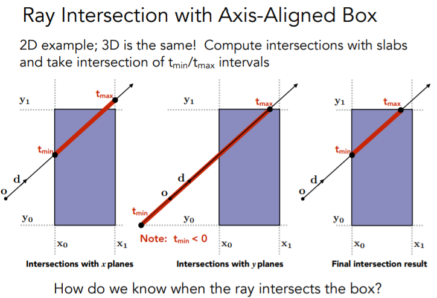

只有当光线进入了三组对面，才能说明光线进入了包围盒，同理，当光线在三组对面外，才可知光线离开了包围盒

如上图，取$t_{min}$里的max，作为进入包围盒的时间，取$t_{max}$里的min，作为离开包围盒的时间

若进入包围盒的时间小于离开包围盒的时间，说明有交点

**几个问题**：光线是射线，如果t是负数，那说明交点在射线的反向延长线上，这是不合理的，下面做分类讨论：

* 盒子在光线背后：${t_{enter}}<0,t_{output}<0$
* 光线起点在盒子内部：$t_{enter}<0,t_{output}>0$

综上，$\text{iff.}\ t_{enter}<t_{output}且t_{output}>0$，此时才能证明光线和包围盒有交点

why Axis-Aligned？为什么使用<u>轴对齐</u>包围盒？

因为轴对齐的情况下，我们可以在求t的时候只求某一轴的信息（光线在轴上的投影），而不用整个坐标，比点乘计算会更加容易

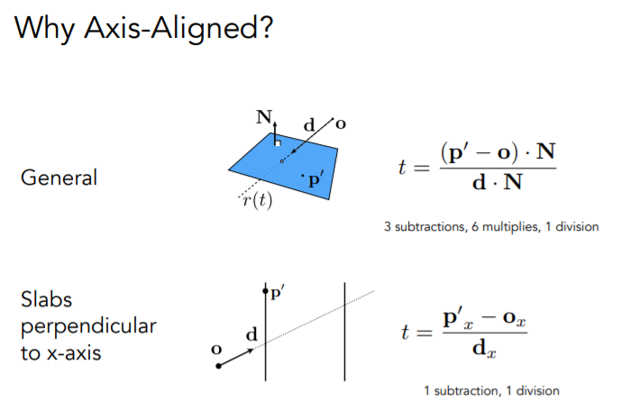

## 使用轴对齐包围盒加速光线追踪

通过上述分析，我们已经知道了光线如何和包围盒求交，那么又要怎么在空间中确定这些包围盒的位置呢

（需要注意，以下对空间的划分都是光线追踪的预处理操作）

# 均匀划分

假设光线与物体求交比光线与包围盒求交慢的多，那么我们需要对包围盒进行进一步加工

均匀划分的步骤如下：

找到场景包围盒 -> 均匀划分该包围盒 -> 判定与物体相交的子包围盒 -> 与物体求交

如果一条光线向右上投射出去，为了确定这条光线与哪些子包围盒相交，简单的想法是他下一次交到的包围盒在他当前交到的右边或上边（如何光栅化一条线）

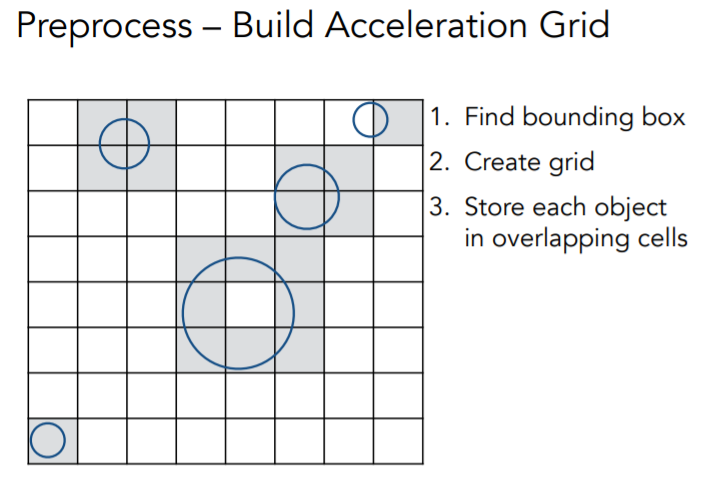

所谓加速就是多做光线与盒子求交，少做光线与物体求交，那么我们来看一下均匀划分的加速效果

| 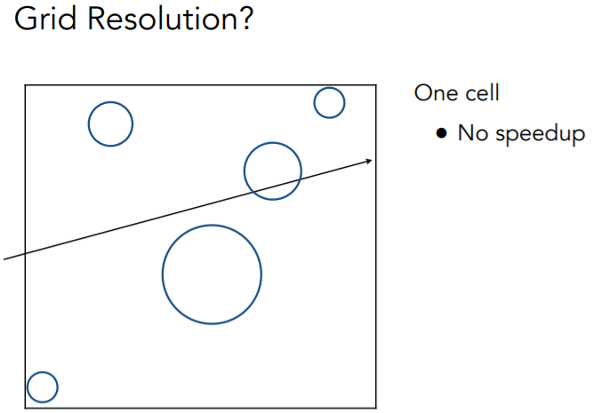 | 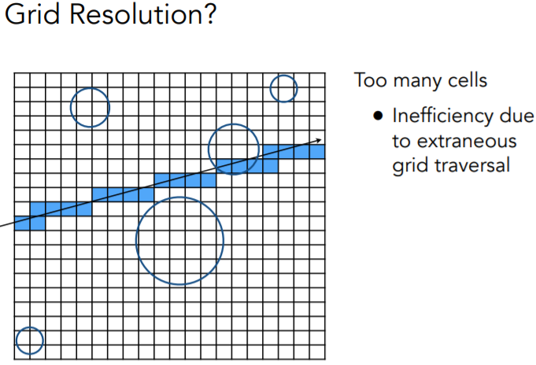 |
| ------------------------------------------------------------ | ------------------------------------------------------------ |

如果划分成1×1的格子，则没有加速效果；如果划分太密集，效率也不会高

根据经验，人们大概得出划分成场景中物体数目的27倍的格子数比较好

**格子的划分方法在大量均匀分布的物体上比较有效，然而在复杂空旷的场景中，会造成很多资源浪费**

# 空间划分

在网格均匀划分中划分出来的都是大小相同的格子，但在有些空旷的地方不需要这样划分，太浪费了，我们想在没物体的地方用大盒子，有物体的地方用密集的盒子，这也就引出了空间划分的方法

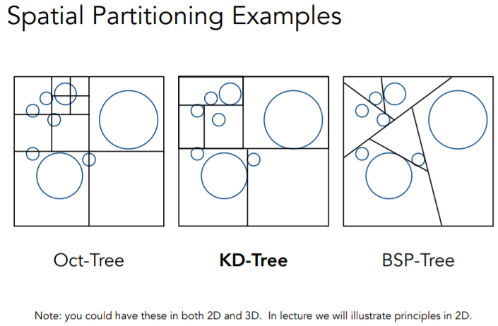

## 八叉树

每一次把空间划分成八份，直到满足一定的停止规则（比如某一次划分8个子空间中7个为空）

<u>缺点：维数越高越复杂，n维空间对应$2^n$叉树</u>

## **BSP树**

一种对空间二分的划分方法，每次选一个方向进行划分，与KD树的区别在于它不是横平竖直地切，且它会有越高维越不好计算的问题（砍开二维用线，砍开三维用面，维度越高越复杂）

## KD树

每次把空间划分为两份，x，y，z轴轮流切分，直到被切分节点中不存在物体则停止

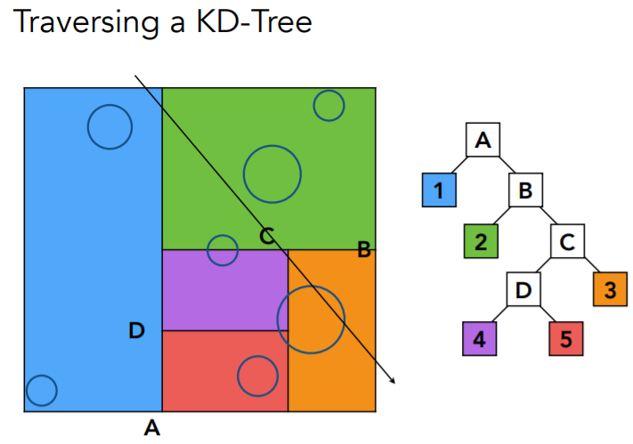

<u>KD树如何加速光线追踪：</u>

如图，如果一条光线与当前结点空间有交点，则继续寻找该结点的子节点，直到找到叶子结点，再与其中物体求交

<u>缺点：</u>

给出一个节点的包围盒，要判断他与物体哪些三角形有交集，才能进行后续着色，这种算法确实存在，但不太好写

其次，很多情况下一个物体和很多包围盒都有交集，它可能会存在很多个叶子节点中，会造成重复计算

由此我们引入另一种基于物体的划分方式——BVHs

# BVHs划分

Bounding Volume Hierarchy

找到场景包围盒 -> 每次将物体分为两堆 -> 对两堆物体重新计算包围盒 -> 直到一堆中物体少到一定程度

如何划分物体：

1°选取当前最长的轴的垂直方向作为划分方向

2°取中间的物体（第$\frac{n}{2}$个三角形）（快速选择算法）

1°或2°都可以，主要是为了保证二叉树的平衡

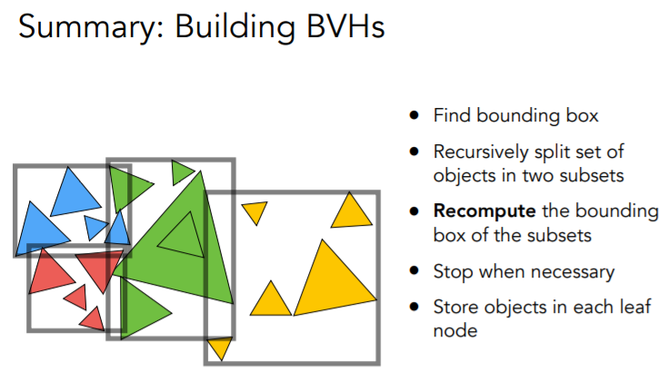

BVH这种储存结构，中间结点储存包围盒和子节点的指针，叶子结点储存包围盒和物体（的集合）

关于BVH如何加速光线追踪，可以参考下述伪代码：

```shell
Intersect(Ray ray,BVH node)
{
	if(node is a leaf node)
	{
		test intersection with all objs;
		return closest intersection;
	}
	hit1 = Intersect(ray , node.child1);
	hit2 = Intersect(ray , node.child2);
	
	return the closer of hit1,hit2;
}
```

# BVHs vs. KD


一个是对空间的划分，一个是基于物体的划分；KD树的包围盒不会发生重合，而BVHs会发生相交

# 辐射度量学基础

why：

Blinn-Phong着色模型中会设置一个数当做光照强度，但我们都不清楚这个数的真实的物理意义，甚至连单位是什么也不知道，研究过程中我们只是将这些物理量简化为一个数，另外Whitted风格的光线追踪所得到的结果也不是我们所想要的真实的效果（路径追踪会提到），而所有的这些都会被辐射度量学解决，这同样也是后面学习路径追踪的基础

辐射度量学给出了一系列度量方法和单位去定义光照，它定义了光照在空间中的属性，并且这在物理上是完全正确的

## 相关概念

|      物理量       | 符号 |     中文翻译      |               简单定义               |   单位    |                  公式                  |
| :---------------: | :--: | :---------------: | :----------------------------------: | :-------: | :------------------------------------: |
|  Radiant Energy   |  Q   |     辐射能量      |           电磁波形式的能量           | 焦耳（J） |                   \                    |
|   Radiant Flux    |  P   | 辐射功率/辐射通量 |         单位时间内的辐射能量         | 瓦特（w） |           $P=\frac{dQ}{dt}$            |
| Radiant Intensity |  I   |     辐射强度      |   点源向某单位立体角发射的辐射功率   |   w/sr    |         $I=\frac{dP}{d\omega}$         |
|    Irradiance     |  E   |   辐（射）照度    |      受照面单位面积上的辐射功率      |  w$/m^2$  |           $E=\frac{dP}{dA}$            |
|     Radiance      |  L   |   辐（射）亮度    | 单位投影面积、单位立体角上的辐射功率 | w$/m^2$sr | $L=\frac{d^2P}{dAd\omega cos(\theta)}$ |

光学中辐射强度的单位：$\frac{W}{sr}=\frac{lm}{sr}=\text{candela}=\text{cd}$

$\Omega/\omega$：立体角；$A$：受照面面积

sr：球面度，立体角国际单位

lm：流明，光通量国际单位

cd：坎德拉，光强单位，SI 7大基本单位之一

光通量和辐射通量：

光通量与辐射通量的量纲相同，但辐射通量是一个辐射度量学上的概念，是一个描述光源辐射强弱程度的客观物理量，而光通量是一个光 学概念，是一个属于把辐射通量与人眼的视觉特性联系起来评价的主观物理量，或者说光通量是按光对人眼所激起的明亮感觉程度所估计的辐射通量

## 立体角

为了理解光线在空间中辐射的过程，我们需要引入立体角的概念

平面情况下，弧度制角度可以由$\theta=\frac{l}{r}$计算得到，仿照二维情况，立体角可以由$\omega=\frac{A}{r^2}$定义

其中A如图所示，是立体角锥体在球面上截出的一块面积

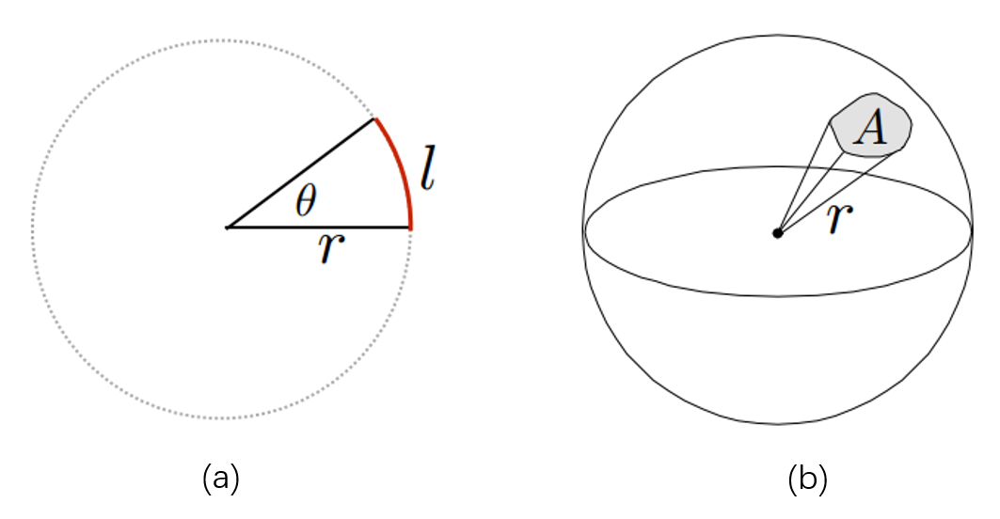

采用微分的思想求A的面积，可由简单推导得到
$$
\displaylines{
\mathrm{d}A=(r·\mathrm{d}\theta)·(rsin(\theta)·\mathrm{d}\phi)=r^2sin(\theta)\mathrm{d}\phi \mathrm{d}\theta \\\\
\mathrm{d}\omega=\frac{\mathrm{d}A}{r^2}=sin(\theta)\mathrm{d}\phi \mathrm{d}\theta
}
$$

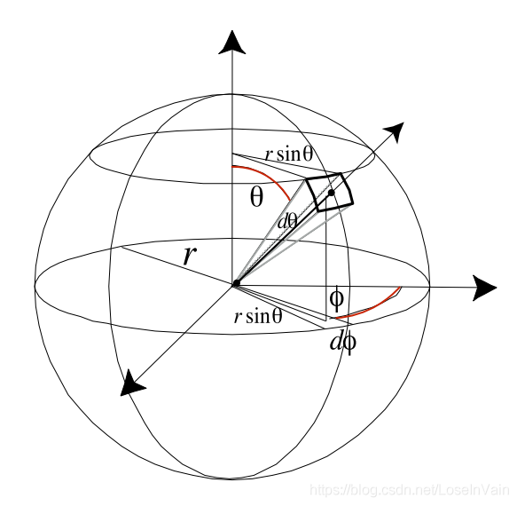

对微分立体角进行全积分，可以得到立体角的范围
$$
\Omega=\int_{S^2}\int_0^\pi sin(\theta)\mathrm{d}\phi \mathrm{d}\theta=4\pi\\
\omega\in[0,4\pi]
$$
具体推导过程参考：




## Irradiance（辐照度）

定义：受照面单位面积上的辐射功率，即在单位时间内，每个单位面积上接受到的光照的能量

公式：$E=\frac{\mathrm{d}P}{\mathrm{d}A}·cos(\theta)=\frac{\mathrm{d}Q}{\mathrm{d}A\mathrm{d}t}·cos(\theta)$

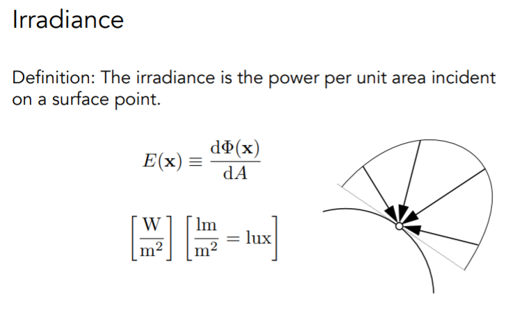

将辐射度量学里的功率换成光学里的流明，公式同样成立，光学中辐照度对应物理量为lux（勒克斯）

同样类似Blinn-Phone模型，这里也需要考虑光线和受照面的角度问题

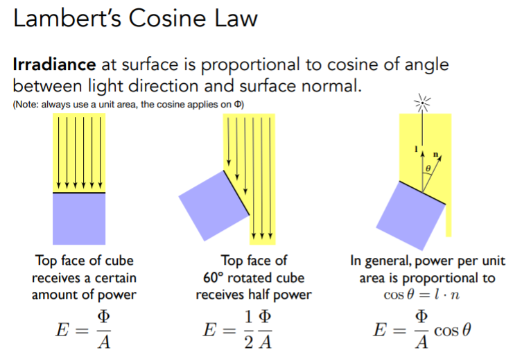

如上三图，兰伯特余弦定理

左图光线垂直受照面，直接代公式；中图夹角60°，六根光线只照到三根，乘cos60°结果正确

更普遍的情况如右图，要乘以光线和受照面法线的夹角，写进代码就是 $l·n$

兰伯特余弦定理也可以解释地球的四季变换，北半球夏天太阳直射北半球，北半球的Irradiance当然更多，也就更热；而当北半球是冬天的时候，光线与北半球地球表面的夹角变大，cos值变小，Irradiance减少，冬天也就更冷

而在讲Blinn-Phone漫反射模型的时候，我们曾提到过，光照的辐射能量可以假设集中在一个球壳上，同一球面上光能处处相等，而随着球壳半径的增长，单位面积上的光能也呈$r^2$衰减

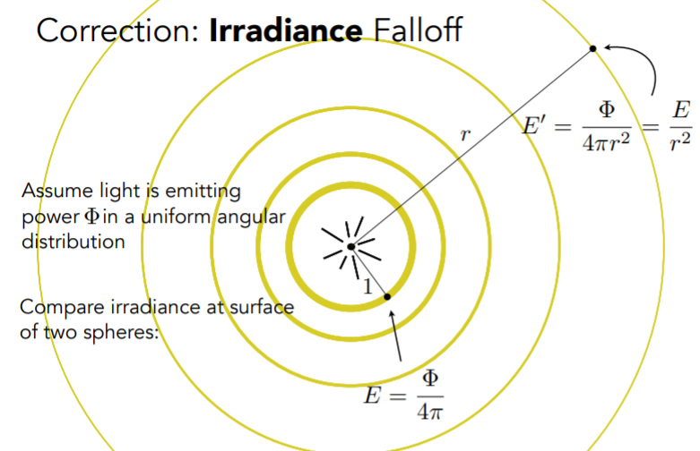

如图，在最里面的单位球上$E=\frac{P}{4\pi}$，而在外层球壳上，$E’=\frac{P}{4\pi r^2}=\frac{E}{r^2}$

在学了辐照度概念之后，我们就可以知道这里光能衰减的并不是Radiant Intensity，而是Irradiance

对于Radiant Intensity，随r的增长，它的值保持不变

## Radiance（辐亮度）

定义：单位投影面积、单位立体角上的辐射功率，是描述环境中光的分布的基本场量

公式：
$$
L=\frac{\mathrm{d}^2P}{\mathrm{d}A\mathrm{d}\omega cos(\theta)}
$$

准确的光线追踪与radiance的关系非常大，其渲染就是在计算radiance

同样的，对于光学来说，辐亮度也有他自己的另一个单位，nit（尼特）
$$
[\frac{w}{m^2sr}][\frac{cd}{m^2}=\frac{lm}{m^2sr}=nit]
$$

## Radiance & Irradiance & Intensity之间的联系与区别

从公式看起
$$
\displaylines{
L=\frac{\mathrm{d}^2P}{\mathrm{d}Ad\omega cos(\theta)};\ \ \ 
I=\frac{\mathrm{d}P}{\mathrm{d}\omega};\ \ \ 
E=\frac{\mathrm{d}P}{\mathrm{d}A}\\\\
L=\frac{\mathrm{d}E}{\mathrm{d}\omega cos(\theta)}^①
 =\frac{\mathrm{d}I}{\mathrm{d}A cos(\theta)}^②
}
$$
从放射（放出能量）的角度来解释，Radiance表示单位面积上 因吸收了能量 而朝某个方向**辐射出去多少能量**

从入射（吸收能量）的角度来解释，Radiance表示单位面积上 所有接收到的能量中的某一束，即**Irradiance在某一方向上的分量**

而对于Intensity，辐射强度代表的是所有在某一单位立体角方向上辐射出的能量

Radiance代表这个Intensity在某个单位面积dA上的投影 / 分量

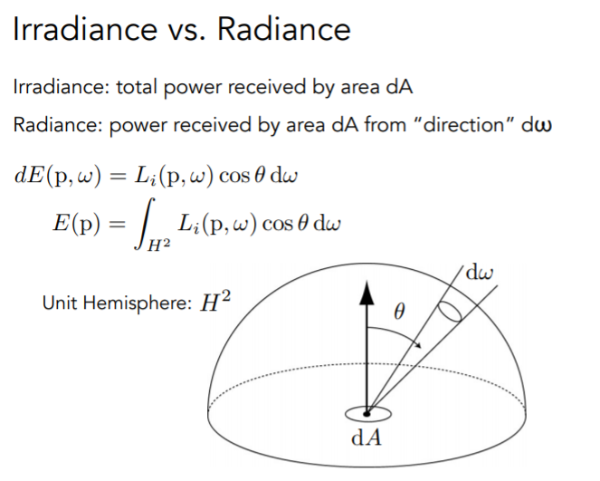

Radiance和Irradiance的区别和联系在图形学中非常重要，总结来说就是：

Radiance是某个单位面积向某个单位立体角辐射出去的能量，Irradiance是某个单位面积上接受到来自四面八方的能量

区别就在于辐亮度Radiance有方向的概念，而辐照度Irradiance没有

把半球面上的所有Radiance积分起来得到的就是Irradiance

# 双向反射分布函数（BRDF）

BRDF：Bidirectional Reflectance Distribution Function  双向反射分布函数

BSDF：Bidirectional Scattering Distribution Function  双向散射分布函数

BTDF：Bidirectional Transmittance Distribution Function  双向透射分布函数

BSSRDF：Bidirectional Scattering-Surface Reflectance Distribution Function  双向散射表面反射（次表面散射）分布函数

以上为PBR知识体系下渲染方程所涉及的BxDF

回归正题，我们之前所说的反射情况，当发生镜面反射时，光线会朝一个方向反射，当发生漫反射时，光线会向四面八方反射

在我们之前的理解中，反射就是光线到达物体表面后偏移到另一个方向，而在学了辐射度量学之后，我们可以换一个角度思考这个过程

假设光线到达物体表面后，被物体表面吸收，而后再由物体表面发射到其他方向去，也就是用Radiance和Irradiance来解释反射

**吸收过程**：$\mathrm{d}E(\omega_{input})=L(\omega_{input})cos(\theta_{input})\mathrm{d}\omega_{input}$参照①号公式

表示单位面积由$\omega_{input}$方向上的光线吸收得到的Irradiance

**辐射过程**：$\mathrm{d}L(\omega_{output})\ \ \ (due\ \ to\ \ \mathrm{d}E(\omega_{input}))$表示单位面积在经过吸收过程后向$\omega_{output}$方向上反射出去的Radiance

由上可知，我们很容易求得单位面积从某一方向吸收了多少能量，而很难求出吸收之后辐射出去的Radiance分布情况

于是我们就定义一种函数来描述这种Radiance的分布：
$$
\displaylines{
\mathrm{d}L(\omega_{output})=
f_r(\omega_{input}\rightarrow\omega_{output})·\mathrm{d}E(\omega_{input})\\\\
f_r(\omega_{input}\rightarrow\omega_{output})=
\frac{\mathrm{d}L(\omega_{output})}{\mathrm{d}E(\omega_{input})}
=\frac{\mathrm{d}L(\omega_{output})}{L(\omega_{input})cos(\theta_{input})\mathrm{d}\omega_{input}}
}
$$
这个函数就是BRDF双向反射分布函数，其实它就是定义了一个比例（该比例由材质决定）
$$
f_r(\omega_{input}\rightarrow\omega_{output})=\frac{吸收后向某立体角方向辐射出去的 Radiance}{辐射前某单位面积\mathrm{d}A接收到的Irradiance}
$$
表示的是一个吸收与辐射的转化比例，即某个光线打到物体表面后，往不同方向反射的能量分布

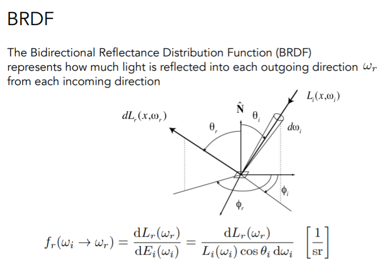

现在再来考虑镜面反射和漫反射，我们会发现镜面反射辐射出去的能量全都集中在反射方向上，而漫反射则是将吸收的能量均匀分配到了各个方向

如果忽略公式本身的推导过程，其实BRDF描述的就是物体和光线之间的相互作用

# 渲染方程

## 反射方程

上述分析中，$\mathrm{d}L(\omega_{output})$是某单位面积在$\omega_{input}$方向上吸收了$\mathrm{d}E(\omega_{input})$后向$\omega_{output}$辐射的能量

而这仅仅是$\omega_{input}$方向上吸收得到的$\mathrm{d}L(\omega_{output})$，我们的研究需要的是这个单位面积从各个方向上吸收了能量而在$\omega_{output}$上总共辐射的能量

因此我们需要对整个半球面求积分，来累加$\mathrm{d}L(\omega_{output})$
$$
\displaylines{
\begin{aligned}
L(p,\omega_{exit})
&=\int_{H^2}f_r(p,\omega_{input}\rightarrow\omega_{exit})·\mathrm{d}E(p,\omega_{input})\\\\
&=\int_{H^2}f_r(p,\omega_{input}\rightarrow\omega_{exit})·
L(p,\omega_{input})cos(\theta_{input})\mathrm{d}\omega_{input}
\end{aligned}
}
$$
方程的（）中多出来的p表示入射（反射）点

另外，在考虑反射方程的时候，我们还要注意：

反射点接受的能量（Irradiance）并不只是来自于光源，还会来自别的表面反射来的光（Irradiance）

从反射点反射出去的能量（Radiance）也并不只会反射到Camera或者人眼，还会作为Irradiance反射到其他的面上

所以理论上的反射方程定义应该带有递归的思想，也因此，光线反射的次数不同，得到的最终效果也就不会不同

但是我们目前先不考虑这些，暂且先用上面这个反射方程当做通用的方程

## 渲染方程

渲染方程与反射方程相比只是多加了一个自发光的项

渲染效果 = 反射光 + 自发光，方程如下：
$$
L(p,\omega_{output})=L_{emission}+\int_{\Omega+}L(p,\omega_{input})·
f_r(p,\omega_{input}\rightarrow\omega_{output})·(n·\omega_{input})\mathrm{d}\omega_{input}
$$
注意其中$\omega^+$和$H^2$是等价的，都是表示半球面 积分区域，并且在渲染方程中，假设入射出射所有的向量都是由内指向外的

## 深入理解

如果只有一个点光源，那么反射光=自发光+入射光×BRDF×入射光与法线的夹角

如果有很多个点光源，那么反射光就是把所有点光源的反射光能量加起来
$$
L(p,\omega_{output})=L_{emission}+\sum L(p,\omega_{input})·
f_r(p,\omega_{input}\rightarrow\omega_{output})·(n·\omega_{input})
$$
如果存在面光源，那么将这个面光源当成点光源的集合，求积分
$$
L(p,\omega_{output})=L_{emission}+\int_{\Omega}L(p,\omega_{input})·
f_r(p,\omega_{input}\rightarrow\omega_{output})·(n·\omega_{input})d\omega_{input}
$$
如果不止光源，还有其他物体反射来的光，则把其他物体的反射面当成光源，递归
$$
L(p,\omega_{output})=L_{emission}+\int_{\Omega}L(X',\omega_{input})·
f_r(X',\omega_{input}\rightarrow\omega_{output})·(n·\omega_{input})d\omega_{input}
$$
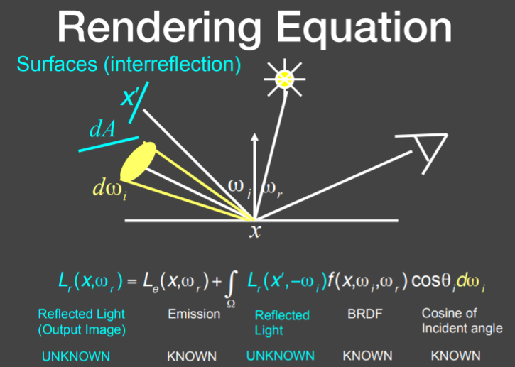

# 全局光照

为方便后续理解，将整个渲染方程简写
$$
\displaylines{
L(p,\omega_{output})=L_{emission}+\int_{\Omega}L(X',\omega_{input})·
f_r(X',\omega_{input}\rightarrow\omega_{output})·(n·\omega_{input})d\omega_{input}\\\\
\Downarrow\\\\
L(u)=e(u)+\int L(v)K(u,v)dv\\\\
\Downarrow\\\\
L=E+KL
}
$$
e(u)：自发光
L(v)：吸收其他物体反射过来的光后辐射出来的Irradiance
K(u,v)：BRDF算子
u，v表示两个不同的反射位置

L、E是向量，K是算子/矩阵

化简，求出L

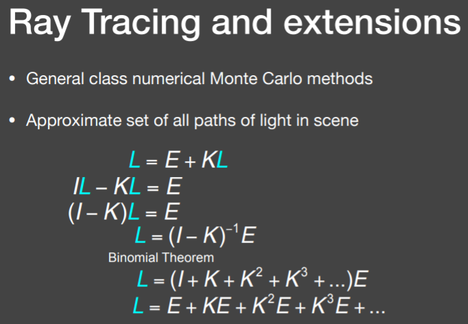

利用算子的运算性质（求逆以及泰勒展开）进一步对L进行变换

最后我们得到的L这种形式可以视作以 光的弹射次数 为区分的很多项，把光线弹射的次数的项累加起来，就得到了全局光照渲染方程

如果用渲染方程来理解光栅化，可以发现光栅化只做了全局光照的前两步，即自发光和直接光照

从这里再理解光线追踪一开始说的光栅化的不足，豁然开朗

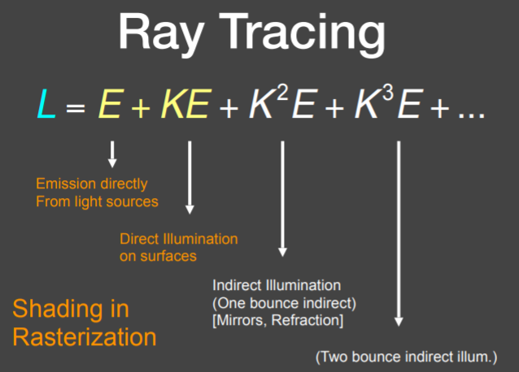

随着展开次数的增加，渲染效果如下图所示

| 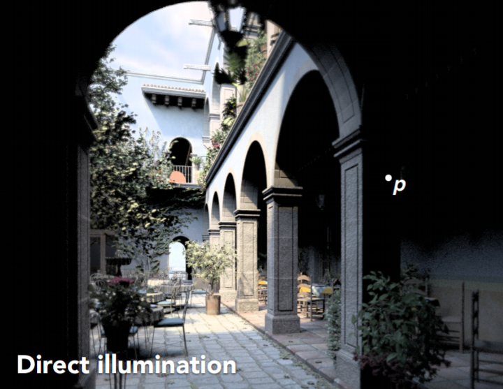 | 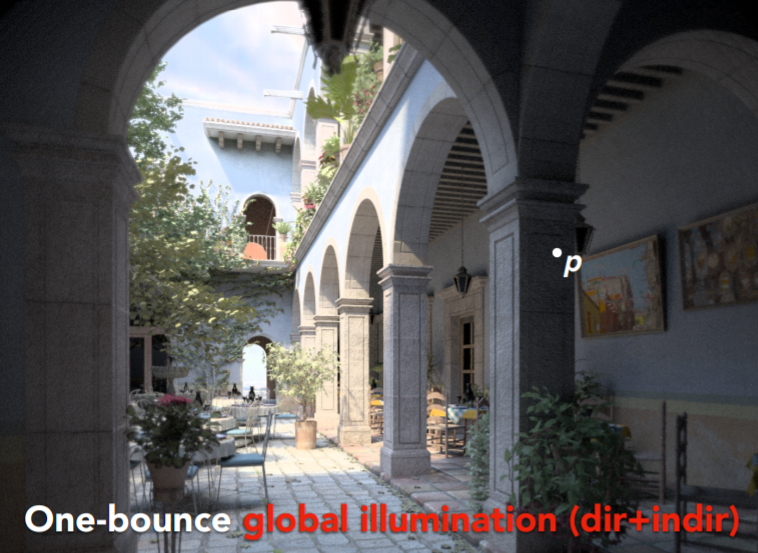 |
| ------------------------------------------------------------ | ------------------------------------------------------------ |
| 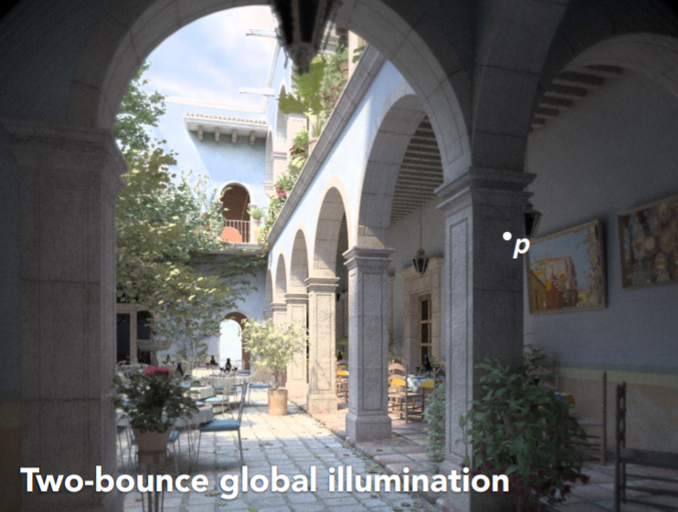 | 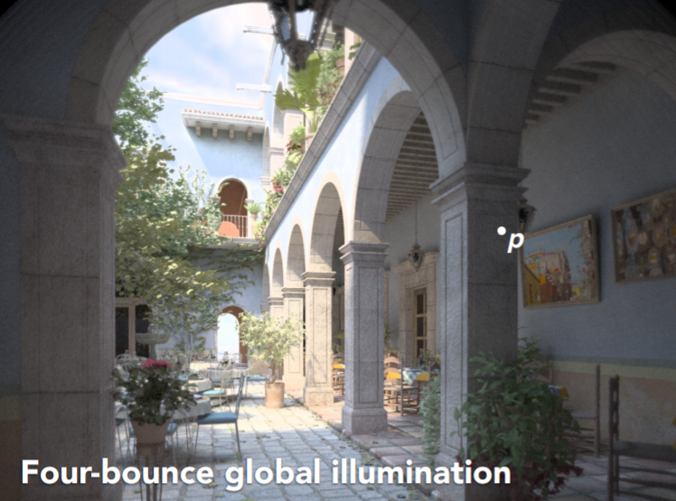 |
| 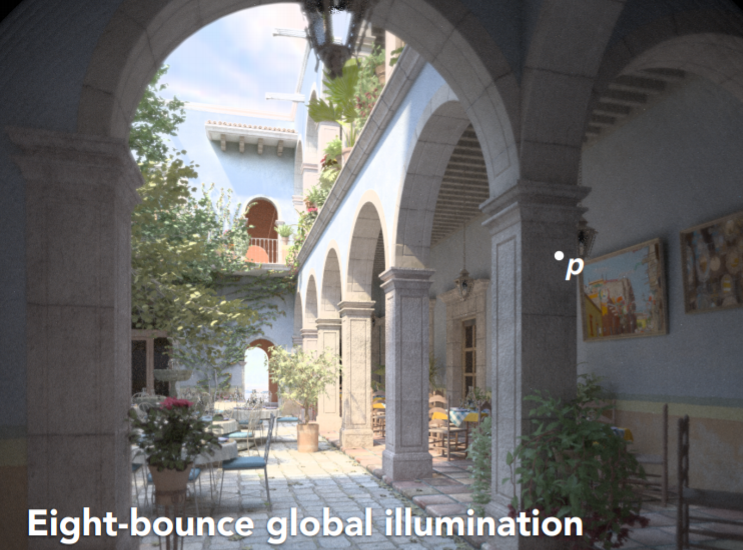 | 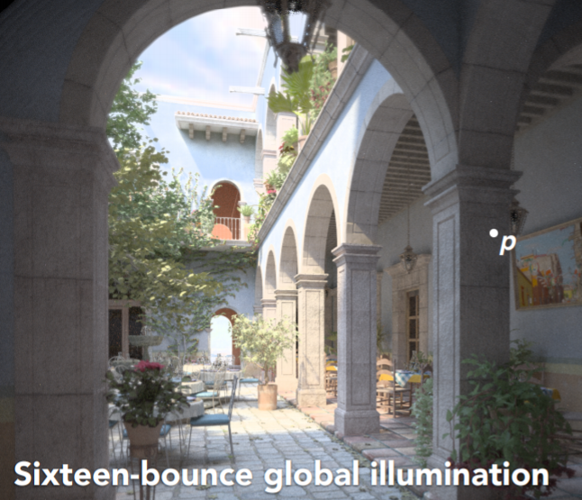 |

前几张的对比效果非常明显，注意到两次反射和四次反射中，图片上方的灯由黑色转为透明，这是因为如果只做两次反射，光线只能被允许进入玻璃内，而无法从玻璃中透射出来，而四次反射则可以让光线从中射出，因此反射四次的灯是透明的

另外，不难发现8次反射和16次反射得到的结果并没有差太多，这也恰恰证明了渲染方程满足泰勒展开级数收敛这一性质

# 蒙特卡洛积分

需要用到的概率论知识点（建议复习）：离散/连续型随机变量的分布，连续型随机变量的概率密度函数（PDF），数学期望

why：正常的定积分（黎曼积分）都要求有解析式才能够进行计算，而大多数情况解析式是求不出来的。蒙特卡洛积分提供了一种求解这些比较难以计算的积分的近似值的思路

what：在积分区域上随机采样，若采样方式为均匀采样（采样pdf为均匀分布），则认为样本和采样值的乘积 $xf(x)$ 为单次采样的积分结果，随后多次采样取平均，得到最终近似结果：
$$
F_N=\frac{b-a}{N}\sum_{i=1}^{N}{f(X_i)}
$$
可以借助之前黎曼积分的面积微元进行理解，蒙特卡洛积分就是求了一个面积的平均值

更一般的，若采样方式并非均匀，而是满足一种概率密度函数（pdf），则积分结果如下：
$$
F_N=\frac{1}{N}\sum_{i=1}^{N}\frac{f(X_i)}{pdf(X_i)}\ ,\ (X_i\sim pdf(x))
$$
其中，N为采样次数，$X_i$为随机变量（采样值）

这里除以$pdf(X_i)$可以理解为一种加权，哪里采样的多哪里就多做平均

```
GPUGems3：
...
However, when we skew sample directions, not all estimates of the integral are equal, and thus we must weight them accordingly when averaging all the samples. For instance, one sample in a low-value region of the PDF is representative of what would be many samples if uniform sampling were used. Similarly, one sample in a high-value PDF region represents only a few samples with uniform sampling. To compensate for this property of the PDF-proportional sampling, we multiply each sample by the inverse of the PDF.
...
```


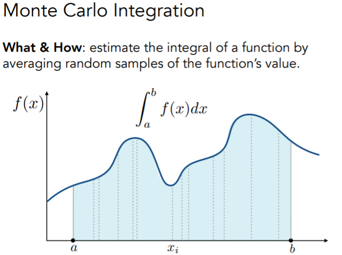

# 路径追踪

Whitted-Style光线追踪的做法是，光线在镜面反射表面弹射，而在漫反射表面停止，这显然是不符合现实的

.png)

其中一个问题，拿经典的Utah teaport为例，whitted光追只能做左图的光照效果，而对于那种有光泽但不全是镜面反射的glossy材质（右图），whitted做出来的效果并不尽如人意

第二个问题，whitted风格光线追踪不考虑漫反射，虽然递归的思想是正确的，但就像下图（康奈尔盒子）所示，whitted的天花板由于接收不到来自环境光照，呈现一个全黑的状态，并且whitted渲染出的长方体并没有表现红墙和绿墙上反射过来的带有色彩的光，相比之下，路径追踪的结果就真实很多

.png)

## 求解渲染方程

对于之前的渲染方程，我们可以用蒙特卡洛积分法进行求解

忽略自发光项（仅计算直接光照），简单考虑均匀采样的情况，半球立体角范围$[0,2\pi]$，因此$pdf(x)=\frac{1}{2\pi}$
$$
\displaylines{
\begin{aligned}
L(p,\omega_{output})
&=\int_{\Omega+}L(p,\omega_{input_i})·
f_r(p,\omega_{input_i}\rightarrow\omega_{output})·(n·\omega_{input_i})d\omega_{input_i}\\\\
&\approx\frac{1}{N}\sum_{i=1}^{N}
\frac{L(p,\omega_{input_i})·f_r(p,\omega_{input_i}\rightarrow\omega_{output})·(n·\omega_{input_i})}{pdf(\omega_{input_i})}
\end{aligned}
}
$$

用伪代码表示：

```伪代码
shade(p,w_o)
	Randomly choose N directions wi~pdf //采样N个方向分别打光
	Lo = 0.0;
	for each wi
	{
		Trace a ray r(p,wi);
		if a ray hit the light //若打到光源，则累加
			Lo += (1/N) * L_i * f_r * cosine / pdf(wi);
	}
	return Lo;
```

接着，引入间接光照

要知道着色点P因Q的反射获得多少能量，其实就相当于摄像机在P点处计算Q的直接光照

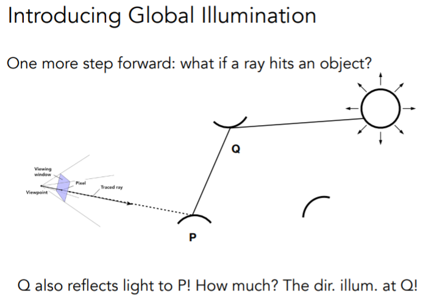

那么就只需要在上述伪代码中加一条判断，看看这条光线有没有打到其他物体

```
shade(p,w_o)
	Randomly choose N directions wi~pdf //采样N个方向分别打光
	Lo = 0.0;
	for each wi
	{
		Trace a ray r(p,wi);
		if ray r hit the light //若打到光源，则累加
			Lo += (1/N) * L_i * f_r * cosine / pdf(wi);
		else if ray r hit an object at q
			Lo += (1/N) * shade(q,-wi) * f_r * cosine / pdf(wi); //若打到物体，则递归
	}
	return Lo;
```

至此，基本的求解渲染方程已经有了大概的架构，但代码依然存在一些不可忽视的问题

## 完善代码

递归递归，有递有归，无非就是要考虑**问题传递的可行性**和**有没有归**这两方面因素

# 问题传递的可行性

p的着色需要q的环境光照信息，而q的环境光照信息又必须包含其他物体的环境光照信息，如此需要追踪的光线数量会呈指数级增长

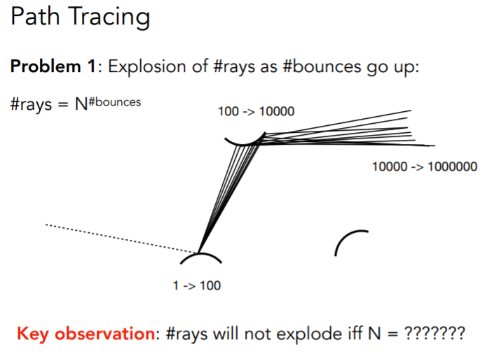

只有当采样数为1的时候，即N=1时，才不会受到这种影响，路径追踪也因此得名（N$\neq$1时称为分布式光线追踪）

虽然但是，这样一来误差就会特别大，渲染结果势必会有非常多的噪点，为了解决这个问题，我们对单个像素计算多次路径追踪结果，随后求平均，这个过程其实也用到了蒙特卡洛方法

修改伪代码，得到路径追踪渲染方程

```
shade(p,w_o)
{
	Randomly choose One directions wi~pdf //采样1个方向打光
	Trace a ray r(p,wi);
	if ray r hit the light //若打到光源，则累加
		return L_i * f_r * cosine / pdf(wi);
	else if ray r hit an object at q
		return shade(q,-wi) * f_r * cosine / pdf(wi); //若打到物体，则递归
	return Lo;
}

ray_generation(cam_pos,pixel)
{
	Uniformly choose N sample positions within the pixel; //对一个像素采样N个路径
	//对每条路径计算着色后进行累加，注意该处pdf和shade函数中的pdf并不相同，这里是对像素采样的pdf
    for each sample in the pixel
	{
		shoot a ray r(cam_pos,cam2sample);
		if ray r hit the scene at p
			pixel_radiance += 1/N * shade(p,sample2cam)/pdf;
	}
	return pixel_radiance;
}
```

# 递归结束条件

很容易看出，上述算法的递归没有终止条件，放到现实中这也是非常合理的，因为现实中的光并不会弹射一定次数后终止弹射，而会一直弹射下去，在算法中强行设置终止次数结束递归不满足现实情况的能量守恒定律，会有一定亮度差异（弹射3次和弹射17次的亮度差异是非常明显的），为了解决这一问题，我们需要用到与俄罗斯轮盘赌类似的思想

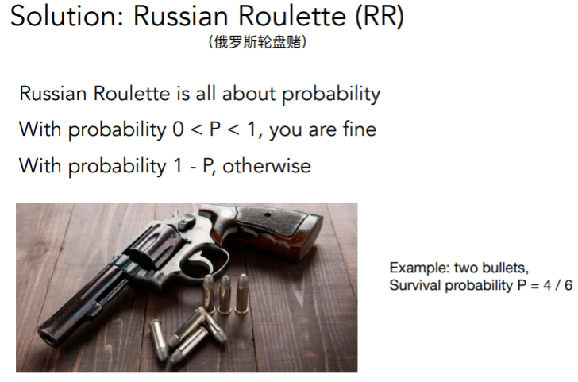

这个思想其实就是一个伯努利分布（均匀分布）概念，让光线在每个弹射点都有一定概率继续弹射，设这个概率为p，那么光线停止弹射的概率为（1-p），为了得到相同的路径追踪结果，意味着这个伯努利实验的期望值必须保持Lo不变，那么我们可以巧妙的认为p概率继续弹射得到的能量是$\frac{Lo}{p}$（终止弹射的结果很自然就是0）
$$
E=P·\frac{Lo}{P}+(1-p)·0=Lo
$$
总结到伪代码

```
shade(p,w_o)
{
	Manually specify a probability P_RR；
	Randomly select ksi in a uniform dist. in [0,1]； //取0-1的一个随机数
	if (ksi > P_RR)
		return 0.0;
		
	Randomly choose One directions wi~pdf //采样1个方向打光
	Trace a ray r(p,wi);
	if ray r hit the light
		return L_i * f_r * cosine / pdf(wi) / P_RR;
	else if ray r hit an object at q
		return shade(q,-wi) * f_r * cosine / pdf(wi) / P_RR;
	return Lo;
}
```

这样一来，我们就有了一个合理的递归终止条件

*思考：闫老师上课提了一个问题，对于分布式光线追踪，这个期望值是多少*

*答：$E=\frac{p}{(1-p)^2}$，证明如下*
$$
displaylines{
\sum_{n=1}^\infty np^n=p+2p^2+3p^3+···+np^n ①\\\\
p\sum_{n=1}^\infty np^n=p^2+2p^3+···+(n-1)p^n+np^{n+1} ②\\\\
①-②:(1-p)\sum_{n=1}^\infty np^n=p+p^2+p^3+···+p^n-np^{n+1}=\sum_{n=1}^\infty p^n=\frac{p}{1-p}\\\\
E=\sum_{n=1}^\infty np^n=\frac{p}{(1-p)^2}
}
$$

## 优化算法

至此，我们的路径追踪算法已经做到完全正确，但又出现了一个矛盾点，即像素的采样率

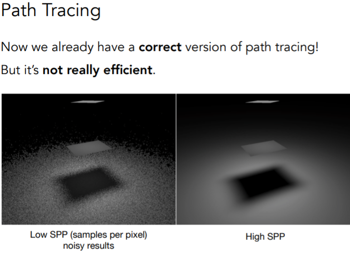

上左图为采样率较低的情况，渲染速度快，效果差，右图采样率较高，效果好，但渲染速度慢

引发这个矛盾的原因是光源大小的不确定性，我们的算法在计算间接光照的时候，可能在采样路径半当中还没弹射到光源就被俄罗斯轮盘终止掉了，相当于这次计算算了个寂寞。面对大的光源，这种情况会很少，而一旦碰上了小光源，这种浪费现象会频繁发生，这是我们不希望看到的，所以我们就想能不能不用这种基于着色点采样的方式，而改为一种基于光源的pdf

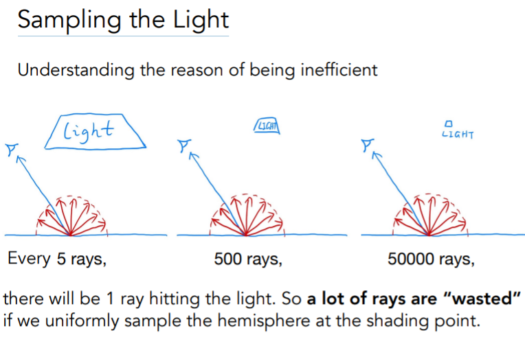

先不考虑光源和着色点之间有物体阻挡这种情况，把光源视为一个矩形表面，直接在光源上采样，就不会发生这种浪费

设着色点法线为n，光源平面的法线n’，如图

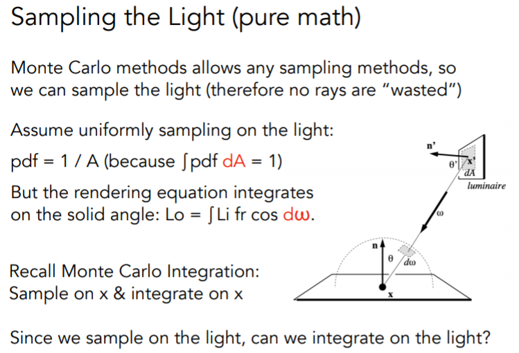

设光源平面面积为A，采样面积dA，则对光源均匀采样的pdf为$\frac{1}{A}$（原因见上图ppt），问题是，之前提渲染方程的时候，都是采样到哪个点就计算哪个点的立体角的积分，这里在光源上采样，却还用着着色点的立体角微分，这显然是不对的

因此，我们需要对积分域做一个变换，即找到$d\omega$和$dA$的关系

先算$dA·cos\theta'$求出$dA$在$d\omega$上的投影，再通过立体角定义，求得
$$
d\omega=\frac{dAcos\theta'}{|x'-x|^2}
$$
重写渲染方程
$$
L(p,\omega_{output})=\int_{\Omega+}L(p,\omega_{input_i})·
f_r(p,\omega_{input_i}\rightarrow\omega_{output})·cos\theta \ d\omega_{input_i}\\
=\int_{\Omega+}L(p,\omega_{input_i})·
f_r(p,\omega_{input_i}\rightarrow\omega_{output})·\frac{cos\theta ·cos\theta'}{|x'-x|^2} \ dA
$$


之前对着色点采样，是一条路径上每弹射一次就判断一次是否继续递归，对于光源采样，思路要进行微调，即分为两部分计算，一部分是光源直接对着色点的影响，另一部分是光源的间接影响

翻译到伪代码

```c
shade(p,wo)
{
	// Contribution from the light source.
	Uniformly sample the light at at x';	//pdf_light = 1/A
	L_dir = L_i * f_r * cosθ * cosθ' / |x'-p|^2 / pdf_light;

	// Contribution from other reflectors
	L_indir = 0.0;
	Test Russian Roulette with probability P_RR;
	Uniformly sample the hemisphere toward wi;	//pdf_hemi = 1 / 2pi
	Trace a ray r(p,wi);
	if ray r hit a non-emitting object at q
    		L_indir = shade(q,-wi) * f_r * cosθ / pdf_hemi / P_RR;
	return L_dir + L_indir;
}
```

还没完，回到没考虑的光源和着色点之间有物体阻挡的情况，需要额外再加一个判断

```c
shade(p,wo)
{
	# Contribution from the light source.
	Uniformly sample the light at x';	//pdf_light = 1/A
	Shoot a ray from p to x';
	if the ray is not blocked in the middle
		L_dir = ...
    	...
}   
```

总结一下路径追踪的整体思路：由像素采样打出追踪路径确定需要计算的着色点，再光源采样计算每个着色点的着色信息，返回给像素

看下结果

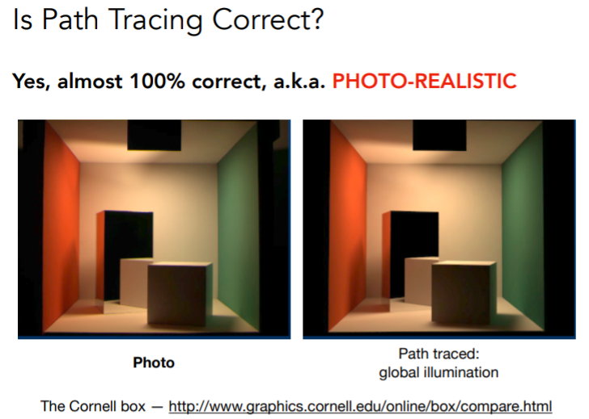

可以看到，路径追踪几乎可以做到100%正确

# 总结

现代的光线追踪已经不再仅仅是指Whitted风格光线追踪了，Ray-Tracing可以被理解为一切模拟光线传播的方法的集合，如双向路径追踪，光子映射等等等等。计图是一个很深的坑，一门入门课肯定有很多东西覆盖不到，就拿路径追踪来说——

蒙特卡洛积分应该用什么pdf？（重要性采样）

计算机自带的随机数真的正确么？（随机数质量）

对着色点采样和对光源采样二者能否结合？（多重重要性采样 IMS）

对像素的采样需要如何加权？

最后得到的结果是radiance，如何转化为像素颜色？（伽马矫正）

......

路径追踪仍然是入门级别的内容......敬畏科学吧

