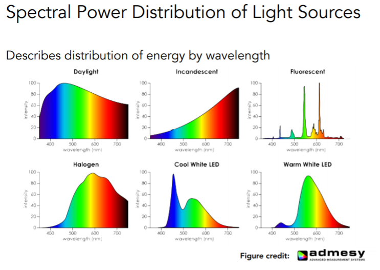
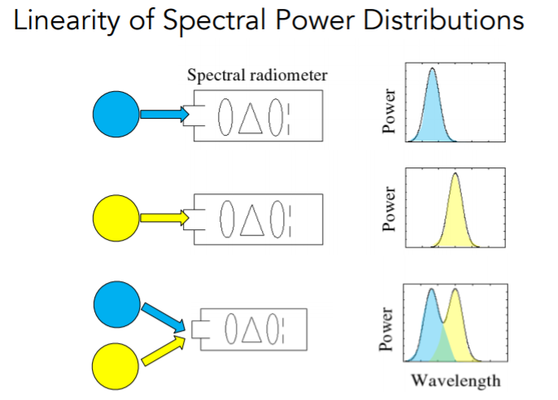

# 颜色的物理学基础

人们对颜色的研究是从牛顿三棱镜色散实验开始的，自此之后人们就意识到有色光是不同波长的光混合起来的结果这一事实

光之所以会发生色散是因为不同波长的光具有不同的折射率，所有经过色散得到的单色光按波长大小依次排列频谱称为光谱，而图形学仅关心光谱中的可见光（波长范围400~700nm）

在光谱的基础上，我们再提出一个更准确的概念，用**谱功率密度**来描述光线在不同波长的强度分布，如图

SPD具有==线性的性质==，如果两个不同光线叠加，那么他们的谱功率密度分布就是他们各自的SPD相加的结果

# 颜色的生物学基础

从生物学角度看色彩，我们发现颜色是人类的感知，而并不是光线本身的属性，同样的光线在其他动物眼里呈现的色彩是不一样的，正是因为人类具有丰富的视觉细胞，才能感受到不同波长的光所组成的多彩的世界

来看看生物学上关于人类的视觉器官的结构：

|  |  |
| ------------------------------------------------------------ | ------------------------------------------------------------ |

人类眼球可以类比为一个摄像机，晶状体就相当于透镜，视网膜相当于传感器，而调整焦距的过程是由肌肉拉扯晶状体来完成的

在视网膜上有各种感光细胞，总体上分为视锥细胞和视杆细胞两类，视杆细胞用来感知光强，视锥细胞感知颜色

视锥细胞还可以进一步分为S，M，L三类，不同的视锥细胞对不同波长的光的敏感度不同，而不同人的这三种视锥细胞的分布也不同，这也说明了在不同人眼里看到的世界是截然不同的

|  |  |
| ------------------------------------------------------------ | ------------------------------------------------------------ |

对于一条光线，人眼这三种视锥细胞感知到的结果，分别都是==细胞对波长的响应程度==和==谱功率密度==乘积的积分

如此得到对应的SML值后，将其相加混合（格拉斯曼定律），就得到了最后我们感觉到的颜色

人眼处理外界颜色信息的过程：

光线（带有spd信息）	→	视锥细胞将spd转化成sml	→	大脑将接受到的sml与感觉到的颜色一一对应

也就是说，人所感知到的颜色信息并不是光线本身的spd属性，而是视锥细胞sml所接受到的信息

# 色彩空间

## 同色异谱

既然我们感受到的不是spd，那理论上不同spd的光也有可能被人眼处理为相同的颜色，这种现象是实际存在的，即我们所说的“同色异谱”

正是因为有这个现象，我们才能通过计算机进行颜色匹配，从而调和不同光谱来模拟我们想要得到的颜色

## 色匹配函数

色匹配函数其实是建立在实验基础上的

实验过程大致是，用一块不透明挡板将一个屏幕分割为两个区域，左边照射要被匹配的颜色的光线，右边同时用rgb三种颜色的光同时照射，然后调节右边三种颜色光源的强度，直到左右两边的颜色看上去一样为止，随后记录对应需要的rgb强度，如此反复，将光谱上所有颜色依次匹配，最后得到曲线就是色匹配函数——==CIE-RGB==

这时候我们发现，红色曲线部分地方出现的负值，这是因为在一些情况下，无论怎么调节右侧的光源强度，都无法得到期望的颜色，只能通过在左边的颜色上加上三色光的一种或几种来完成匹配，在左边加，就等价于在右边减，所以出现负值是在情理之中的

## CIE-XYZ空间

虽然色匹配函数允许出现负值，但负数的出现多少对计算会造成一些影响，为了消除这种影响，国际照明委员会（CIE）就对原来的色匹配函数做了一次线性变换，提出了一种所有分量都为正值的颜色空间，就是我们所谓的CIE-XYZ空间

因为只是在原来基础上做了一次线性空间的变换，所以既然CIE-RGB可以表示所有颜色，CIE-XYZ也可以，二者之间是完全等价的

## 色域&屏幕色彩空间

由上我们知道，任何一个颜色都能被三个参数的线性组合表示出来，也就是说颜色本身属于一种三维的信息

为了更方便表示，我们通常会将其降至二维，通过归一化使三个参数的和为1，这时候就只需要两个参数就能表示颜色空间中任意一个颜色了，而这种表示方式所得到的颜色集合，我们就称之为色域

但是到这里为止，我们还是无法将颜色显示在计算机的屏幕上，因为计算机屏幕并不是人眼，他所支持的色域通常会比可见光色域小得多，那这时候我们就必须把计算得到的 XYZ 转换到屏幕空间中（空间变换和gamma校正），而因为不同设备的转码方式不同，就形成了不同设备各自的色彩空间

由上图我们可以直观的看到不同色彩空间所能表示的色域范围

常见的色彩空间有sRGB，Adobe RGB等，还有一些其他的RGB空间，比如用色调、饱和度、亮度表示的色彩空间HSV，和CIE用互补色表示的色彩空间等，就不再一一列举了

|                             HSV                              |                           CIE-LAB                            |
| :----------------------------------------------------------: | :----------------------------------------------------------: |
|  |  |

关于CIE-LAB的互补色，还可以多提几句，美术中的互补色通常指红黄蓝（RYB）色相环中成180°角的两种颜色，这两种颜色放在一起会给人一种强烈对比的色觉，并有时会产生主观上的感知错觉（详例见ppt），这进一步证明色彩是人的感知，而不是光本身的属性

关于这方面知识更为系统的解释：

https://zhuanlan.zhihu.com/p/24214731

https://zhuanlan.zhihu.com/p/24281841

gamma校正：

| .jpg) | .jpg) | .jpg) |
| ------------------------------------------------------------ | ------------------------------------------------------------ | ------------------------------------------------------------ |

https://zhuanlan.zhihu.com/p/36581276

https://blog.csdn.net/candycat1992/article/details/46228771/

关于三原色：

光学三原色和绘画三原色是不一样的，光学三原色是红绿蓝rgb，美术三原色是品红，黄和靛青

光学三原色是加色模型，美术三原色是减色模型

|  |  |
| ------------------------------------------------------------ | ------------------------------------------------------------ |

右图为UE中材质结点关于加色模型和减色模型的一个直观展示