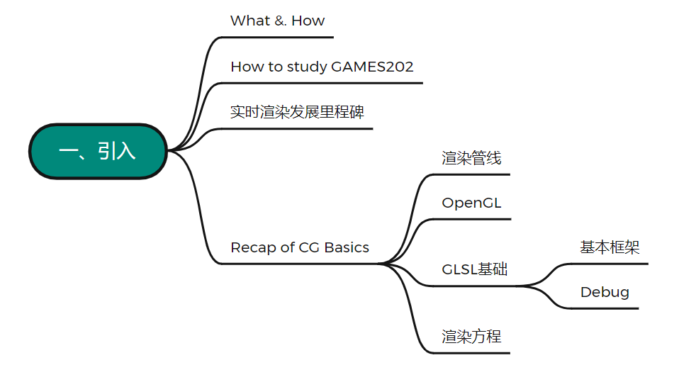
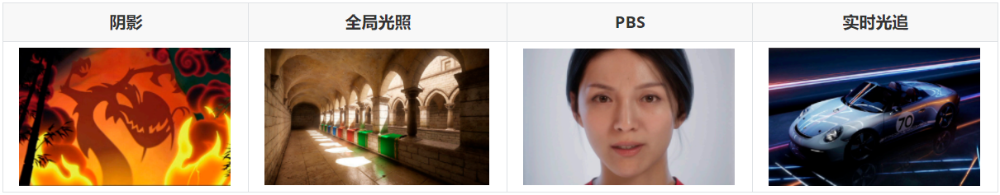
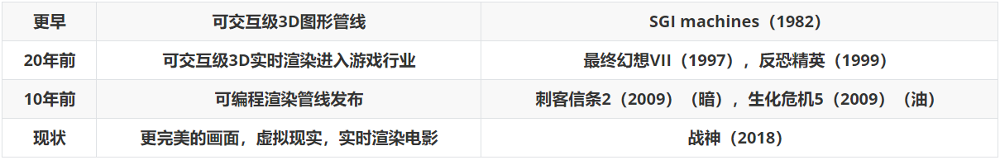
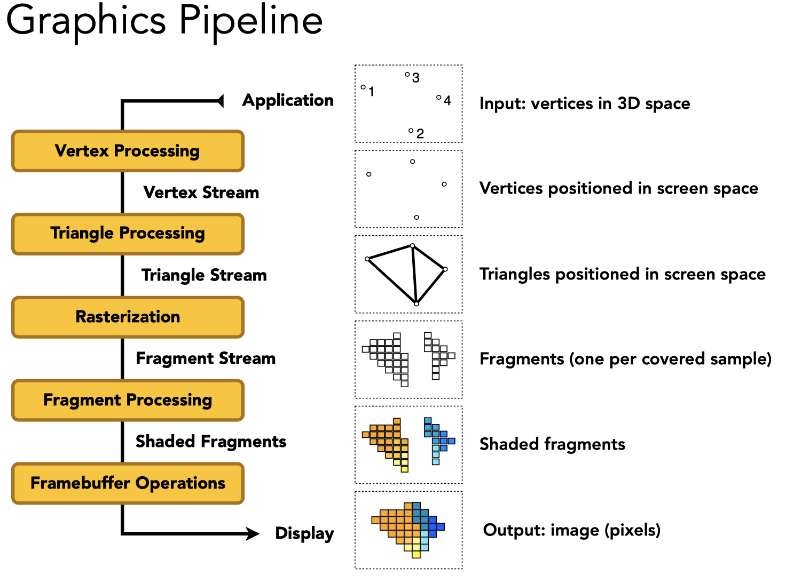
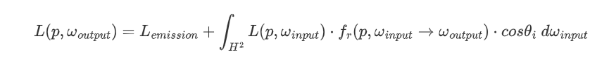
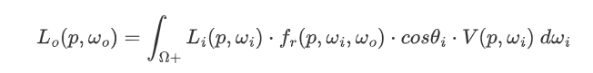
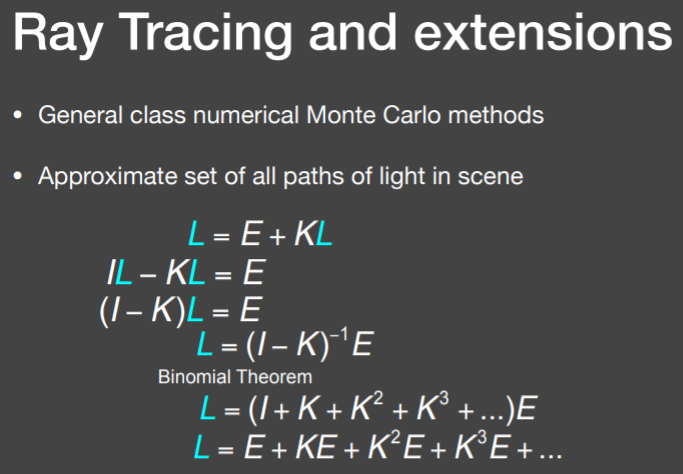
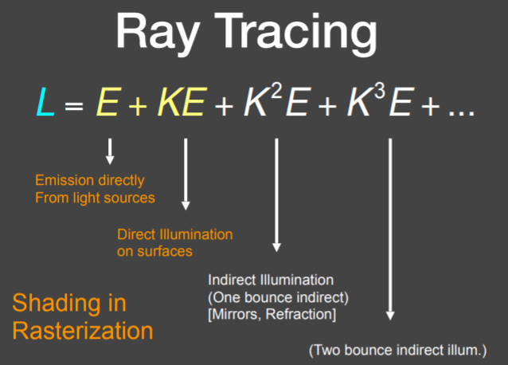

# What is GAMES202 About



一共两个关键词，一个<u>高质量</u>，一个<u>实时</u>

首先是**实时**，一般来计算机图形学中所说的实时所要求的标准是30fps，VR/AR要求更高，需要达到90fps

与实时渲染相对的是离线渲染，更多的应用于影视行业，渲染一帧的时间非常之久，渲染结果也相应的更加真实

而介于离线渲染和实时渲染之间的渲染，则被称为交互式渲染（interactive rendering），低于30fps，但也不会太低（卡成ppt）

其次是**高质量**，渲染的究极目标是以假乱真，为了获得更高质量的结果，就要面临极其昂贵的计算，这种trade off在101中经常性的被提及。但是，人类的本质是贪婪的，怎么做到“我全都要”，即在保证在实时的情况下，让结果尽可能的物理（近似）正确，是非常大的一个挑战

至于**渲染**，则可以理解为在一个3d场景中，通过计算生成图片（来模拟光线等信息）的过程

总之，课程内容可归纳为以下四个部分：



内容较101更分散，包括但不限于环境映射（Environment Mapping），非真实感渲染（NPR），球面谐波函数（SH），抗锯齿与超采样等等等等，难度并不会比101的路径追踪大，但需要101的知识做铺垫

另外，202不会包含如下内容：

* 建模，引擎（不教工具使用方法，只会教这些工具背后的工程或科学原理，太偏应用不会提及）
* 离线渲染（卫星？难度极大）
* 神经渲染（Neural Rendering，做不到“实时”和“高质量”，但会提一些成功的应用，如DLSS）
* 怎么用OpenGL之类的着色语言，以及有关着色器的优化，或高性能计算（CUDA）


# How to study GAMES202

首先要清楚一件事：科学$\neq$技术，**科学=知识**，**技术=让科学理论落地**，二者并不等价，但同等重要

简单来说就是  **科技=科学+技术**，比如虚幻这些商业引擎，它们背后的科学原理非常简单，但真正实现过程中所采用的技术，使得他不论在效率还是易用性上都更胜一筹。从另一点来说，工业界在实时渲染上的发展也远远领先于学术界，一方面是需求推动，另一方面也可以说业界已经逐渐形成了从提出问题到解决问题的闭环，加上知识产权之类的问题，最后导致了这一奇怪现象，这也某种程度上算是证明了科学与技术的不等价关系

其次，欢迎倍速（×1.25）（但我还是习惯原速）

一些要求：

* 对渲染或图形学感兴趣（很重要）
* 图形学基础和一些高数知识储备
* 基本的GLSL基础，课程用WebGL，跨平台没有任何问题
* 不需要买显卡，不需要买书（rtr4可以作为参考），参考资料在BBS上都有
* 没必要用IDE，作业独立完成


# 发展里程碑

实时渲染的历史可能比离线渲染还要悠久

|    更早    |            可交互级3D图形管线            |                 SGI machines（1982）                 |
| :--------: | :--------------------------------------: | :--------------------------------------------------: |
| **20年前** |    **可交互级3D实时渲染进入游戏行业**    |      **最终幻想VII（1997），反恐精英（1999）**       |
| **10年前** |          **可编程渲染管线发布**          | **刺客信条2（2009）（暗），生化危机5（2009）（油）** |
|  **现状**  | **更完美的画面，虚拟现实，实时渲染电影** |                   **战神（2018）**                   |

预计算（15年前）：以牺牲存储空间为代价，提前将复杂的效果算出来，从而减少实时渲染的消耗

可交互级光线追踪（8-10年前，CUDA+OptiX）：先在gpu上用较低的采样率算出一个噪声很多的结果，然后快速做一次降噪，在多gpu加持下可以做出不错的效果




# Recap of CG Basics

## 渲染管线



光栅化，深度缓存，着色模型，插值......详细可参考101 p7，或《入门精要》p9

| **Q：光栅化前的三角形设置是怎么知道连接哪些顶点的？**        |
| ------------------------------------------------------------ |
| **A：这是在obj这类格式的文件中被定义的，由点到面，在每个面上都带有三个顶点的坐标信息** |
| **Q：有没有适合全局光照的渲染管线？**                        |
| **A：目前暂时还没有，但光线追踪的渲染管线是已经非常完善了的** |
| **Q：纹理坐标是怎么参数化的？**                              |
| **A：看102，可以理解为物体外面有个盒子，参数化的过程就是把盒子挤压到物体上（降维），而盒子上的uv信息是很方便获取的** |

## OpenGL

是一系列通过CPU调动GPU的API之一，是一种图像应用编程的接口，所以具体用什么语言并不重要，重要的是怎么去写（背后的逻辑）

OpenGL（GLSL）具有良好的跨平台性，但迭代过于碎片化，且是C风格的代码，不具备任何面向对象的概念

DirectX（HLSL/Cg）相较之下对硬件的兼容性就比较高，但作为完全由微软控制的着色器编译，在平台上的限制就比较大，基本仅限于微软自己的产品

Vulkan可以理解为OpenGL的后续版本，支持多线程，可以跨除苹果以外的所有平台，是目前最新的一套图形接口

具体可以参考《入门精要》2.4.1

我们可以用画油画的步骤来类比OpenGL的架构

**1、摆放绘制物体**

获取模型信息，确定模型渲染位置。这个过程是有顶点缓冲对象（VBO）来完成的，它与obj格式文件非常类似，只不过他是在gpu中开辟出来的一块空间，用来储存点的位置和连接方式等信息，通过OpenGL定义的一些函数，可以对其进行空间变换和一些其他的运动

**2、摆放画架**

确定相机位置，进行视口变换（透视or正交）

**3、摆放画布**

FrameBuffer帧缓冲，对场景渲染一次可以渲染出很多纹理（MRT），至于对应关系，则会在之后的片元着色器中指定

在MRT中有一个特殊的渲染目标是直接渲染到屏幕，因为这么做会造成帧与帧之间的渲染结果覆盖，导致画面撕裂，所以一般不推荐这么做。当然，可以通过设置“垂直同步”来解决这一问题，或者把渲染的结果储存在缓冲区里，确认无误再在屏幕上渲染（双重缓冲/多重缓冲）

**4、在画布上进行绘制**

即着色，202只会用到顶点着色器和片元着色器

先由顶点着色器做MVP映射，再在片元着色器上进行插值、深度测试等操作，而将顶点打散为三角形的光栅化过程，则是由OpenGL来完成的

**5、画完了可以换一张画布接着画**

1-4是一次渲染，一次渲染就是一个pass（一个pass可以输出多张图到一个frambuffer）

换个画布就是换个pass，而在每个pass里都包含如下过程

* 指定渲染对象，指定相机
* 指定输出对象（渲染到哪个纹理）
* 定义顶点/片元着色器，进行绘制

**6、画新的画可以参考之前画的画**

在之前的pass渲染好的纹理可以作为参考，为别的pass提供信息（多pass渲染，《入门精要》中第一次出现是在第八章的透明效果）

| **Q：shadowmap？光源也需要深度测试吗？**                     |
| ------------------------------------------------------------ |
| **A：shadow map可以去101 p12最后部分复习一下，场景中有几个光源就要几张shadow map，光源也需要纳入深度测试** |
| **Q：opengl支持optix吗？**                                   |
| **A：可以是可以，但别指望shader能调用一个光线和一个场景怎么运作** |
| **Q：纹理是不是个buffer？**                                  |
| **A：opengl里两者定义不一样，但也可以这样理解，都是显存里的一块缓存区域** |
| **Q：一个pass就是一个frame buffer渲染一次？**                |
| **A：可以理解为一个场景渲染一次**                            |

## GLSL基础

之前说过，GLSL是OpenGL的着色语言，用来描述着色器的各种不同操作，整体是C风格的语言，没有类的概念，但可以用结构体写

在着色语言出现以前，人们是在GPU上用汇编语言编写这些操作的，因此着色语言大大降低的图形编程的门槛

最早的着色语言是斯坦福的SGI，随后有了C for Graphics，再到现在主流的HLSL

*题外：Unity是可以用GLSL或其他的着色语言的，用相应的片段包裹就行了（只不过入门精要用的是CG罢了）*

# 基本框架

其实和在cpu上编程差不多：

编写shader -> GPU编译shader -> 建立program，集合所有自定义的shader -> 链接并检查有没有问题 -> 渲染

初始化：

```glsl
//shader初始化代码（不做要求）
GLuint initshaders (GLenum type, const char *filename) {
	// Using GLSL shaders, OpenGL book, page 679 
	GLuint shader = glCreateShader(type);
	GLint compiled;
	string str = textFileRead (filename);
	GLchar *cstr = new GLchar[str.size()+1];
	const GLchar *cstr2 = cstr; // Weirdness to get a const char
	strcpy(cstr,str.c_str());
	glShaderSource (shader, 1, &cstr2, NULL);
	glCompileShader (shader);
	glGetShaderiv (shader, GL_COMPILE_STATUS, &compiled);
	if (!compiled) { 
		shadererrors (shader);
        throw 3;
    }
    return shader;
}

GLuint initprogram (GLuint vertexshader, GLuint fragmentshader){
	GLuint program = glCreateProgram();
    GLint linked;
	glAttachShader(program, vertexshader);
	glAttachShader(program, fragmentshader);
	glLinkProgram(program);
	glGetProgramiv(program, GL_LINK_STATUS, &linked) ; 
 	if (linked)
        glUseProgram(program);
	else { 
 		programerrors(program);
 		throw 4;
    }
	return program;
}
```

顶点着色器：

```glsl
//attribute定义只在顶点着色器中出现的关键字
attribute vec3 aVertexPosition;
attribute vec3 aNormalPosition;
attribute vec2 aTextureCoord;

//uniform定义全局变量
uniform mat4 uModelViewMatrix;
uniform mat4 uProjectionMatrix;

//varying定义需要被传递到片元着色器的关键字
varying highp vec2 vTextureCoord;
varying highp vec3 vFragPos;
varying highp vec3 vNormal;

void main(void){
	vFragPos = aVertexPosition;
    vNormal = aNormalPosition;
	gl_Position = uProjectionMatrix * uModelViewMatrix * vec4(aVertexPosition，1.0);
    vTextureCoord = aTextureCoord;
}
```

片段着色器：

```glsl
//更多的全局变量
uniform sampler2D uSampler;//sampler2D是纹理的数据类型
uniform vec3 uKd;
uniform vec3 uKs;
uniform vec3 uLightPos;
uniform vec3 uCameraPos;
uniform float uLightIntensity;
uniform int uTextureSample;

//highp定义计算精度
varying highp vec2 vTextureCoord;
varying highp vec3 vFragPos;
varying highp vec3 vNormal;

void main(void) {
	vec3 color;
	if (uTextureSample == 1){
		color = pow(texture2D(uSampler, vTextureCoord).rgb, vec3(2.2));//2.2是伽马校正
    }
    else{
		color = uKd;
    }
    //环境光
    vec3 ambient = 0.05 *color;
    //漫反射
    vec3 lightDir = normalize(uLightPos - vFragPos);
    vec3 normal = normalize(vNormal);
    float diff = max(dot( lightDir, normal), 0.0);
    float light_atten_coff = uLightIntensity / length(uLightPos - vFragPos);
    vec3 diffuse = diff * light_atten_coff * color;
    //镜面反射
    vec3 viewDir = normalize(uCameraPos - vFragPos);
    float spec = 0.0;
    vec3 reflectDir = reflect(-lightDir, normal) ;
    spec = pow (max(dot(viewDir, reflectDir)， 0.0)，35.0);
    vec3 specular = uKs* light_atten_coff * spec;
    
    gl_FragColor = vec4( pow((ambient + diffuse + specular)，vec3(1.0/2.2))，1.0);
}
```

# Debug

难以调试的原因：编译好的shader是在gpu上运作的，调试会涉及到cpu和gpu的通信，必须使用外部工具才能实现

多年以前的调试工具，只有NVIDA的Nsight with Visual Studio，并且只能调试GLSL，HLSL还得在软件上运行才能debug

而现在，调试工具就丰富了，有Nsight Graphics（跨平台，但不跨硬件，只支持NVIDA），还有RenderDoc（对显卡品牌没要求）

更粗暴的可以用RGB调试法，具体参考《入门精要》5.5

| Q：不同shader里定义的变量互通吗？ |
| --------------------------------- |
| **A：不互通**                     |

## 渲染方程

$$
L(p,\omega_{output})=L_{emission}+\int_{H^2}L(p,\omega_{input})·
f_r(p,\omega_{input}\rightarrow\omega_{output})·cos\theta_i \ d\omega_{input}
$$

渲染方程是一个用来描述光线传播的等式，在101中扮演着非常重要的角色，是路径追踪的基础

这个等式表述的是，任意一点p反射到摄像机的radiance都等于该点发出的radiance + 其他打到该点的radiance × brdf × cos

实时渲染的渲染方程有一些区别：
$$
L_o(p,\omega_o)=\int_{\Omega+}L_i(p,\omega_i)·
f_r(p,\omega_i,\omega_o)·cos\theta_i·V(p,\omega_i)\ d\omega_i
$$
其中，BRDF可能指$f_r(p,\omega_i,\omega_o)$，也有可能指$f_r(p,\omega_i,\omega_o)·cos\theta_i$

$V(p,\omega_i)$是visibility项，考虑物体会不会被光源照到，通常定义为一张Cube Map或一张Sphere Map

注意，渲染方程的计算是像素级别的，非常消耗资源，有关这一点后续还会进一步提到

另外还有关于光线追踪渲染方程的递归定义，还是一样，回101复习吧









