# Shadow Mapping 阴影映射

提到阴影，就不得不从Shadow Mapping开始说起，它是最早被应用于离线渲染的硬阴影的手法，也是现在的一种家喻户晓的渲染技术

## Recap

首先上图，先复习一下

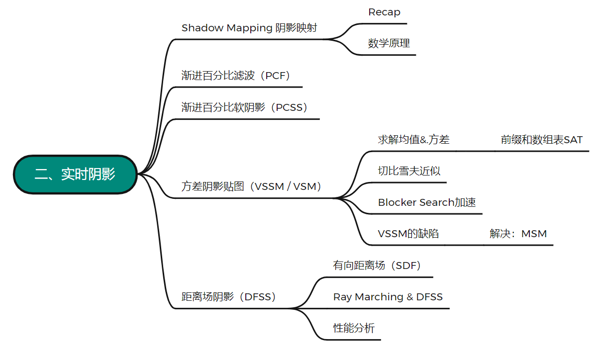

简单来说，它是一个2-pass算法，要用到两个pass（可以理解为渲染两遍），第一个pass先从光源出发，将==光源空间的深度值==写入阴影映射纹理（也就是所谓的shadow map），这张纹理表示场景哪里会被光源照亮；第二个pass从摄像机出发，将==屏幕空间的深度信息==写入z-buffer，再将当前像素的屏幕空间深度转换到光源空间中，并与shadow map上查询到的深度值相比较，若shadow map上的深度值小于屏幕空间的深度，就说明当前渲染位置产生了阴影（《入门精要》p197）

关于比较shadow map深度与屏幕空间的深度，有两种方法，一种是用深度缓存比较z分量，另一种是直接比较线性距离（光源坐标、相机坐标和图元坐标代入距离公式...），绝大多数情况下是用的第一种，也就是z分量比较（因为缓存速度快？）

而至于shadow map产生的问题，主要分为两种，一种是==自遮挡==（shadow acne，阴影失真），另一种是==走样==

自遮挡现象产生的原因有二，其一是处理器的数值精度的限制，还有一个原因是因为shadow map本身保存的值是离散值，也就是说shadow map上每个采样点都代表着一块范围内图元的深度值，因此在第二个pass比较深度的时候，shadow map中的深度可能会略低于物体表面的深度，部分片元就会被误计算为阴影，导致自遮挡。该现象在光源与平面趋于平行时（掠射）尤为严重

| 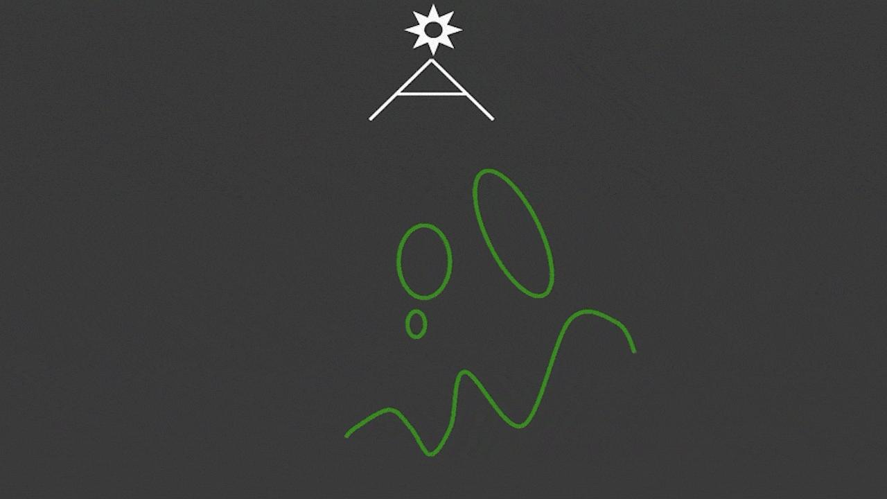.png) | 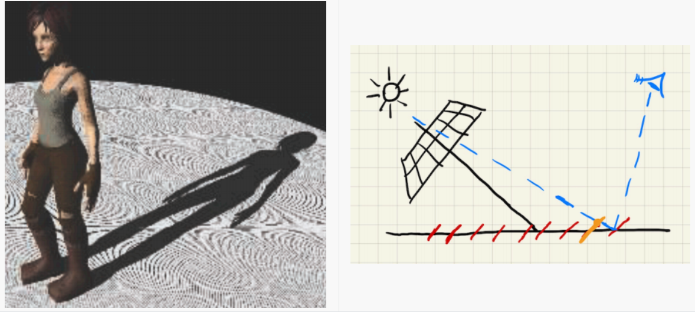.png) |
| ------------------------------------------------------------ | ------------------------------------------------------------ |

为了解决这个问题，我们可以在shadow map中引入一个偏移值（bias），使得每次在比较深度大小的时候，都将一定区间内的shadow map深度认作与屏幕空间深度相等，强行减弱阴影判定。但这样做又会引入一个新的问题——detached shadow，或者说，peter panning（阴影悬浮）——即丢失部分原本可能发生遮挡的阴影

| 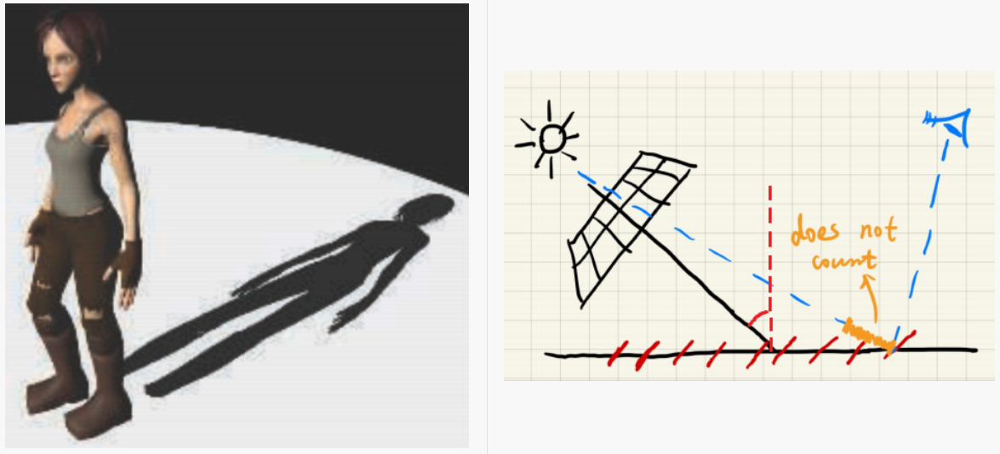.png) | 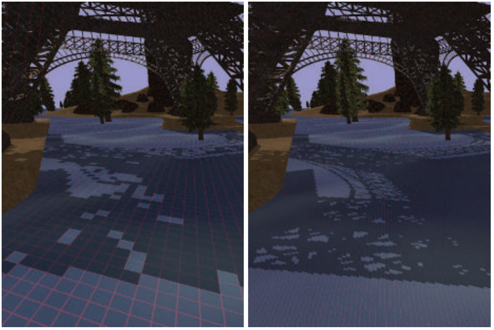.png) |
| ------------------------------------------------------------ | ------------------------------------------------------------ |

解决阴影悬浮有两种方法，一种是将偏移值与入射角相关联，可以在OpenGL中通过glPolygonOffset来设置，入射角越大，偏移量越大，还有一种是second-depth shadow mapping，即在生成shadow map时使用最小深度和次小深度（正面剔除）的中间值，但使用这种方法也就意味着计算阴影的时间会随之翻倍，并且它还存在着封闭物体的局限性（只适用于盒体，球体这类非面片物体），因此在工业界这种方法并没有得到大范围的使用

另外有一点值得强调的是，不要小看翻倍的代价，在实时渲染中，开发者通常只会关注算法的绝对速度（以ms计），而不会去关注算法的时间复杂度，正所谓RTR does not believe in COMPLEXITY，就是这个道理

除了自遮挡，剩下还有一个问题就是走样。产生走样的原因是由于shadow map纹理的分辨率不足导致的，在对shadow map采样时，多个不同的顶点都采样到同一个纹素，从而产生锯齿。这个问题的解决方法与101中的MipMap类似，采用级联阴影（CSM），通过牺牲一些显存来对阴影进行分级，从而提高阴影质量，具体就不再赘述了

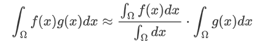

## 阴影映射背后的数学原理

之前提到过，实时渲染是在保证实时的情况下让结果尽可能的**近似**正确，而不苛求结果的绝对正确，因此在这个领域通常会把一些不等式直接当做约等式来用，比如微积分中的施瓦茨不等式和闵可夫斯基不等式....

接下来介绍一个实时渲染中非常重要的约等式
$$
\int_\Omega f(x)g(x)dx\approx\frac{\int_\Omega f(x)dx}{\int_\Omega dx}·\int_\Omega g(x)dx
$$
这个式子的分式部分是一个归一化操作，其实也就是求了一下积分域内$f(x)$的均值

它提供了一种很好的方法，使得能够将乘积的积分拆为两个积分的乘积，并且当$g(x)$的积分域很小时，或当$g(x)$在其积分域内足够光滑（低频）的时候，这个约等式的结果是（更加）准确的

将这个约等式应用于渲染方程
$$
L_o(p,\omega_o)=\int_{\Omega+}L_i(p,\omega_i)·
f_r(p,\omega_i,\omega_o)·cos\theta_i·V(p,\omega_i)\ d\omega_i\\
\approx\frac{\int_{\Omega+}V(p,\omega_i)d\omega_i}{\int_{\Omega+}d\omega_i}\int_{\Omega+}L_i(p,\omega_i)·
f_r(p,\omega_i,\omega_o)·cos\theta_i\ d\omega_i
$$
立刻就可以发现，它将原来的渲染方程变为了Visibility项和Shading项相乘的结果，也就是在说，一边判断可见与否一边算着色结果，和先算着色结果再乘以shadow map的结果是近似相等的，这也就是shadow mapping做硬阴影的背后的理论基础

再考虑这个式子的准确性，积分限足够小对应光源类型为点光源或方向光源，$g(x)$足够低频对应brdf趋近diffuse（光滑材质），当满足这两个条件，这个约等式的准确性是非常高的（注意这里只考虑直接光照，不考虑间接光，当然间接光也可以强行使用，就是没这么准确罢了...）

| Q：离线渲染有这种近似吗？                               |
| ------------------------------------------------------- |
| **A：没见过**                                           |
| **Q：有误差公式吗？**                                   |
| **A：很少，且没有必要从理论上分析这类近似的误差上下界** |

# 渐进百分比滤波（PCF）

一般的Shadow Map只能实现硬阴影，想要实现更加自然的软阴影，需要其他的方法

在介绍PCSS之前，需要先介绍一下PCF（Percentage Closer Filtering）

PCF原本是一种抗锯齿方法，是在Shadow Map采样过程中，一次性取多个光源空间深度（shadow map纹素）与shading point的屏幕空间深度值进行比较，得到二值化数据，再对二值化数据（加权）平均得到非二值数据，从而达到软化阴影锯齿的目的

请注意，这个过程发生在采样过程中，滤波对象既**不是**Shadow Map所使用的深度图（1. 对深度图滤波，没有任何实际意义；2. 对深度图滤完波再做深度上的比较，结果仍是二值化数据，相当于什么都没做），也**不是**光源空间最后得到的阴影结果（非但不会消除锯齿，还会让阴影变糊，在101中有提到过，如下图所示），**而是**比较的光源空间和屏幕空间的深度所得到的二值图，对二值图做 filter（平均or加权）得到visibility，充当阴影软硬的依据

|                  先（采样）渲染再滤波（×）                   |                  先滤波再（采样）渲染（√）                   |
| :----------------------------------------------------------: | :----------------------------------------------------------: |
| 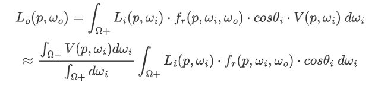.png) | 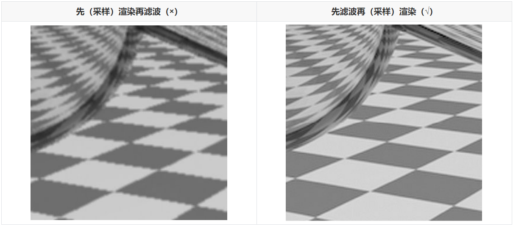.png) |

由下图可以看到，PCF的结果还算不错，很好的消除了锯齿，但首先开销的成倍增加是其中一个问题，其次，这种方法也不能很好的表现现实中投影前实后虚的效果（虽然下右图有景深的因素，但这不影响观察阴影）

|                           PCF结果                            |                           真实情况                           |
| :----------------------------------------------------------: | :----------------------------------------------------------: |
| 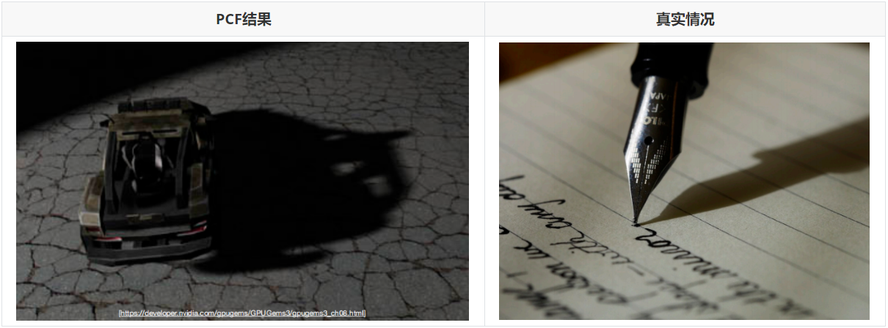 | 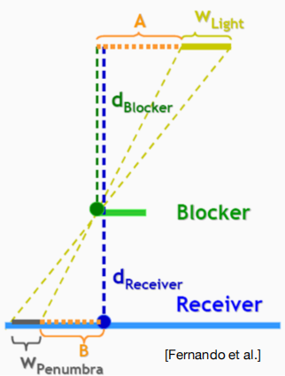 |

# 渐进百分比软阴影（PCSS）

为了达到前实后虚的软阴影效果，就可以采用PCSS（Percentage Closer Soft Shadow），通过计算投影平面与遮挡物之间的距离，来确定滤波范围的大小==（自适应的filter size）==

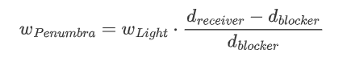

如上图所示，这个filter size由半影区大小决定，半影区的大小可以由下述公式得到（其实就是一个相似三角形的问题）：
$$
w_{Penumbra}=w_{Light}·\frac{d_{receiver}-d_{blocker}}{d_{blocker}}
$$
*（软阴影产生的前提是光源本身具有一定面积，对于这种光源，产生Shadow Map的过程是取光源中间某一点，直接当做点光源来处理）*

PCSS的具体步骤如下：

* 首先依据着色点选择一块范围，对Shadow Map做一次局部深度测试，找到范围内的blocker并计算其平均深度（计算平均深度的目的是减小遮挡物自身的几何影响，避免漏光）
* 得到$d_{blocker}$后代入公式计算滤波范围，$d_{blocker}$越小，$d_{receiver}-d_{blocker}$越大，卷积核越大，得到的阴影就越软
* 重新进行深度测试，继续完成PCF的过程

这里有个问题，filter size可以按上述方法确定了，那么计算filter size时需要用到的$d_{blocker}$同样需要在一定范围内做平均，这个范围又怎么确定呢？我们可以人为规定一个固定的大小，如4\*4，16\*16等，但这么做绝对不是最优解，更好的方法是在光源处设置一个视锥，将shadow map置于近平面上，接着连接着色点和光源，以其在shadow map上所截得的范围作为样本，来计算平均深度

这么做有一个非常大的好处，就是计算$d_{blocker}$也采用了自适应的方法，离光源越远，遮挡物越多，计算blocker所用的样本范围就越小；而离光源越近，遮挡物越少，计算blocker所用的样本空间就越大，非常合理

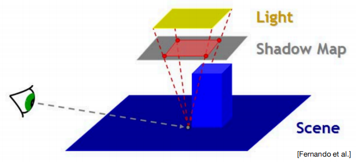

| Q：多光源怎么处理？                                         |
| ----------------------------------------------------------- |
| **A：如果是Shadow Mapping的话，只能一个个算**               |
| **Q：点光源和方向光源怎么做PCSS？**                         |
| **A：前提错了，点光源和方向光源只能产生硬阴影，用不着PCSS** |
| **Q：运动物体怎么办？**                                     |
| **A：这和运动物体没关系，因为每一帧的Shadow Map都会重新算** |

从数学公式上再深入理解一下，如图，设p为当前像素对应在shadow map上的采样点，q为p邻域上另一纹素

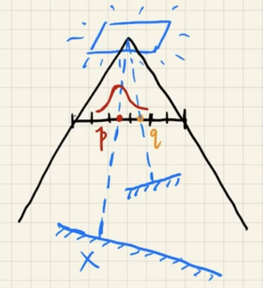

那么PCF计算阴影图的过程就可以表示为下述公式：
$$
V(x)=\sum_{q\in N(p)}w(p,q)·\chi^+[D_{shadow\ map}(q)-D_{scene}(x)]
$$
其中权重$w(p,q)$可以由p和q之间的距离来定义，而乘号后的符号函数 $\chi^+[D_{}(q)-D(x)]$ 就是深度测试的过程
$$
V(x)\neq \chi^+\{[w*D_{shadow\ map}](q)-D_{scene}(x)\}\\
V(x)\neq \sum_{y\in N(x)}w(x,y)·V(y)
$$
通过这个公式我们也能更清楚的理解，为什么PCF的滤波对象不是shadow map和阴影图，而是一定filter size内的0-1样本了

那么再看回PCSS的三个步骤，很容易发现在步骤一和步骤三中都存在着遍历采样shadow map进行深度比较的操作，这对实时渲染来说是非常慢的。当然了，我们可以选择不遍历，而是通过随机采样的方式得到一个近似的结果，但这样也就意味着会引入一些噪声

工业界通常的处理方式就是这样，先对shadow map稀疏采样，再在图像空间内对含噪声结果进行一步降噪，就可以获得比较好的结果。至于怎么降噪，到之后的实时光线追踪部分再说

除了这种稀疏采样的方法，VSSM提供了另外一套针对性的解决方案

| Q：这样连续的稀疏采样会不会造成闪烁（flicker）？             |
| ------------------------------------------------------------ |
| **A：确实会，帧与帧之间随机采样相互独立，引入的噪声就不一样，连在一起就会flicker** |

# 方差阴影贴图（VSSM / VSM）

类比一个场景，在某次考试后，你想知道自己在班中的排名百分比，如果说PCF的过程是在用你的分数与其余同学的分数一一比较，从而获取精确的排位，那么VSSM就更像是在基于历史经验，省去遍历比较的过程而直接估计出排位。为了实现这样的估计，VSSM提出了许多大胆的假设

首先是PCSS的第三步，也就是PCF操作，VSSM假设在这一步对shadow map采样时得到深度值样本大致服从正态分布（其实并不是这样，后面提到的切比雪夫近似根本不需要知道样本服不服从正态分布，这里的假设只是为了方便理解），想要定义出这样一个正态分布，就需要事先求得样本的均值和方差

## 均值&方差

对于快速求样本的均值，MipMap或许是一个不错的方法，在101中提到过，它是一个==快速的、近似的、正方形查询==方法，只不过在101中，这个算法是为了解决纹理过大的问题，回顾一下，那时候说如果一个屏幕像素对应多个纹理像素，为了避免失真，我们会预先通过双线性插值生成多级纹理，让纹素与像素大致对应，

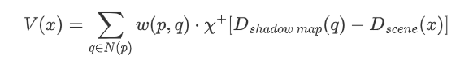

然后在查询时依据查询范围确定层级序号（$D=log_2L$），在层与层之间再做一次插值作为结果写入像素

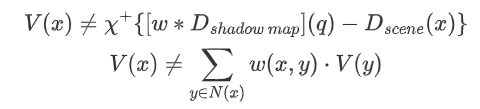

这样一个标准的三线性插值，用在shadow map上也是一样的，先在gpu上双线性插值得到多级阴影贴图，依据filter size确定层级序号，随后三线性插值完成查询

这个方法虽然简单，但一方面它要做三次插值，准确度不太高，另一方面，它只能做正方形查询，局限性太大（各向异性过滤可以解决），所以有人就提出了另一种方法——采用前缀和数组表（SAT）这一数据结构进行加速

SAT其实相当于一种预处理操作，在一维的情况下，SAT数组中的每一项SAT[i]都保存input数组前 i 项之和，假如想要知道图中原数组第3项到第6项元素之和，就只需要拿SAT数组中的第6项减去第3项就行了

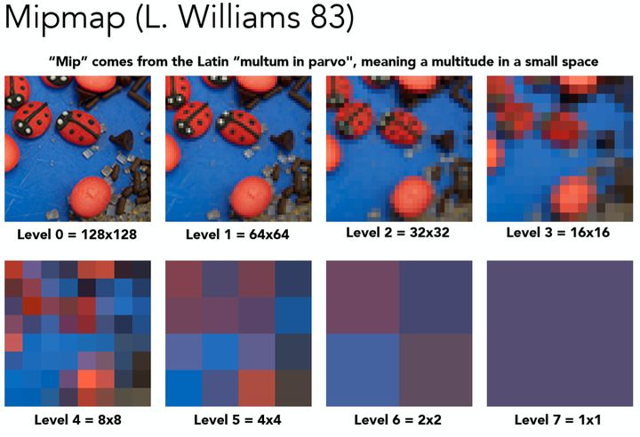

对于二维的情况，生成SAT可以先并行的建立每一行的SAT，再在此基础上对列并行累加，不难算出，建立这样一张表需要的时间复杂度为$O(m*n)$，虽然建立的过程是并行的，但现代gpu往往具有更高的并行度，这样一个算法仍会显得比较“慢”

至于二维的查询就很简单了，想要获得任一矩形内元素的总和，只需要查4次表，用图中两个绿色矩形对应的SAT元素之和减去两个橙色矩形之和就行，这是最简单的容斥原理，也是leetcode 1314 matrix block sum这道经典算法题的基本思路

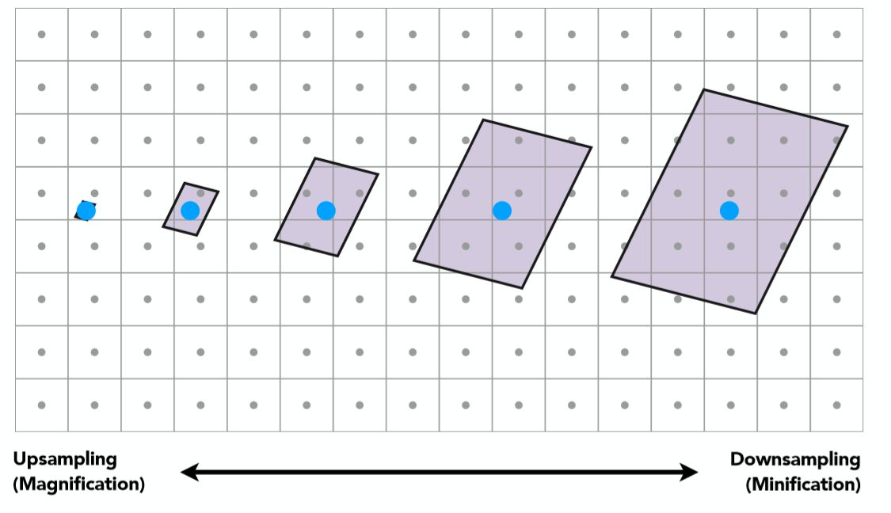

得到矩形区域内的元素和，再求样本均值就不在话下了。现在我们有了这一快速求均值的方法，再来看怎么求样本的方差

在概率论中有这样一个公式，体现了方差和期望之间的关系
$$
Var(X)=E(X^2)-E^2(X)
$$
既然现在我们可以快速求$E(X)$，那么求$E(X^2)$就只需要在生成shadow map的时候额外计算一次光源空间深度的平方值就行了，将原来的shadow map储存在纹理的R通道，将square-depth map储存在G通道，完美解决

到此为止，样本均值和方差都变为了已知，那么定义假设中的概率密度函数也就非常方便了

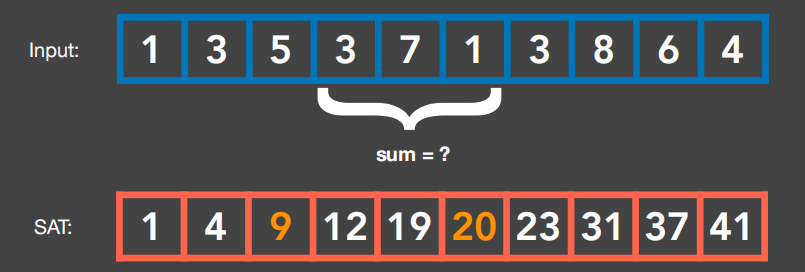
$$
CDF(x)=\int_{-\infin}^{x}PDF(t)\ dt
$$
如图，左侧PDF中的阴影部分面积表示shadow map上比shading point深度小的纹素占比，也就是会产生遮挡的概率，那么问题就转化为如何求这个PDF的概率分布（CDF，定义为PDF的积分）

可惜的是，大部分正态分布并不具备解析解，只能通过查表得到其数值解，就算c++中有内置的误差函数ERF可以专门用来求CDF数值解，这么做也是非常麻烦的。VSSM对于这个问题的解决方式，正是其精髓所在

## 切比雪夫近似

我们知道，实时渲染中常常会把一些不等式当做约等式来使用，VSSM就利用了这一点，通过切比雪夫不等式，用求得的期望和方差近似的估计CDF的值。这同时也是VSSM的第二个大胆假设
$$
P(x>t)\leq \frac{\sigma^2}{\sigma^2+(t-\mu)^2}\\
\Rightarrow P(x>t)\approx \frac{\sigma^2}{\sigma^2+(t-\mu)^2}
$$
这个约等式可以快速的求出下图中红色部分的概率，也就是$1-CDF(t)$，并且不仅仅是正态分布，它还适用于其他任何的单峰函数，这也是为什么VSSM不需要假设样本服从正态分布的原因

不过，切比雪夫近似也有它自己的局限性，那就是t必须位于均值右侧，即$t>E(x)$时约等关系才成立（对正态分布这个其实很好解决，把t转化为$2\mu -t$就行了）

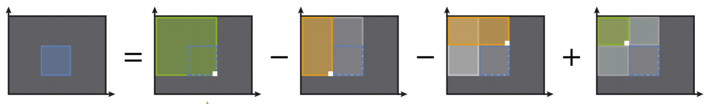

至此，VSSM对PCSS第三步的加速就已经全部完成了，然而它对PCSS的第一步的优化我们却还只字未提，那么在这个步骤中，VSSM又是怎么做的呢？

## Blocker Search加速

如前文所述，我们在第一步的主要目标是计算遮挡物的平均深度，按PCSS的做法是要先对shadow map采样，判断哪些是遮挡物

VSSM却直接忽略了这一步，以上图5\*5的范围为例，它将深度小于着色点的蓝色遮挡区域的平均深度记作$Z_{ooc}$，而深度大于着色点的红色非遮挡区域的平均深度记作$Z_{unooc}$，则易得
$$
\frac{N1}N ·Z_{ooc}+\frac{N2}N ·Z_{unooc}=Z_{Avg}
$$
其中$\frac{N1}N$和$\frac{N2}N$分别表示遮挡物和非遮挡物的占比，刚好可以用第三步完全一样的方法快速求得
$$
\frac{N1}N=P(x>t)\\
\frac{N2}N=1-P(x>t)
$$
剩下还有$Z_{ooc}$和$Z_{unooc}$未知，在这里VSSM再一次做出大胆的假设，直接认为$Z_{unooc}=Z_{shading\ point}$，$Z_{ooc}$随之迎刃而解
$$
Z_{ooc}=\frac{Z_{Avg}-\frac{N2}N ·Z_{unooc}}{\frac{N1}N}
$$
如此假设不无它的道理，因为大多数情况下阴影的接受物都接近一个平面，但这也就意味着只要接受平面是曲面，或者遇到光线掠射的情况，VSSM就会出现一些问题

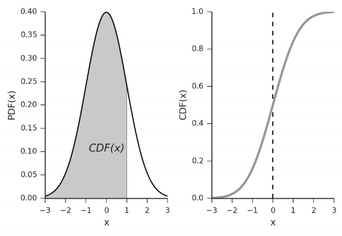

可以看到，VSSM计算的阴影结果非常不错

总结一下，VSSM的实现过程如下：

* 生成shadow map，同时生成square-depth map
* 依据着色点选择一块范围，基于shadow map和square-depth map，使用SAT数据结构计算局部深度和以及局部深度平方和，代公式求得期望和方差
* 使用切比雪夫近似，得到遮挡物和非遮挡物的占比，代入关系式求得遮挡物平均深度$d_{blocker}$
* 得到$d_{blocker}$后代公式算出fiter size
* 基于shadow map和square-depth map，使用SAT数据结构计算当前fiter size范围内的局部深度和以及局部深度平方和，代公式求得期望和方差
* 使用切比雪夫近似，得到shading point的遮挡概率，写入Visibility

虽然但是，现在工业界仍更倾向于选择PCSS，因为随着各种降噪方法的提出，人们对噪声的容忍度变得越来越高，此时稀疏采样的PCSS与VSSM之间的差距就显得微不足道了，这种情况下，使用VSSM可能会有得到错误结果的风险，开发者自然就更倾向于使用PCSS了

| Q：如果场景中有物体移动，不就要实时更新mipmap么？            |
| ------------------------------------------------------------ |
| **A：没错，不仅是物体移动，只要生成了新的shadow map，就需要更新mipmap，所以还是存在一定开销的，但也不必过于担心，因为gpu对mipmap支持非常到位，可以认为基本不消耗时间** |
| **Q：投射平面是曲面会发生什么？**                            |
| **A：不仅是曲面，只要光源和投影平面不平行就会出错**          |
| **Q：VSSM是PCSS的快速版本么？**                              |
| **A：可以这么理解，但不能等价替换，可以将PCSS作为一个基准**  |

## VSSM的缺陷

VSSM的缺陷主要表现在如下几点：

* 漏光（Light Leakiing）：VSSM将遮挡物分布强行假设为单峰分布，但有时候会与实际情况相差很远，如下左图，如果实际的非遮挡区域占比比假设小，那么就会得到一个局部较亮的结果，导致漏光

  | 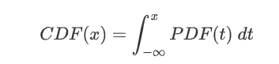.png) | 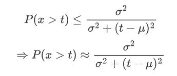.png) |
  | ------------------------------------------------------------ | ------------------------------------------------------------ |

* 不连续阴影：在算$d_{blocker}$的时候，VSSM假设非遮挡平面深度都等于shading point深度，这会导致在阴影接受面不平整的时候出现阴影中断现象

  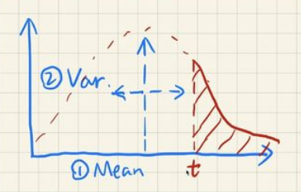

* 使用切比雪夫近似本身具有一定局限

## MSM

就像VSSM的提出是为了改进PCSS，MSM（Moment Shadow Mapping）的存在是为了解决VSSM假设带来的一些缺陷

其核心思想是，使用更高阶的矩来描述遮挡概率的CDF，使其更接近真实分布，从而避免漏光

关于矩的概念，它是数学中对变量的一种特征度量值，最简单的就是一个数的几次方，统计学中的期望是一阶矩，方差是二阶矩，所以从这个角度理解，VSSM就相当于记录了前两阶的矩

| 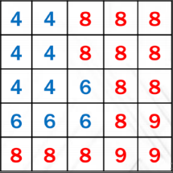.png) | 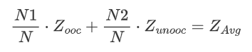.png) | 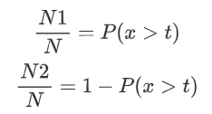.png) |
| ------------------------------------------------------------ | ------------------------------------------------------------ | ------------------------------------------------------------ |

使用更高阶的矩就能得到更好的拟合，但是如何用更高阶的矩描述CDF是一件非常复杂的事情，同样需要相当的额外空间开销和性能开销

# 距离场阴影（DFSS）

## 有向距离场（SDF）

又称有符号距离场，是一种**标量场**，场中每一点都记录了<u>该点</u>到<u>定义该场的物体</u>之间的最小距离，并且用正负号表示该点在物体内还是在物体外，若距离为0，则认为该点在物体表面上

课程一共提到了三种SDF的应用：字体渲染，几何形变和光线步进（Ray Marching）

字体渲染方面，因为距离场记录的是标量信息，不会受到分辨率限制，并且在细微层面可以通过插值进行拟合，所以有时候能做出很好的抗锯齿效果，甚至能实现无限分辨率的字符（已在商用引擎中得到应用，但对中文支持欠佳）

|                         距离场可视化                         |                         距离场等值线                         |                         SDF字体渲染                          |
| :----------------------------------------------------------: | :----------------------------------------------------------: | :----------------------------------------------------------: |
| 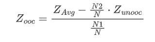.png) | 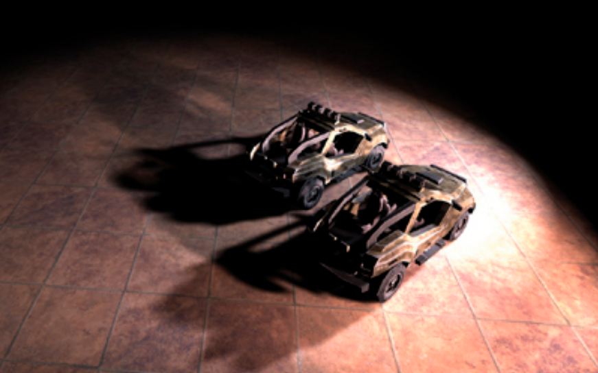.png) | 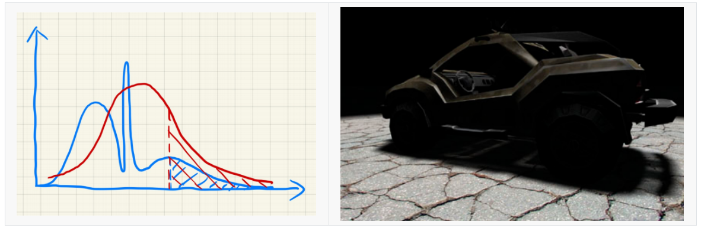.png) |

|                       三维距离场可视化                       |
| :----------------------------------------------------------: |
| 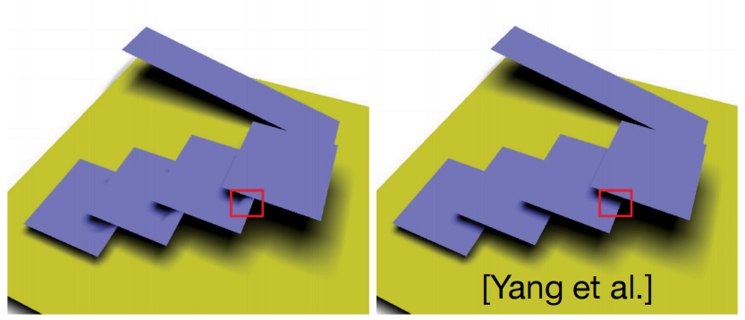 |

而在几何方面，我们在101中讲距离函数的时候就提到过了，不同的物体有不同的距离场，在距离场与距离场间做插值运算，就能很好的进行混合过渡

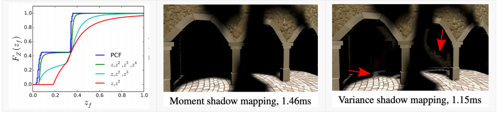.png)

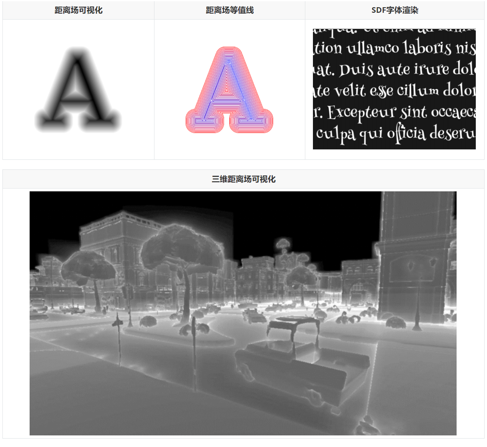.png)

## Ray Marching & DFSS

我们的重心主要放在Ray Marching上。采用了SDF的光线步进算法提供了一种截然不同的与场景物体求交的方法，具体来说，当我们向场景中投射一根光线的时候，Ray Marching会依据场景中每个物体的SDF，在投射点位置选取一个最小距离作为安全距离当做步长，也就是说在以投射点为球心、安全距离为半径的球形范围内，不论光线方向为何，它都不会与场景内物体相交，而当光线按原来方向走过这一段步长后，它又可以在新的位置依据SDF计算出新的安全距离，以此类推，直到步进次数达到一定值或者步长小到一定范围，即可认为光线与物体相交，退出循环

| 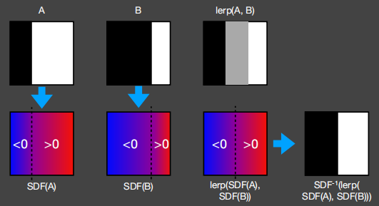.png) | 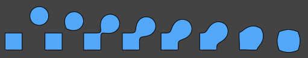.png) | 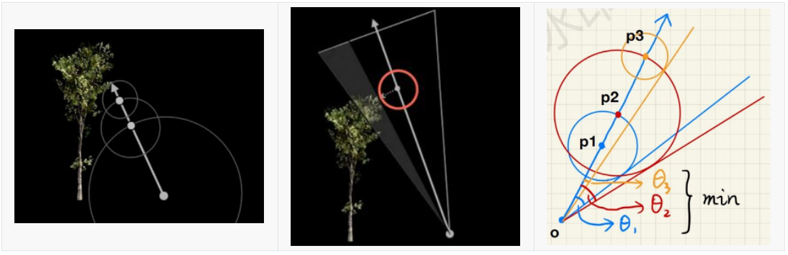.png) |
| ------------------------------------------------------------ | ------------------------------------------------------------ | ------------------------------------------------------------ |

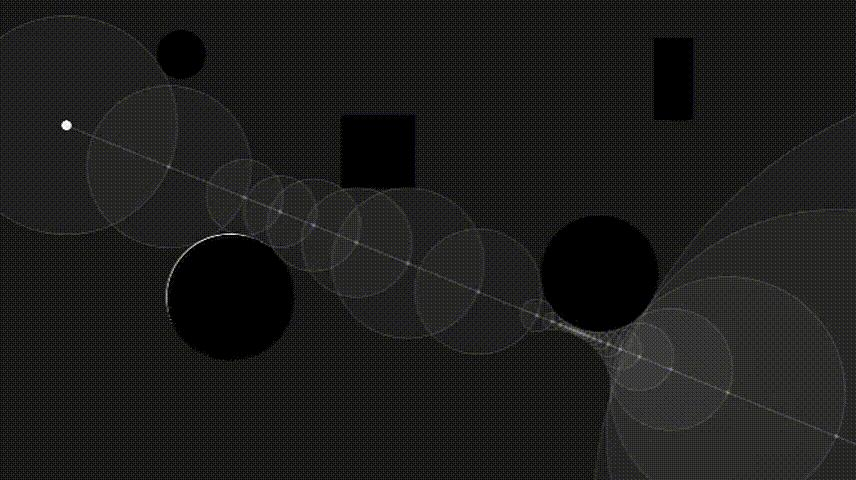

现在可以对这个方法稍微做一个延伸，既然我们可以通过距离场算出安全距离，那么算出一根光线在当前位置的“安全角度”应该也是非常简单的，只需要用安全距离与累加的步长和做一步反三角运算就可以得到了。此时，我们连接面光源的中心与着色点，在这个方向上做Ray Marching，得到一系列安全角度后取个最小值作为最终的安全角度，这个角度越小，就说明光线被遮挡的概率越高，阴影就可以设置的越黑，反过来，当这个角度大于一定值时，就可以认为光线不被遮挡，不产生阴影

不过，上面说的用反三角算安全角还是有点废性能，于是iq大佬就提出了一种实时渲染的近似方法：
$$
arcsin\frac{SDF(p)}{p-o}\Longrightarrow min\{\frac{k·SDF(p)}{p-o},1.0\}
$$
直接用一个k与sin值相乘，再截断在1以内直接作为Visibility的值（绝了wc），虽然说这么做近似非常胆大，但通过这种方式我们获得了一个非常好的控制参数——k

同等安全角度下，k越小，visibility越小，半影区越大，阴影越软；k越大，visibility越容易被1截断，阴影越硬

## 性能分析

DFSS是一种非常聪明 效果也非常好的阴影算法，但如果说DFSS比Shadow Map系列算法快的话其实是非常不公平的，因为DFSS本质上是一种预计算，而我们一般说的DFSS速度快，是忽略了它本身计算储存SDF的时间的，要知道，三维下的SDF在空间上的消耗可不是一般的大，尤其是对于场景内有物体发生形变的情况，还得重新计算SDF，从这点上来看，算上预处理的性能消耗，DFSS和SDF目前差距并不大，我们学习他只是为了参考它巧妙的处理方法而已

至于如何生成SDF，如何储存，还有DFSS的一系列artifact，这里就不再展开了

| Q：查询空间中某个点的距离场时需要遍历场景中所有物体吗        |
| ------------------------------------------------------------ |
| **A：不需要，预处理的时候每个物体单独算距离场，查询的时候只要取所有距离场在该位置的最小值即可** |
| **Q：使用SDF会有什么问题吗？**                               |
| **A：SDF生成的物体表面不太好贴纹理，如何参数化（UV）现在正在研究中** |
| **Q：SDF得到的阴影是真的阴影吗？**                           |
| **A：不是，只会更假**                                        |

