# 环境贴图

环境贴图是一种记录了场景中任意一点在不同方向上接受到的光照强度的贴图（天空盒 / 天空球），它默认这些环境光来自无穷远，因此它所记录的强度与位置无关（这也是为什么用环境贴图渲染的时候，走到哪里都会有一种漂浮感）

目前主流的环境贴图包括Spherical Map和Cube Map。类似这种处理环境光照的方法被统称为IBL（image-based lighting）

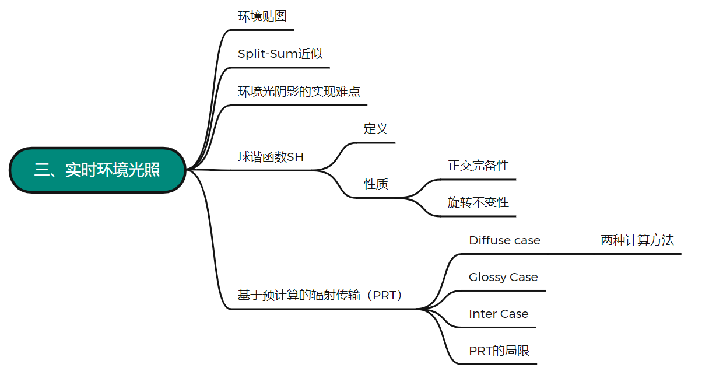

# Split-Sum近似

首先来看渲染方程
$$
L_o(p,\omega_o)=\int_{\Omega+}L_i(p,\omega_i)·
f_r(p,\omega_i,\omega_o)·cos\theta_i\ d\omega_i
$$
这里我们假设不考虑遮挡，所以直接舍去Visibility。按照之前路径追踪的做法，我们要解这个渲染方程需要借助蒙特卡洛积分去进行一个（无偏的）估计，但做过101作业7的应该都知道，蒙特卡洛需要非常大的采样率才能让结果接近真实，这对于实时的环境光照来讲是一件极其恐怖的事情，相当于对场景中每个图元都要做这么多次采样，无疑是非常慢的

（p.s.由于近几年TAA等一系列temporal方法的发展，使得一些采样方法已经能在实时领域得到应用，所以sampling对实时来说非常慢这个观点正在逐渐成为历史，但在那之前我们还是优先考虑其他不采样的方法）

这时候我们就又要用到之前那个在实时渲染中非常重要的积分近似公式了
$$
\int_\Omega f(x)g(x)dx\approx\frac{\int_\Omega f(x)dx}{\int_\Omega dx}·\int_\Omega g(x)dx
$$
之前提这个公式的时候说，当$g(x)$的积分域很小，或当$g(x)$在其积分域内足够光滑（低频）的时候，这个约等式的近似结果会更加准确，而渲染方程中的brdf项又无非分为glossy和diffuse两种，glossy对应积分域小，diffuse对应低频，那我们理所应当的就可以把light项给拆出来了

|                       glossy，积分域小                       |                      diffuse，光滑低频                       |
| :----------------------------------------------------------: | :----------------------------------------------------------: |
| 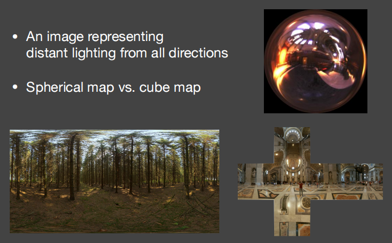 | 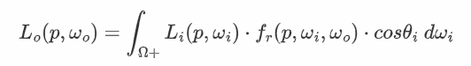 |

$$
L_o(p,\omega_o)\approx\frac{\int_{\Omega_{f_r}}L_i(p,\omega_i)d\omega_i}{\int_{\Omega_{f_r}}d\omega_i}
\int_{\Omega+}f_r(p,\omega_i,\omega_o)·cos\theta_i\ d\omega_i
$$

不难发现，原本的渲染方程现在变为了对积分域上的Light项取平均，换个说法，就是对环境贴图做了个模糊处理，材质越glossy，积分域越大，图像就越模糊：

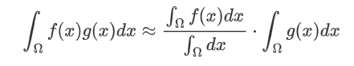

因为模糊对象是环境贴图，所以这个模糊操作是可以在渲染之前就完成的，即所谓的pre-filtering。我们可以在渲染前对环境贴图进行多级模糊，和MipMap一样，到真正的渲染环节，依据场景物体的材质确定模糊等级（通过插值保证级与级之间的连续），做一次查询就可以得到我们想要的结果

更形象一点，就如下图所示

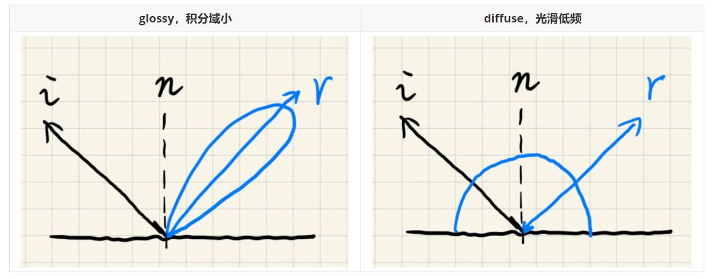

多次采样后用pdf求平均得到的值 $\approx$ 对采样对象滤完波查询一次得到的值，没毛病

（p.s. 老师上课讲的lobe是反射波瓣，就是图中pdf的采样区域，brdf的形状）

| Q：spherical map每个像素表示的立体角不一样，那是不是不应该用统一的fiter size |
| ------------------------------------------------------------ |
| **A：没错，滤波的核的大小的单位是立体角，是在对一个球面做滤波** |
| **Q：漫反射是不是对整个环境贴图求平均**                      |
| **A：这么想也不是不行...实时渲染中的漫反射是一种很特殊的情况，它的的lobe是个半球面，所以直接沿着法线方向去查就可以了，至于diffuse的lobe慢慢变小会变为glossy的情况，真正在实现的时候会把diffuse单独处理，所以也不是什么问题** |

这样一来，我们就解决了环境光项的问题，此时的渲染方程还剩下一个brdf部分尚未解决，对于这个部分，我们仍可以用预计算替代实时采样，但考虑到微表面的BRDF可能会涉及菲涅尔项和法线分布等至少五维（粗糙度, r, g, b, 角度，总共五维）的数据处理，直接暴力预计算肯定是不可取的，只好通过一些近似来降低维度，以此来简化预计算

让我们先来复习一下101中微表面理论提到的几个近似：

| 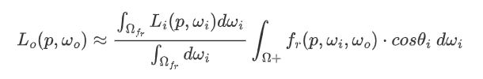 | 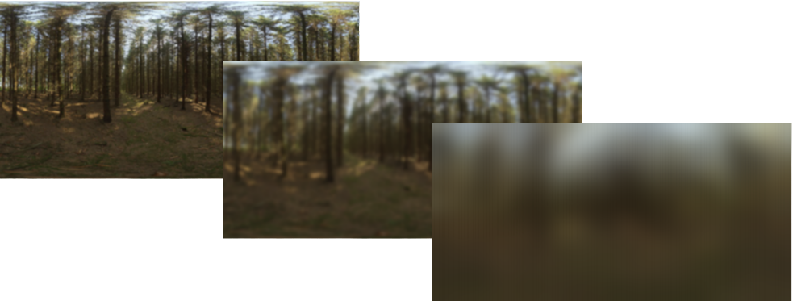 |
| ------------------------------------------------------------ | ------------------------------------------------------------ |

菲涅尔用的Schlick近似，认为菲涅尔项与基础反射率$R_0$和入射角有关；法线分布的Beckmann近似，认为该项与表面粗糙度与$\theta_h$（半角与法线的夹角）有关；而在实时渲染中，因为<u>入射角</u>、<u>反射角</u>以及<u>入射角和反射角的半角</u> 度数差别不大，可以近似的看成一个角，$\theta_h$又能通过这三个角转化得到，所以角度部分可以认为是一个维度，现在，BRDF项的储存就由五维变成了三维

三维还是不太好存，能不能再压呢？来看下面这个化简：
$$
F=R_0+(1-R_0)(1-cos\theta)^5=R_0(1-(1-cos\theta)^5)+(1-cos\theta)^5\\
\int_{\Omega+}f_r(p,\omega_i,\omega_o)·cos\theta_i\ d\omega_i
=\int_{\Omega+}\frac{f_r(p,\omega_i,\omega_o)}{F}·F·cos\theta_i\ d\omega_i\\
\Downarrow\\
\int_{\Omega+}f_r(p,\omega_i,\omega_o)·cos\theta_i\ d\omega_i
\approx R_0\int_{\Omega+}\frac{f_r}{F}(1-(1-cos\theta)^5)·cos\theta_i\ d\omega_i
+\int_{\Omega+}\frac{f_r}{F}(1-cos\theta)^5·cos\theta_i\ d\omega_i
$$
看起来很复杂，其实还是比较简单的。通过这个操作我们把基础反射$R_0$从积分里拆了出来，消除了原方程对它的依赖，那么现在剩下需要预计算的就只剩下roughness和角度两个变量了，直接将预计算结果储存为一张二维的纹理，之后要用的时候直接查表就完事了

（p.s.实时领域一般会把积分号写成求和号，但里面的内容是一样的）

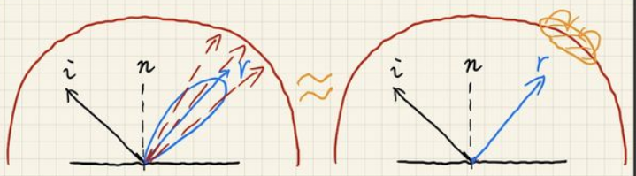

可以看到，即使做了这么多近似，结果还是非常令人满意。这也是Unreal引擎做PBR的基础

| Q：Fresnel项需要预计算么？                                   |
| ------------------------------------------------------------ |
| **A：Fresnel项被拆开了，可以说只有一部分需要预计算**         |
| **Q：这个预计算结果是固定的吗？**                            |
| **A：是固定的，只要是同种类brdf都可以用**                    |
| **Q：用Microfacet GGX，参数会多么？**                        |
| **A：不会**                                                  |
| **Q：深度学习在实时渲染领域有没有什么其他的应用？除了DLSS**  |
| **A：现在甚至连降噪都不会用深度学习，它在实时渲染中并不怎么成功，实在太慢了** |
| **Q：IBL适用于什么场景？**                                   |
| **A：适用于任何你想用它的场景，但当光源和你的物体有确定的距离的时候，就不能再这么使用了（因为IBL假设光源无限远）** |
| **Q：积分里的F怎么计算？**                                   |
| **A：不用算，BRDF的式子里包含F，分子分母消掉了**             |

# 环境光阴影的实现难点

前面我们介绍了如何在忽略阴影的情况下计算环境关照，那么如果现在不忽略阴影，我们又该如何计算呢

很可惜，以目前的技术来说，实现环境光下的阴影是基本不可能的一件事，尤其是对于实时来讲，它会变得更为困难。这主要体现在两个问题上，其一是**多光源问题（many-light problem）**，如果将环境光理解为四面八方无数的小光源，那么生成阴影也就意味着需要在每个小光源的位置处生成一张对应的shadow map，这么做的代价是不可估量的；另一个问题是**如何采样**，就算通过某种手段我们得到了多光源的shadow map，我们也很难获取着色点周围所有方向上的遮挡情况，那么为了计算Visibility项我们只好盲目的进行采样，在生成一大堆样本后慢慢处理。同时，我们也无法从渲染方程中将Visibility提取出来，因为对于环境光， <u>①足够小的积分域 ②高频的BRDF</u> 这两个提取条件它一个都无法满足，所以，常规的做法到这里都会变得寸步难行

在这方面，工业界也没有什么好的解决方法，一般做法都是选取一个主要光源（如太阳）生成阴影（摆就完了）

相关研究指路：

* Imperfect Shadow Maps，做的是全局光照阴影
* Light Cut，离线渲染中里程碑式的工作，将场景中反射物当做小光源，试图通过归类得到近似结果
* Real Time Ray Tracing（RTRT），或许是未来的终极解决方案
* Precomputed Radiance Transfer（PRT），可以得到非常准确的得到环境光阴影，但需要付出一定代价（后面会讲）

| Q：UE5的全局光照是不是用的上面说的这些算法？                 |
| ------------------------------------------------------------ |
| **A：不知道，但游戏引擎对全局光照这块一般都不会只用一种算法，通常是几种方案的混合体** |

# Recap

1、傅里叶级数展开：任何一个周期函数，都可以表示为一系列sin和cos函数的线性组合加一个常数项的形式，对应到信号处理就是不同频率的波的叠加，或者是对数据的一种有损压缩，通过这么处理可以将图像从时域（空间域）变换到频域

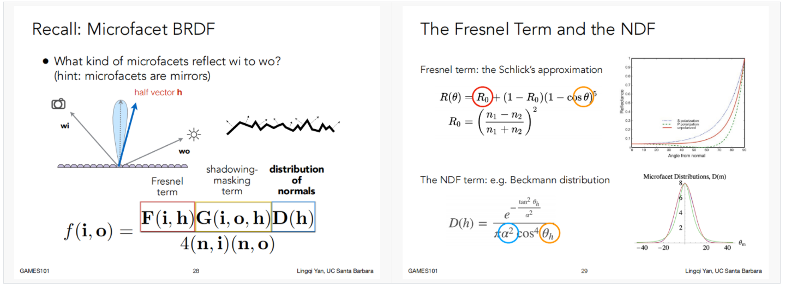

2、基函数（Basis Functions）：一个函数可以表示为一系列其他函数的组合，这些“其他函数”，就是所谓基函数
$$
f(x)=\sum_i c_i·B_i(x)
$$
​	  傅里叶级数展开就是将原函数表示为一系列基函数的过程

3、滤波（Filtering），这个应该不陌生了，前面都已经用过好几次了（指路：101 p6）

​	  图像的高频信息越多，其内容变化越丰富，细节展示就越多

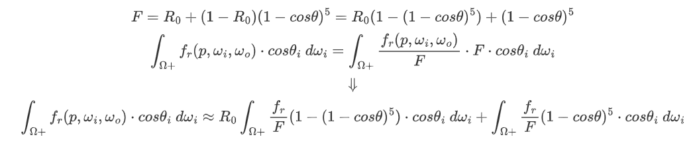

4、卷积：对图像每个像素都在一定范围（卷积核）内做加权平均的操作，算是一种滤波的操作

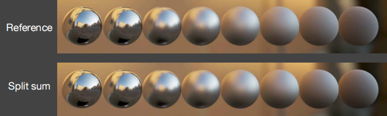

在时域内的卷积操作就相当于在频域内的相乘（原图频谱×卷积核频谱），而相乘结果经过逆傅里叶变换就能得到基于原图的模糊效果

用数学来表示，就是对两个函数的乘积求积分（product integral）：
$$
\int_{\Omega}f(x)g(y)dx
$$
相当于在频域上让两个信号相乘，==最后输出的频率取决于积分前的两个函数的最低频率==

# 球谐函数SH

## 定义

比较易懂的科普可以看这篇 https://zhuanlan.zhihu.com/p/351289217，以下内容在顺序上存在部分调整

球谐函数（Spherical Harmonics）其实就是定义在球面坐标系中的一系列**二维基函数**，每个基函数都可以用 *勒让德多项式* 写出来，我们不需要了解勒让德多项式是什么（那毫无意义），只要能看明白下面这张可视化就行：

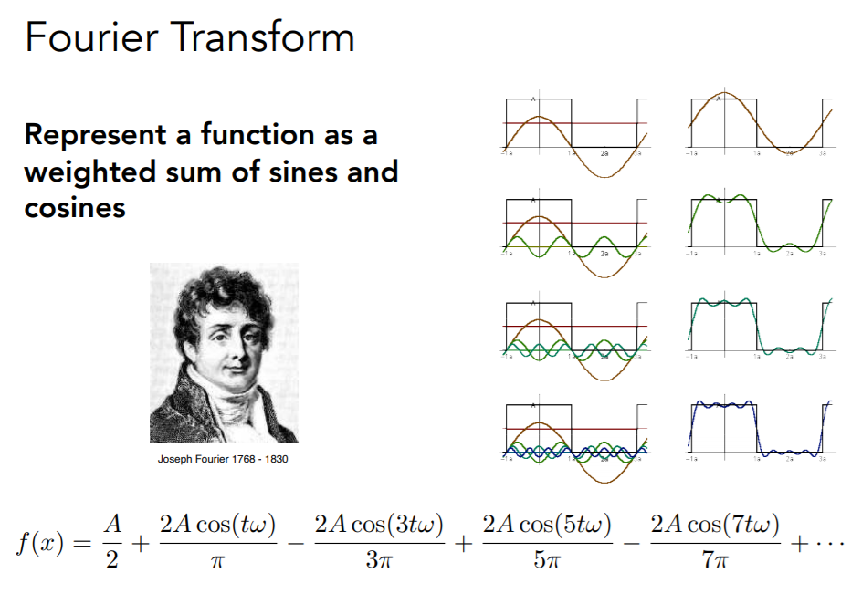

图中蓝色表示的是正值，黄色表示的是负值，颜色深浅表示的是**函数值的大小**，越深越小，而形状则表示**频率的大小**

图的最左边标明了球谐函数的**阶数**，第 $l$ 阶球谐对应有 $2l+1$ 个基函数，前 $n$ 阶一共有 $n^2$ 个基函数，而图的最下边 $m$ 则对应了球谐函数的**序号**，第 $l$ 阶对应的序号范围为 $[-l,l]$

有了这一系列概念，再来看球谐函数的展开公式，$f(x)=\sum_i c_i·B_i(x)$，其中$B_i(x)$是球谐函数，可以认为已知，$f(x)$是原函数，$c_i$是球谐系数，那么原函数就可以储存为一个 $i$ 维向量$(c_1,c_2,···,c_i)$

计算球谐系数的过程称为**投影**，其计算方法如下（product integral）：
$$
c_i=\int_\Omega f(w)B_i(w)\ dw
$$
已知球谐系数，还原原函数的过程称为**重建**（实际上可以理解为做了一系列的点乘），使用的基函数越多，展开的阶数越高，重建的细节的越多，还原的效果就越好，如图

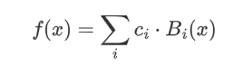

当我们使用Spherical Map作为环境贴图时，环境光信息被定义在一个球面坐标系内，这时候我们就可以用球面谐波函数对其展开近似，而当brdf为diffuse时，渲染方程的$f_r$项只有低频信息，相当于一个低通滤波器，那么无论环境光多么高频，最后乘积的结果仍是低频，所以此时只需用三阶的球谐函数就能做到很好的近似，这样一来通过预计算虽然牺牲一定储存空间（存16维向量），但它既免去了采样的过程，又为后面的PRT奠定了理论基础，显然还是很划算的

## 性质

在正式介绍PRT之前，还需要补充球谐函数的一些优良性质

# 正交完备性

球谐函数中任意两个基函数之间都满足相互正交，即其中任意一个球谐函数向另一个球谐函数的投影结果都是0，而如果向自己投影，则结果是1：
$$
\int_{\Omega}B_i(i)·B_j(i)\ di=1,\ (i=j)\\
\int_{\Omega}B_i(i)·B_j(i)\ di=0,\ (i\neq j)
$$

# 旋转不变性

对任意函数进行旋转，就相当对球谐展开的基函数进行旋转，旋转后的基函数虽然不能再被称为基函数，但它仍旧可以由同阶的基函数的线性组合表示出来，这就意味着不论怎么旋转原函数，我们都可以立刻得到其新的球谐系数

# PRT

现在有了SH，就可以将Visbility项考虑进来了

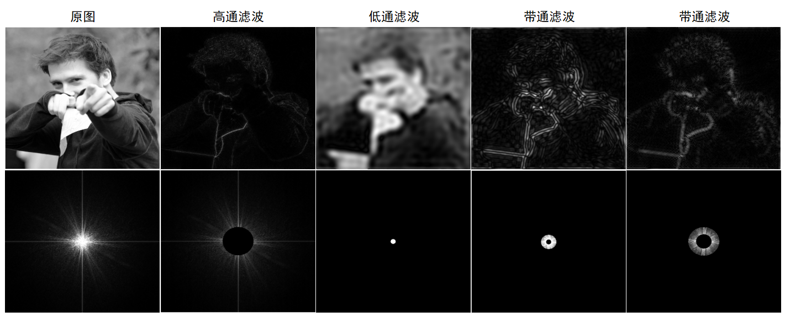

（brdf可以由入射角、出射角、入射方位角和出射方位角定义，所以可以写成图中的四维的形式，详情参考101 p17）

一般思路是将环境光项、Visibility项和brdf项全都描述为球面函数（这里为了方便理解使用cube map展示），然后逐像素相乘，最后相加。这种思路可谓一点都没体现球谐函数的优势，且不论三张贴图的存储，对每个shading point，光光逐像素计算就要花费很多计算，远远满足不了实时的要求

因此我们引入了PRT（Precompute Radiance Transfer，基于预计算的辐射传输），其核心思想是将渲染方程分为lighting（环境光项）和lighting transport（Visibility&brdf）两部分，假设场景中只有lighting部分会发生变化（旋转or更换光源），而lighting tansport部分固定不变。因为lighting部分可以被球谐展开，所以旋转操作并不会造成多大影响（旋转不变性），即使更换光源，也只要在预计算中多计算几个光源就行，那么这两部分就都可以被球谐展开，从而在预处理中完成部分计算

下面来详细分析PRT的计算过程

## Diffuse case

# 计算方法Ⅰ

第一种计算diffuse的方法，因为对于diffuse的情况，brdf几乎可以被认为是一个常数，所以直接将其提到积分号外面
$$
L(o)=\rho \int_{\Omega} L(i)V(i)max(0,n·i)\ di
$$
再将$L(i)$写成球谐函数的形式，因为实时渲染中求和和积分次序可以任意交换，所以原式化简如下：
$$
L(o)\approx \rho \sum l_i \int_{\Omega} B_i(i)V(i)max(0,n·i)\ di
$$
对于这个约等式的积分部分，一共有两种理解方式，一种是将其理解为一个投影操作，将light transport投影到某个基函数上，得到的是它在环境光照球面坐标系内的球谐系数，那么最后的渲染方程就变为了两个向量的点乘（$\sum l_iT_i$其实就是点乘）
$$
L(o)\approx \rho \sum l_iT_i\\
T_i=\int_{\Omega} B_i(i)V(i)max(0,n·i)\ di
$$
另一种理解方式是将$B_i(i)$理解为一盏光，那么这里的积分就相当于重算了一个渲染方程，算的是这些<u>球谐函数所描述的环境光</u>作用于物体的结果，最后以$l_i$为权重叠加求和，得到最终的重建结果（下图中红色代表正值，蓝色代表负值）

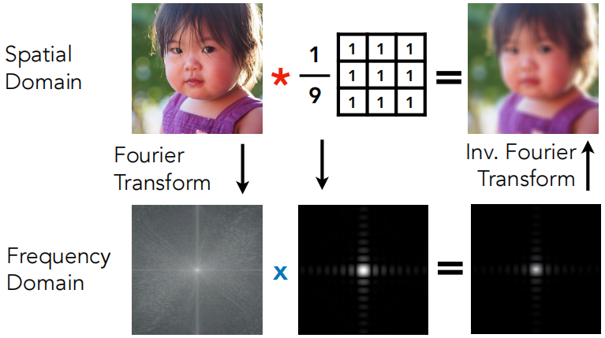

# 计算方法Ⅱ

与计算方法Ⅰ不同，计算方法Ⅱ彻底将lighting和light transport部分分开考虑，分别对他们球谐展开，设$c_p$为lighting的球谐系数，$c_q$为light transport的球谐系数：
$$
L_o(p,w_o) = \int_{\Omega+} L_i(p,w_i) f_r(p,w_i,w_o) cos\theta_i V(p,w_i) \ dw_i\\
=\int_{\Omega+}L(i) · \rho V(i) max(0,n·i) dw_i\\
$$

$$
\begin{cases}
L_i=L(i)\approx \sum_p c_pB_p(i)\\
T_i=\rho V(i)max(0,n·i)\approx\sum_q c_qB_q(i)
\end{cases}
$$

代入渲染方程，同计算方法Ⅰ，交换求和与积分次序，将两个球谐系数提出来
$$
L_o(p,w_o)=\int_{\Omega+} \sum_p c_pB_p(i)\sum_q c_qB_q(i)\ dw_i\\
=\sum_p\sum_q c_p c_q \int_{\Omega+}B_p(i)B_q(i)\ dw_i
$$
可以发现结果变为了一个双重求和的形式，并且乍一眼看上去时间复杂度还似乎从计算方法Ⅰ的$O(n)$变为了$O(n^2)$

实际上，因为球谐函数的正交性，只有当p=q的时候，也就是lighting和light transport用了同阶基函数时，$\int_{\Omega+}B_p(i)B_q(i)\ dw_i$才会等于1，其他时候都等于0，根本不用纳入计算范围，就好比一个二维矩阵只计算它对角线上的元素，其算法复杂度仍然是$O(n)$

# Diffuse总结

纵观PRT的整个计算过程，不管是哪种计算方法，它都只需要经过部分的预计算，就能把原先的逐顶点 / 逐像素操作转化为向量的点乘，这对于性能来说绝对是成百倍的提升，并且我们还可以从下图看到，它不仅适用于计算带阴影的环境光，还适合做多次bounce的间接光照预计算，结果同样非常不错（关于间接光预计算后面会有详细说明）

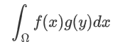

| Q：预计算能不能做天气系统或者日出日落？                      |
| ------------------------------------------------------------ |
| **A：会预计算一部分**                                        |
| **Q：实时光追普及后，PRT会不会淘汰？**                       |
| **A：个人认为不会，实时光追的普及反而会让PRT有更多的表现空间** |
| **Q：每个点的Visibility的球谐函数是怎么得到的？**            |
| **A：最暴力的方法就是从shading point出发往四周trace光线，因为是预计算，所以时间可以认为是无限的** |

## Glossy Case

对于glossy的材质，brdf项就不能简简单单的当做一个常数去处理了，因为当观察glossy材质的时候，每个不同的视角得到的shading结果都不一样，所以计算其光路还需要将视角关联进来（四维brdf：入射角、出射角、入射方位角、出射方位角）

那么如果这时候再像之前计算方法Ⅰ那样，将light transport投影到lighting的基函数上，投影的结果就不再会是一个球谐系数了，而是一个关于出射方向o的函数$T_i(o)$，换句话说，是一组球谐系数
$$
L(o)\approx \rho \sum l_iT_i\ 
\Longrightarrow\ 
L(o)\approx \sum l_iT_i(o)
$$
对$T_i(o)$球谐展开，$T_i(o)\approx \sum t_{ij}B_j(o)$，代入原式
$$
L(o)\approx \sum l_i\sum t_{ij}B_j(o)\\
=\sum(\sum l_it_{ij})B_j(o)
$$
于是结果就从原来的向量点乘变为了一个向量和一个矩阵的乘法

<u>矩阵理解方式1</u>：$T_i$的每个基函数都对应一组球谐系数，矩阵大小为基函数阶数n*视角采样次数m

<u>矩阵理解方式2</u>：对任一出射方向 / 视角上的$T_i(o)$球谐展开，会得到一组基函数的球谐系数，最后把所有方向上对应的基函数vector组合在一起，就形成了一个矩阵。矩阵大小为视角采样次数m*基函数阶数n

<u>矩阵理解方式3</u>：我们最后得到的结果是不同方向上的radiance，是一个向量，而lighting部分球谐展开得到的也是一个向量，只有向量乘以一个矩阵才能最后得到一个向量，所以light transport部分球谐展开得到的是一个矩阵（倒推法）

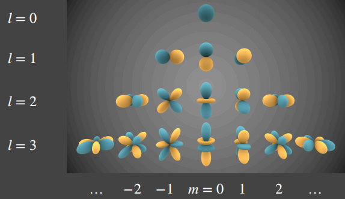

所以对于glossy材质，使用PRT的效率会比diffuse差很多，四阶的情况下，diffuse的每个shading point只要乘一个16维向量就够了，而glossy必须乘以一个16\*16的矩阵，五阶就是25\*25，这在储存上带来的压力增长可想而知

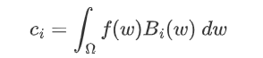

## Inter Case

之前提到，PRT还适合做一些多次bounce的间接光照预计算，那么它这么做的理论依据是什么呢？

其实非常简单，我们把light transport部分理解为光的传播路径，再用正则表达式把它描述出来

|     表达式      |                     含义                     |
| :-------------: | :------------------------------------------: |
|       LE        |                  light→eye                   |
|       LGE       |               light→glossy→eye               |
|      LGGE       |           light→glossy→glossy→eye            |
|   L(D\|G)\* E   |       light→(diffuse or glossy)\*n→eye       |
| LS\* (D\|G)\* E | light→specular\*n→(diffuse or glossy)\*n→eye |

可以看到，所有光线的传播路径的起点和终点都是光源light和摄像机，不论中间有多少次bounce，最终的表达式都可以被描述为light和light transport两部分，所以我们只需要预计算出light transport，就可以得到最后的shading result（计算方法参考Diffuse计算方法Ⅰ的第二种理解方式，结合Ray Tracing之类的算法就可以完成）。而这样一来，因为所有复杂的计算都被集中在预计算中处理掉了，实际渲染所消耗的时间自然就与light tranport的复杂度无关了

下图为各种不同的BRDF的渲染结果，spatial varying BRDF指的是各点具有不同brdf的材质，如生锈的铁器等

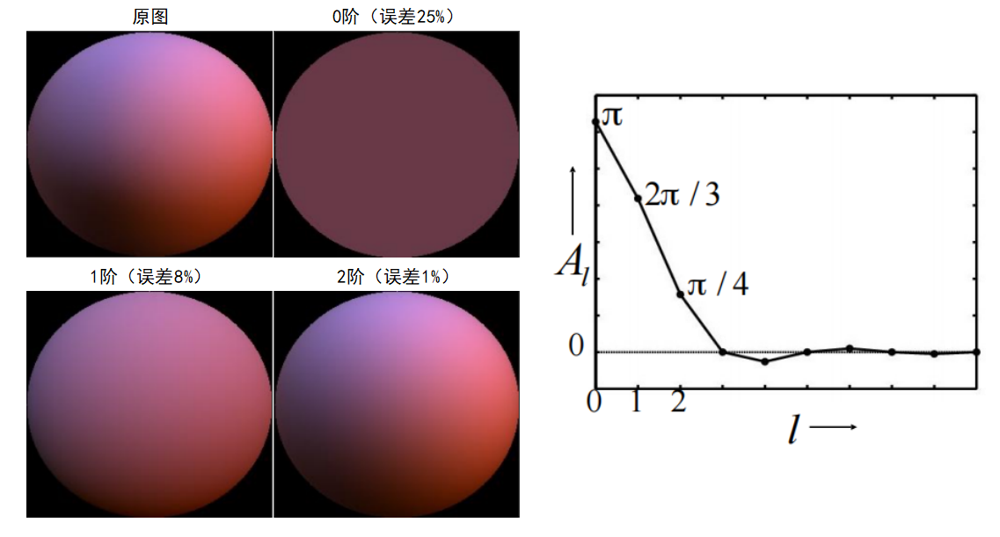

## PRT的局限

PRT虽然可以很好的实现带有阴影的实时环境光渲染，但它也有它自己的局限性，主要体现在两方面

首先是对场景的要求。之前我们假设light transport不变，相当于默认了这一部分对于场景是一种自带的属性，也就是说如果要使用PRT，渲染对象就必须具备==静态场景、动态光源==这一条件，如果场景中的物体发生移动，物体原先的阴影就会因为Visibility项固定不变而留在原地，而如果物体的材质发生变化，或者物体发生了形变，则会得到错误的结果

其次是对材质的要求。因为球谐函数在描述高频信息时需要非常高阶的基函数才能完成重建，所以一般PRT只适合做一些较为低频的情况（试想用26阶球谐重建glossy材质，最后得乘一个$26^2$阶的矩阵，676\*676，这是何等恐怖的储存压力）

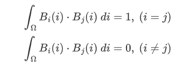

| Q：怎么做spatial varying的brdf预计算                         |
| ------------------------------------------------------------ |
| **A：PRT关注的更多的是已知brdf的预计算，一般人们会用一些诸如柏林噪声之类的可控制噪声来得到spatial varing brdf** |
| **Q：glossy材质中的视角方向怎么决定？**                      |
| **A：不是视角方向怎么决定，而是要在预计算中把所有视角方向的球谐都算出来，至于矩阵不能无限大** |
| **Q：预计算是写在光栅化里面么？**                            |
| **A：预计算是一个独立的程序，会有存储和读取的过程**          |
| **Q：预计算可以理解成伪材质吗？**                            |
| **A：可以，可以理解为伪材质的一部分**                        |

## 小波函数（Wavelet）

为了解决SH在频率上的局限，科学家研究出了一些其他不同的基函数，如Zonal Harmonics，Spherical Gaussian（SG），Piecewise Constant等等等等，而小波函数也是其中之一

不同于球谐函数，小波函数是定义在图像块上的一系列基函数，不同的小波函数具有不同的定义域，如图

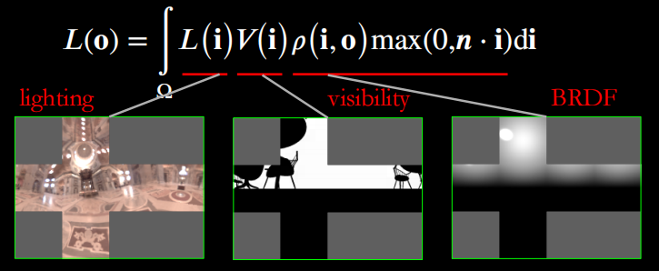

当用小波函数对原函数进行压缩的时候，我们也不再会采用SH那样的截断方法，而是选择将原函数投影到全部基函数上，通过舍去大量接近0的小波系数，保留部分基函数从而来完成近似

因为小波函数是定义在图像块上的基函数，所以为了防止重建后的图像出现接缝，我们一般会使用cube map记录环境光照。以二维Haar Wavelet为例，从下面的gif可以看出，小波函数对图像的压缩过程是先把压缩区域分为四个部分，将低频信息放在左上角，高频信息分波段填充剩余部分，随后对左上角的低频信息继续递归执行之前的步骤（四叉树）

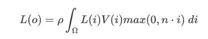

从图中我们很容易观察到，随着压缩程度的越来越大，cube map会变得越来越灰，这恰恰说明了经过小波变换后原图像会舍去大量次要信息（只保留0.1% - 1%的有效信息），从而高效地得到一个==全频段==的压缩结果

值得一提的是，虽然小波函数解决了球谐函数的频率限制，但它同时也放弃了球谐的一些好的性质，比如SH的旋转不变性，使用小波函数就无法做到像之前那样随意转动灯光，每次旋转都必须重新进行计算（这就涉及到dynamic scene的PRT研究了，单论基函数的话小波函数还是非常不错的）

