# Recap

1、全局光照=直接光照+间接光照，是指通过模拟光线的传播路径，将物体反射的间接光纳入计算，从而提高结果真实感的一种渲染技术（如图中金属球的焦散，蜡烛的次表面）

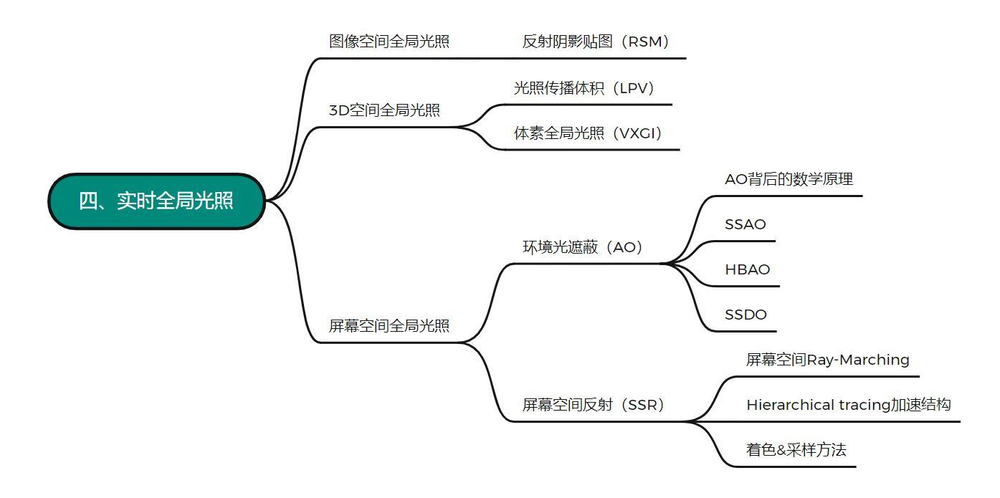

实时渲染中的全局光照，一般就是指如何**简单而快速**地计算比直接光照**多一次bounce**的光照结果

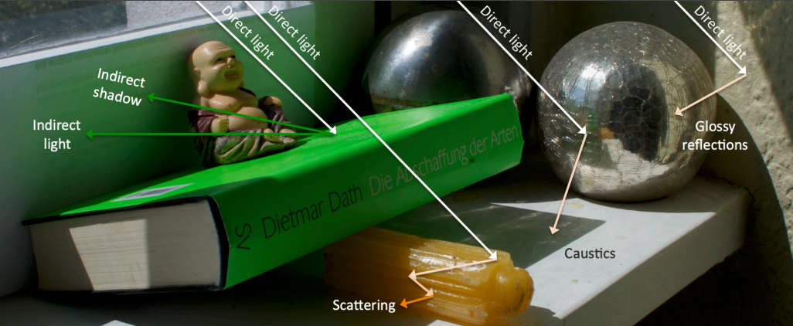

2、辐射度量学相关概念：

|      物理量       | 符号 |     中文翻译      |               简单定义               |   单位    |                  公式                  |
| :---------------: | :--: | :---------------: | :----------------------------------: | :-------: | :------------------------------------: |
|  Radiant Energy   |  Q   |     辐射能量      |           电磁波形式的能量           | 焦耳（J） |                   \                    |
|   Radiant Flux    |  P   | 辐射功率/辐射通量 |         单位时间内的辐射能量         | 瓦特（w） |           $P=\frac{dQ}{dt}$            |
| Radiant Intensity |  I   |     辐射强度      |   点源向某单位立体角发射的辐射功率   |   w/sr    |         $I=\frac{dP}{d\omega}$         |
|    Irradiance     |  E   |   辐（射）照度    |      受照面单位面积上的辐射功率      |  w$/m^2$  |           $E=\frac{dP}{dA}$            |
|     Radiance      |  L   |   辐（射）亮度    | 单位投影面积、单位立体角上的辐射功率 | w$/m^2$sr | $L=\frac{d^2P}{dAd\omega cos(\theta)}$ |

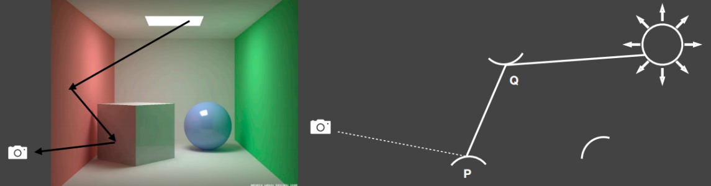

[Lights and Shadows – Bartosz Ciechanowski](https://ciechanow.ski/lights-and-shadows/) 安利一个网站，可以很好的帮助理解这块概念

3、BRDF的定义：
$$
f_r(\omega_i\rightarrow\omega_o)=\frac{dL(\omega_o)}{dE(\omega_i)}=\frac{吸收后向某立体角方向辐射出去的 Radiance}{辐射前某单位面积dA接收到的Irradiance}
$$
4、对光源采样的渲染方程：
$$
L(p,\omega_o)=\int_{\Omega+} L(p,\omega_i)·f_r(p,\omega_i \rightarrow \omega_o)·cos\theta \ d\omega_i\\
=\int_{\Omega+}L(p,\omega_i)·f_r(p,\omega_i\rightarrow\omega_o)·\frac{cos\theta ·
cos\theta'}{\abs{x'-x}^2} \ dA
$$
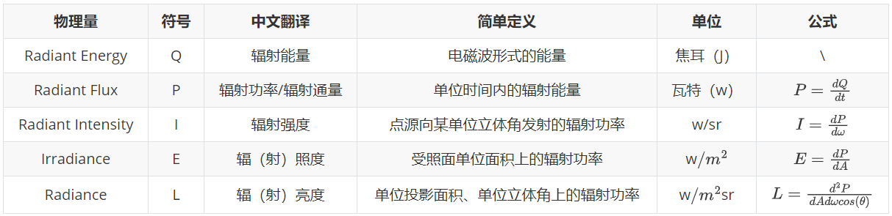

（建议重新过一遍101 p16）


# 图像空间方法

## 反射阴影贴图（RSM）

参考：[【论文复现】Reflective Shadow Maps](https://zhuanlan.zhihu.com/p/357259069)

# 基本思路

既然实时全局光照只计算比直接光照多一次bounce的间接光照，那么问题就自然分为了两个部分：

1° 场景中哪些表面会被直接光照影响，反射出间接光

2° 如何计算这些表面对着色点p的贡献

对于这两个问题，RSM的思路是通过shadow map获取直接光照的影响区域，再根据shadow map的分辨率将这些区域微元化，把其中每一个像素（或者说surface patch）都当做一个次级光源进行计算，如图

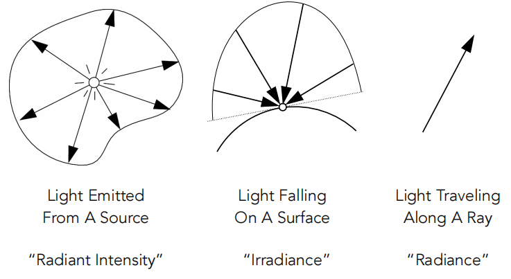

这个概念其实和离线渲染中的虚拟点光源（Virtual Point Light，VPL）有些类似，唯一的区别在于，这里RSM会将所有次级光源的表面设为diffuse，以摆脱这些surface patch对视角方向的依赖（如果不这么设置，次级光源是glossy的话，计算量会变得非常恐怖），又因为我们无法对每个次级光源都生成一张阴影贴图，所以在实时渲染中间接光通常不会考虑Visibility的大小，那么现在连接pq，我们所要计算的虚拟光源贡献就是在q点处出射的radiance大小
$$
L_o(p,w_o)=\int_{\Omega_{patch}}L(p,w_i) V(p,w_i)·f_r(p,\omega_i,\omega_o)·cos\theta_i\ dw_i\\
=\int_{A_{patch}} L(q \rightarrow p)f_r(p,q \rightarrow p,\omega_o)·
\frac{cos\theta_p · cos\theta_q}{\abs{q-p}^2}\, \mathrm{d}A
$$
上式中，因为光源面积是阴影贴图上的一系列像素，所以可以直接当做$dA$处理

由brdf定义$f_r(\omega_i\rightarrow\omega_o)=\frac{dL(\omega_o)}{dE(\omega_i)}$，得$L(q \rightarrow p)=f_r·\frac{\phi}{dA}$，代入渲染方程，原式化简如下
$$
L_o(p,w_o)=\phi ·f_r^2(p,q \rightarrow p,\omega_o)·
\frac{cos\theta_p · cos\theta_q}{\abs{q-p}^2}
$$
又由假设中的diffuse次级光源，可知$f_r$是一常数，合并参数，最后就可以得到下面这个式子（老师的写法）：
$$
L_o(p,w_o)=\phi_p·\frac{cos\theta_p · cos\theta_q}{\abs{q-p}^2}\\
$$
至于老师说的paper里的那个分母中的4次方，则是因为分子未做归一化导致的，后来在p9开头有做澄清（硬盘装不下.jpg）

两个式子都没有错，这里把字母全都做了一个统一，方便比较：
$$
L_o(p,w_o)
=\phi_p·\frac{max\{ 0, n_p·\frac{q-p}{\abs{q-p}} \} · max\{ 0, n_q·\frac{p-q}{\abs{p-q}}\} }{\abs{q-p}^2}\\
=\phi_p·\frac{max\{ 0, n_p·(q-p) \} · max\{ 0, n_q·(p-q) \} }{\abs{q-p}^4}
$$
到这里为止，算法的核心思想就已经介绍完毕了，但如果说要去真正实现它，那还是存在着一些问题的

# 算法优化

试想按照前面的思路去计算场景中一个点的间接光，如果每个着色点所使用的shadow map分辨率都是512*512，那就意味着要设置20多万个虚拟光源，这显然非常不合理；并且我们从下图也很容易看到 ，场景有一些点是不可能对目标着色点产生影响的（如$q'$点和$p$），计算它们纯粹是在浪费性能

| 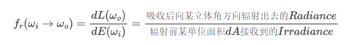 | 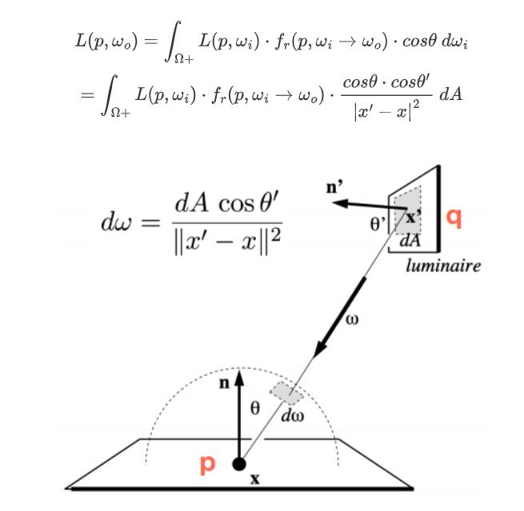 |
| ------------------------------------------------------------ | ------------------------------------------------------------ |

于是为了解决这个问题，作者不再采用逐一计算虚拟光源的方法，而选择以着色点为中心，做一个有侧重的选取

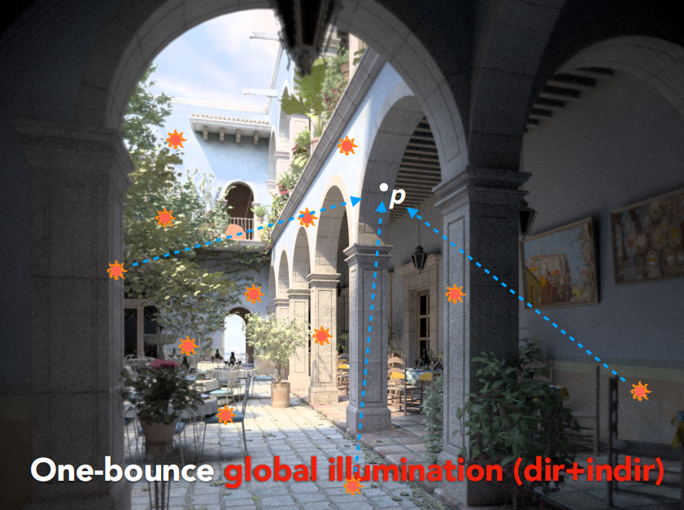

他认为在shadow map中 距离着色点越近（或深度越接近）的虚拟光源带来的贡献越大，那么就只要多选取一些离着色点相近的次级光源，再引入一个与SM距离相关的权重来弥补稀疏采样带来的误差（越远越稀疏，权重越大），就能对最终的结果做出一个很好的近似（一般一个shading point只要400次采样就足够了，直接在原先基础上降了3个数量级，优化幅度还是非常大的）

# RSM总结

综上所述，实现RSM一共需要储存四种信息：

① 光源空间的深度值（shadow map）；② 世界坐标，用来比较距离；③  法线；④ 光源光强flux

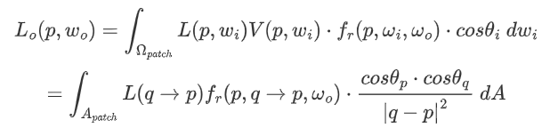

在实际应用中，RSM通常被用来做一些小型的单光源全局光照（如下面这张gif里的手电筒），一方面是因为它思路比较直接，实现起来比较方便，另一方面也是因为小型光源的shadow map的储存压力小，使用RSM可以以非常低的性能代价给画面带来质的提升

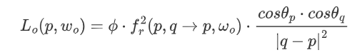

但是同样也是因为这个原因，使得RSM在光源数增加的时候更容易遇到性能瓶颈（因为需要储存更多的shadow map）

另外在其他方面，RSM也还存在着一些问题，比如次级光源的diffuse，忽略Visibility项，低采样率和质量的取舍等等，这些都会或多或少对结果造成一定影响，导致RSM在实际开发中的应用频率并不高

即使如此，作为一个经典的算法，RSM仍对后人带来了相当深远的启发，包括后面要讲的LPV，也是建立在其基础上才被提出的，因此其中的思想仍然值得我们去学习和借鉴


# 三维空间方法

## LPV

参考：[Light Propagation Volumes](https://zhuanlan.zhihu.com/p/412287249)（其中包括Visibility的解决方法）

Light Propagation Volumes（光照传播体积），最早是由 CryEngine3 提出的一种基于RSM和球谐函数的实时全局光照技术，其核心思想是通过将场景划分为一系列三维网格（体素化）来模拟光线的传播，随后利用其Irradiance在传播过程中保持恒定这一特征，计算出每个shading point上的间接光照。这一创造性的方法不仅在速度和质量上有着非常好的表现，还同时解决了一部分RSM带来的问题，下面就来介绍它的具体做法

* **生成（Generation）**

  第一步很简单，利用光源的shadow map完成次级光源的定义即可。在这一步可以通过采样对次级光源的数量做出一些简化，从而给算法带来一定优化

* **注入（Injection）**

  对整个场景进行体素化，并将虚拟光源转化为对应体素的属性。一块体素可能对应多个虚拟光源，叠加其内部所有虚拟光源即可得到当前体素的Radiance信息

  在存储过程中，由于Cube Map的开销过于庞大，我们可以使用球谐函数对其进行压缩，工业界一般认为两阶SH就能做到很好的拟合

  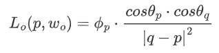

* **传播（Propagation）**

  对于每一个体素，依据其储存的Radiance分布，计算它周围六个体素的radiance，然后分别对它们使用SH进行简化。对角的体素可以被多步传播覆盖到，因此不做考虑

  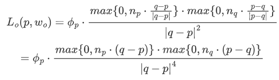

  计算完成后，再算这六块体素各自 除了原体素相邻面以外的 另外五个格子，如此迭代，直至传播的radiance趋于稳定

* **渲染（Rendering）**

  对场景中任意着色点，找到其所在的体素并叠加所在体素中所有方向的radiance后正常渲染即可

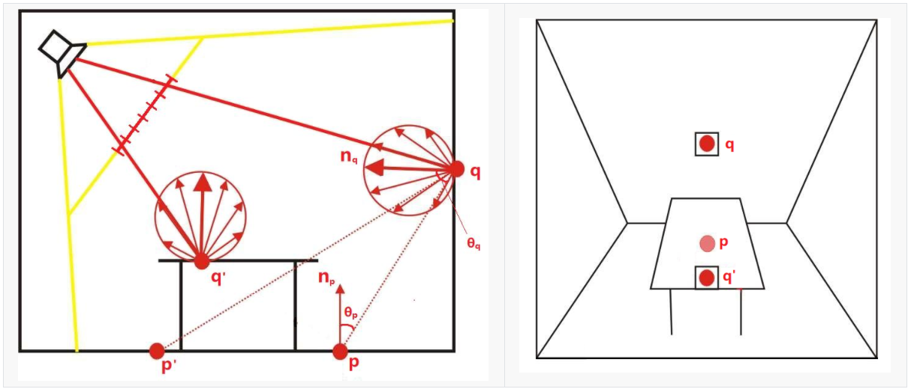

LPV提供的这种实现全局光照的方法<u>不需要任何的预计算</u>，因此可以支持各种变化的场景，做到真正的”实时“。不过，它有时候也会存在一些问题，如图，当渲染的几何对象小于体素大小，即体素划分精度不足时，会出现漏光的现象

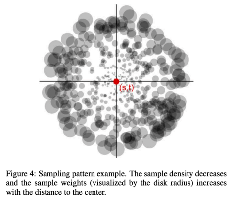.png)

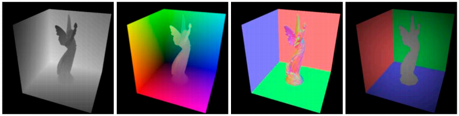.png)

这是因为在LPV注入的时候，我们假设所有的Radiance都是由体素中心发出的，因此对于下左图中原本位于薄墙左侧的点p，就会被强行移动到右侧，产生漏光。为了解决这个问题，我们可以选择提高体素精度，但这还是会面临一个性能与质量之间的取舍

| 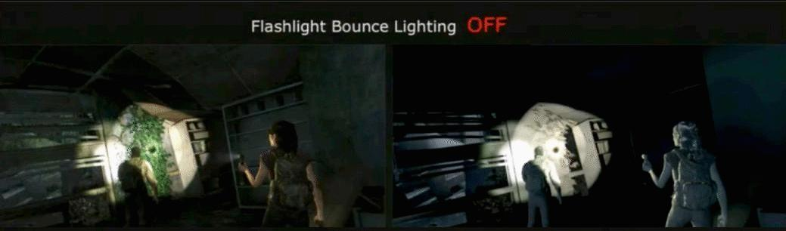 | 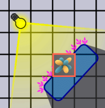 |
| :----------------------------------------------------------: | :----------------------------------------------------------: |

另外，在场景较大、光源较多的情况下，LPV的计算压力也会随之上升，关于这一点，可以使用类似LOD的级联方法进行加速（上右图）

| Q：体素划分一般多大比较合适？                                |
| ------------------------------------------------------------ |
| **A：至少比场景分辨率少一个数量级**                          |
| **Q：一块体素会记录其他多个体素的传播贡献吧？**              |
| **A：当然，每个格子都会对它周围 6个/5个 格子产生贡献，最后累加** |
| **Q：传播过程中会不会一直不稳定传播，达不到稳态而无法停止？** |
| **A：肯定是会达到稳态的，就像向水面投一块石头产生的波纹，没有外界影响的话最后肯定是会收敛的** |
| **Q：LPV会假设次级光源是diffuse的吗？**                      |
| **A：会，只要是用SH压缩，渲染glossy表面都会造成强烈模糊，所以一般只要用了SH都会假设diffuse** |

## VXGI

与RSM和LPV类似，Voxel Global Illumination（体素全局光照）也是一个基于体积渲染的2-pass实时全局光照算法，但它与二者的区别在于：① VXGI 会在对场景离散体素化之后，再对数据做一次==稀疏八叉树划分==，所以从一开始，它的“次级光源”就是一系列体素；② 在渲染过程中，VXGI 会采用==Cone-Tracing==的方式计算间接光的贡献，在速度方面会比LPV慢很多

|                          体素离散化                          |                          八叉树划分                          |
| :----------------------------------------------------------: | :----------------------------------------------------------: |
| 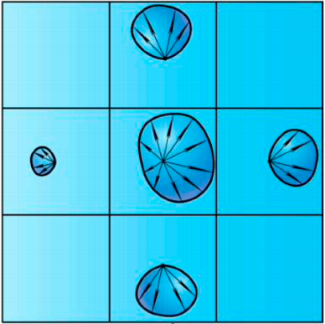 | 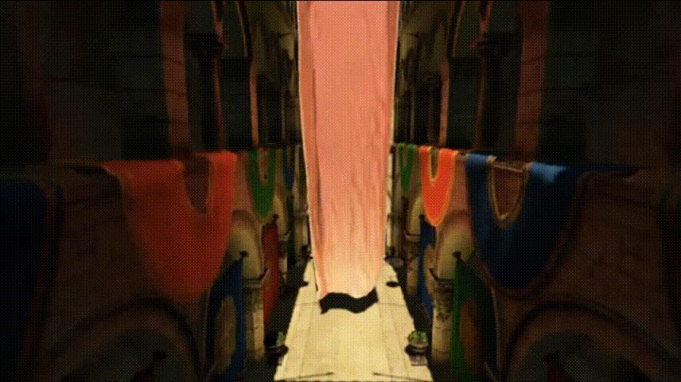 |

下面来具体介绍这个算法的执行步骤：

* **Light-Pass**

  VXGI 的第一个pass主要关注场景中哪些表面会被直接光照照亮，以及间接光照的反射方向。和LPV的注入过程不同的是，虽然它们都是以体素为储存单位，但 VXGI 记录的是直接光源的==入射方向区间==和体素对应的受光表面的==法线方向区间==，结合材质，VXGI 能够轻松的算出间接光照的分布（即直接光出射方向，反射波瓣），而在算完最低层级的体素之后，将当前层级的八个叶子结点相加，就可以计算更高一级体素的间接光照分布了（diffuse的情况比较特殊，下面会提）

  

  比起LPV用SH压缩记录虚拟光源信息，这种计算方法可以支持glossy，并且结果会更加准确

  相关拓展：[Voxel Global Illumination 体素全局光照](https://zhuanlan.zhihu.com/p/414691569)

* **Camera-Pass **

  在第二个Pass，VXGI 就要开始考虑真正的渲染问题了。通过第一个Pass我们可以知道Cone-Tracing的间接光照投射方向与锥角大小，那么对于glossy的表面就可以像Ray-Marching那样，只要基于一定Ray-Cone Footprint（理解为锥截面大小），到八叉树中相应层级进行查询，就可以得到范围内所有shading point的==irradiance==大小了（其实和mipmap一模一样，只不过将纹理查询转化为了子树遍历问题）

  | 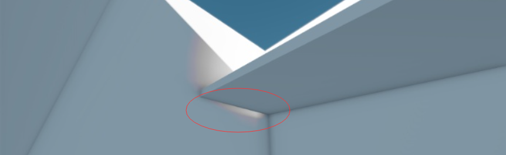.png) | 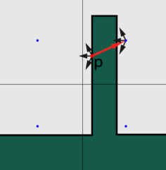.png) |
  | :----------------------------------------------------------: | :----------------------------------------------------------: |

  而对于diffuse表面就比较特殊了，VXGI 通常会将出射方向看做若干圆锥，而忽略锥与锥之间的间隙（影响并不会很大），暴力求解，但这样一来diffuse就会比glossy多一层循环，效率比起其他方法自然也会更差

  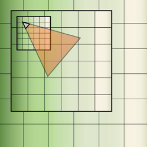

总的来说，同样作为一种体积渲染方法，VXGI 的渲染结果质量非常好，有时候甚至可以做到与光线追踪相近的效果，但缺点是开销太大，且Light-Pass前的体素化会有一定预处理需求，所以它的实际应用也受到了很大的限制

下面是VXGI 的效果gif

|                           直接光照                           |                            体素化                            |                           最终结果                           |
| :----------------------------------------------------------: | :----------------------------------------------------------: | :----------------------------------------------------------: |
| 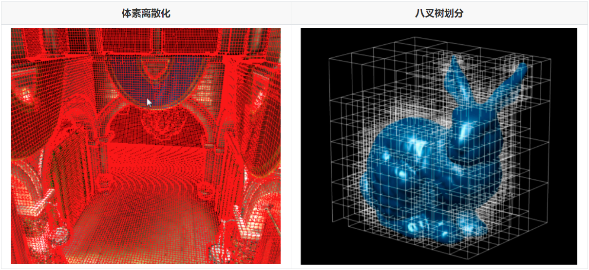 | 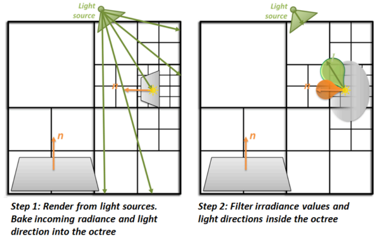 | 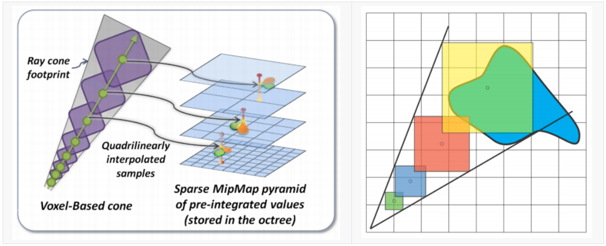 |


# 屏幕空间方法

屏幕空间实时渲染，是指利用在所有pass渲染完成之前各个帧缓冲中的信息，对已渲染结果加以修改的渲染方法。伴随着延迟渲染的兴起，更多的信息得以在屏幕空间取得，因此也延伸出许多不同的算法，这些算法一般都具有如下特点：

* 能够很方便的支持各种滤波算法
* 解除了场景复杂度对算法的限制
* 会有不同程度的信息丢失（因为只能获得一些相机观察得到的信息，所以遮挡越多，越有可能发生信息丢失）

本节将针对屏幕空间的全局光照，介绍SSAO，HBAO，SSDO、SSR共四种GI近似方法

## AO（环境光遮蔽）

在开始这个话题之前，首先要明白AO是什么，它和法线、RGB这类信息一样，也是场景的一种属性，描述的是物体与物体之间环境光互相遮挡的程度。在场景中加入AO信息，可以让物体相交处的阴影更加脚踏实地，从而让整个画面更具立体感

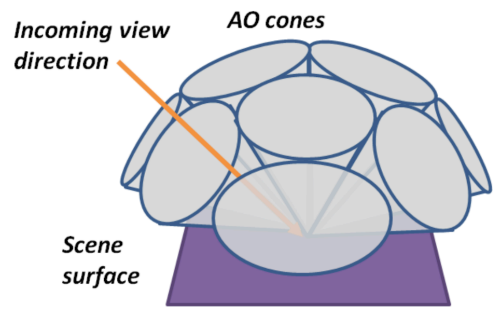

在计算全局光照过程中，由于我们无法在屏幕空间中直接获得间接光照，所以一般会假设间接光照强度为一个定值，随后通过AO来决定GI的亮度。比如在下图中，左边的shading point的AO比右图小，那么显然左边的间接光就会比右边亮

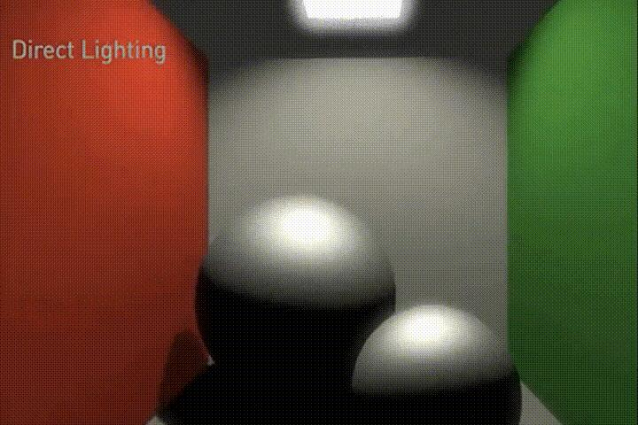

# AO背后的数学原理

有了形象解释，再来看渲染方程
$$
L_o(p,\omega_o)=\int_{\Omega+} L_i(p,\omega_i) f_r(p,\omega_i,\omega_o)
V(p,\omega_i) cos\theta_i \, \mathrm{d}\omega_i\\
\int_\Omega f(x)g(x)dx\approx\frac{\int_\Omega f(x)dx}{\int_\Omega dx}·\int_\Omega g(x) \, \mathrm{d}x\\
L_o(p,\omega_o) \approx \frac
{\int_{\Omega+}V(p,\omega_i)\cos\theta_i \, \mathrm{d}\omega_i}
{\int_{\Omega+}\cos\theta_i \, \mathrm{d}\omega_i}·
\int_{\Omega+}L_i(p,\omega_i)f_r(p,\omega_i,\omega_o)\cos\theta_i \, \mathrm{d}\omega_i
$$
为了方便理解，我们需要再次用之前那个积分近似公式 把Visibility项拆出来，只不过这次我们并不是简简单单的对拆出去的Visibility取平均，而是引入了一个新的概念——投影立体角

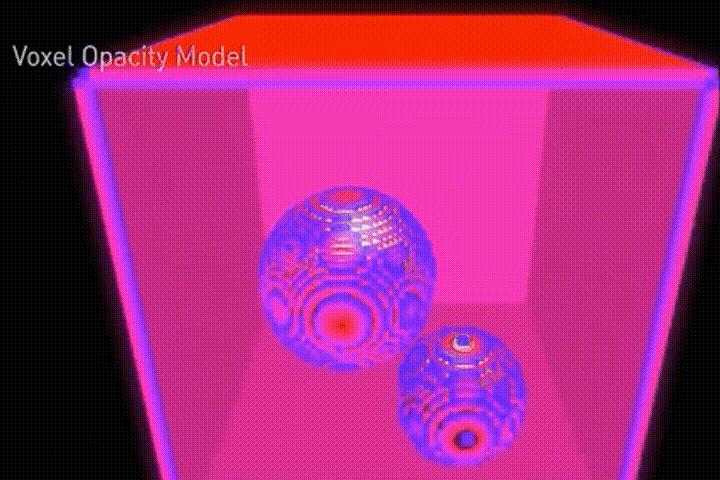

从图中可以看到，我们原先定义的立体角是在单位球上的一个面积微元，$\mathrm{d}\omega_i=\sin{\theta} \mathrm{d}\theta\mathrm{d}\phi$，如果我们在此基础上，将这个面积微元向x-y平面投影，就会得到一个单位圆上的面积微元，而这块面积我们就称其为投影立体角，$\mathrm{d}x_{\perp}=\cos{\theta_i}\,\mathrm{d}\omega_i$，不难看出，对单位半球面上的投影立体角求积分的结果，就相当于在求一个单位圆的面积，那么约等式的前半部分就可以理解为是在对 **单位半球面  沿法线垂直向下投影  所得的单位圆内**对可见性按照cos值进行加权平均；而对于式子的后半部分，由于我们假设了间接光照强度是一个定值，且材质BRDF全都统一为diffuse，所以整个后半段积分积出来就是个常数，$L_{indir}·\frac{\rho}{\pi}·\pi=L_{indir}·\rho$，这对于积分近似公式也是100%准确的

由上，原式最后可以化简如下
$$
L_o(p,\omega_o)=\int_{\Omega+} L_i(p,\omega_i) f_r(p,\omega_i,\omega_o)
V(p,\omega_i) cos\theta_i \, \mathrm{d}\omega_i\\
=\frac{\rho}{\pi}·L_i(p)· \int_{\Omega+}V(p,\omega_i)\cos\theta_i \, \mathrm{d}\omega_i\\
$$
通过这个式子我们就可以很直观的了解到AO背后的实现原理，即==环境的间接光照 = 来自远处的未被遮挡的光线==

值得注意的是，此处的“来自远处”并不代表着可见判断范围可以无限大，因为在某些特定的封闭场景下（如室内），如果可见性判定范围无穷大，将会得到一个AO处处为1的结果（即没有间接光照），而若判定范围不足，则会造成可见信息的丢失，因此我们为了得到准确的AO，一般都会选取一个合适的判定半径，在一个半球范围内完成操作，这是一个不可避免的trade off

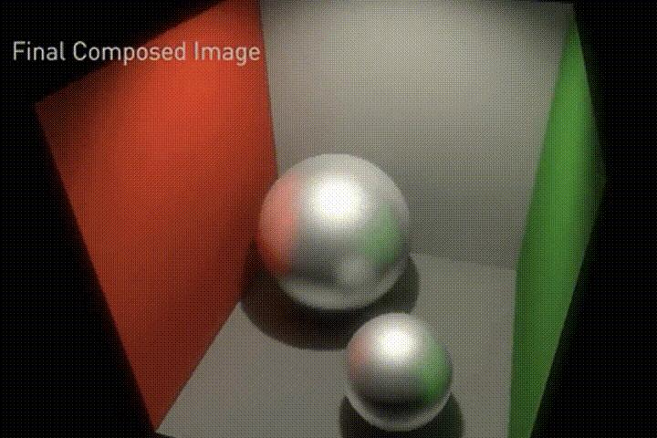

## SSAO

经过上述分析，我们已经得到了场景AO的计算方法，那么现在的问题就只剩下如何（在屏幕空间中）求Visibility的积分了

对此，SSAO（Screen-Space Ambient Occulusion）的解决方案如下：

* 首先从相机出发，得到屏幕空间的深度信息，写入z-buffer
* 对屏幕空间的任意一个像素（着色点），在以它为中心、R为半径的球体范围内随机寻找数个采样点，判断其可见性
* 若该采样点的深度大于它在屏幕空间对应的深度，则认为该点不可见，记可见性为0（下图绿点）
* 计算可见性为1的采样点的占比，作为当前像素的visibility值

在早些时候，屏幕空间渲染还无法获得法线信息，因此那时候SSAO只能通过考虑visibility小于50%的情况来近似AO，并且同时无法使用上面推导的cos对可见性进行加权

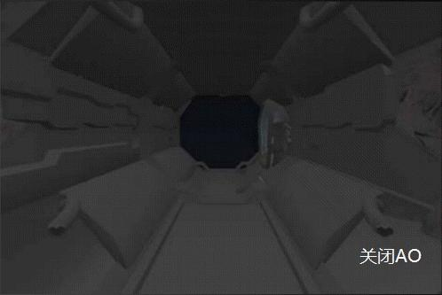

而在延迟渲染普及之后，我们就可以更加准确的在法向半球内采样，进而也能够使用法线与采样点之间的夹角余弦对结果做加权平均

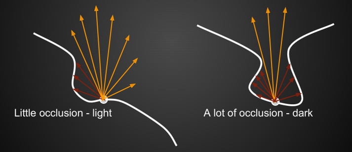

但是即使这样，在特定的采样点我们仍会得到错误的结果，如上图中红色虚线右侧的红点，理论上它应该需要为其对应着色点计算贡献，但却由于深度测试 该点被错误判定为不可见，而导致结果产生多余的阴影

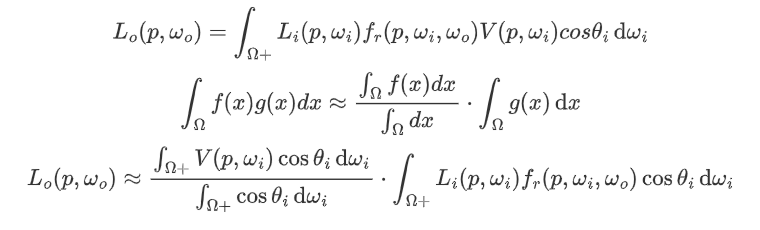

对于这样的错误，首先它并不会对最终结果造成太大的影响，其次SSAO也没有什么可靠的解决方案，所以在实际计算过程中我们一般选择忽略不计......

纵观SSAO的整个实现过程，我们可以发现它的思路非常像PCF做软阴影，采样的过程也极其相似，样本数量越大，结果越好，效率越慢，只不过由于在屏幕空间做后处理非常方便，通常情况我们不会直接使用非常高的采样率，而是会先采用一个较低的采样(64次以内)，再对它做一次降噪，降噪残留的模糊与噪声在与其他光照叠加计算后会得到一定掩盖，所以我们并不需要过多的担心质量的问题

| Q：减少采样半径可以缓解false occlusion么？          |
| --------------------------------------------------- |
| **A：可以，但减少采样半径会伴随着AO自身效果的变淡** |

## HBAO

这里老师讲的并不是非常明白，如果有需要可以参考：[【论文复现】Image-Space Horizon-Based Ambient Occlusion](https://zhuanlan.zhihu.com/p/367793439)

HBAO（Horizon-Based Ambient Occlusion）相比SSAO，不仅改善了冗余阴影的问题，还大大减少了采样率的需求，使得它成为了目前手机端最主流的环境光遮蔽算法

其主要思想是，使用==多次光线步进== 找到<u>着色点切平面</u>与<u>遮挡物采样点</u>形成的最大角度，再通过这个角度来计算物体与物体间的遮挡程度，从而完成对环境光遮蔽的近似

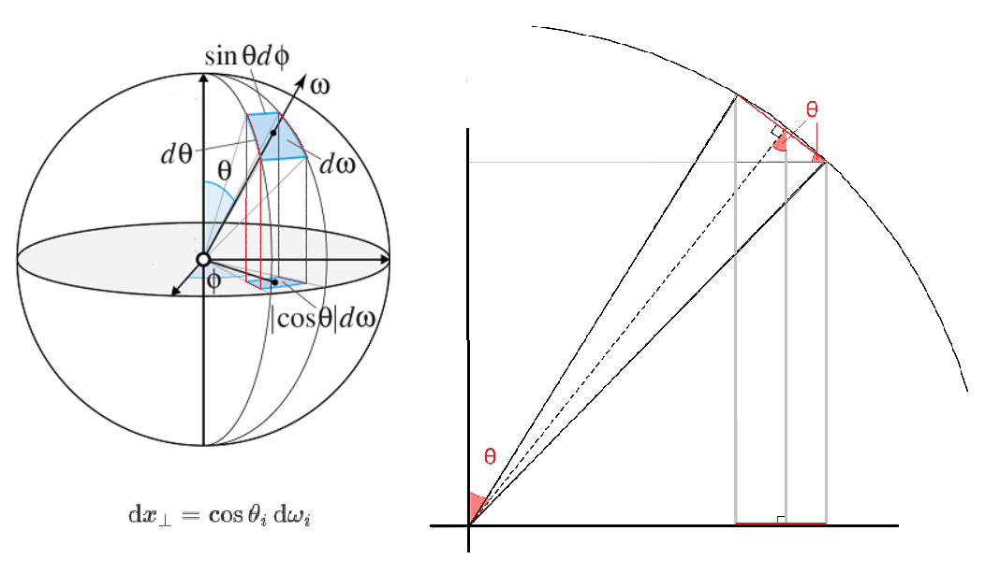

公式如下：
$$
AO_p=1- \frac{1}{2\pi} \int_{\Omega} \cos(\alpha)W(\omega_i) \, \mathrm{d}\omega_i\\
=1- \frac{1}{2\pi} \int_{\theta=-\pi}^{\pi}(\sin(H(\theta))-\sin(t(\theta)))W(\omega_i) \, \mathrm{d}\omega_i
$$
公式中的sin可以由万能公式换成tan进行计算，其余推导见链接

下图展示了SSAO与HBAO各自的效果，可以看到，二者还是存在一定质量上的差距的

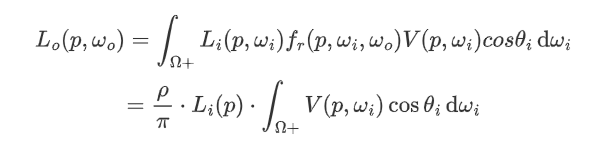

## SSDO

和HBAO一样，SSDO （Screen Space Directional Occlusion）也是一种对于SSAO的改进算法，它几乎照搬了RSM的实现思路，通过在屏幕空间计算一系列虚拟光源的贡献，以较小的代价取得了相比SSAO更为准确的结果

# 实现原理

其计算过程大致可以分为两部分——直接光照与间接光照：

* **直接光照**

  在着色点的法向半球内随机寻找若干采样点，判断其可见性，以此确定是否要为该采样点计算直接光照

  下左图中，$\textcolor{red}{A、B、D}$均为遮挡，因此仅需要计算$\textcolor{red}{C}$点的直接光照：
  $$
  L_o^{dir}(p,\omega_o)=\int_{\Omega+,\textcolor{blue}{V=1}} L_i^\textcolor{blue}{dir}(p,\omega_i)
  f_r(p,\omega_i,\omega_o) \cos\theta_i \, \mathrm{d}\omega_i
  $$

* **间接光照**

  在完成直接光照计算后，找到所有采样点在着色点法向半球内对应的表面微元，将它们设置为diffuse的次级光源，再依据次级光源的法线信息判断其有效性，对所有满足条件的次级光源计算间接光贡献

  下右图中，$\textcolor{grey}{C}$点在法向半球以外，$\textcolor{grey}{A}$点因法线朝向问题被判定为无效，所以最后只需计算$\textcolor{grey}{B}$点和$\textcolor{grey}{D}$点的间接光照即可
  $$
  L_o^{indir}(p,\omega_o)=\int_{\Omega+,\textcolor{blue}{V=0}} L_i^\textcolor{blue}{indir}(p,\omega_i)
  f_r(p,\omega_i,\omega_o) cos\theta_i \, \mathrm{d}\omega_i\\
  =\sum_{i=1}^N L_{pixel}(1-V(\omega_i)) · \frac{\rho}{\pi} · 
  \frac{A_s \cos{\theta_{s_i}}\cos{\theta_{r_i}}}{d_i^2}
  $$

*（公式解释：$d_i$为着色点$P$到次级光源$P_i$的距离，$\cos{\theta_{s_i}}$为次级光源$P_i$的法线与$\overrightarrow{P_iP}$的夹角余弦，$\cos{\theta_{r_i}}$为$P$点法线与$\overrightarrow{PP_i}$的夹角余弦，$A_s$为为调节渗光程度的因子，表示虚拟点光源的面积，此处为$\frac{\pi r^2_{max}}{N}$）*

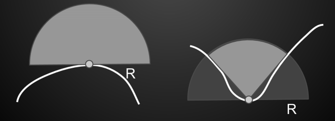

可以看到，SSDO与SSAO的最大区别在于它们==计算间接光照的来源不同==，SSAO认为间接光来源于远处的未被遮挡的光线，而SSDO则认为它们来自于周围较近的遮挡物体的反射，正因为这一点，SSDO可以直接通过屏幕空间的像素颜色对间接光照进行估计，而不再需要将间接光照设为一个定值代入计算，也正因如此，SSDO的结果会得到更多的细节表现（color bleeding）

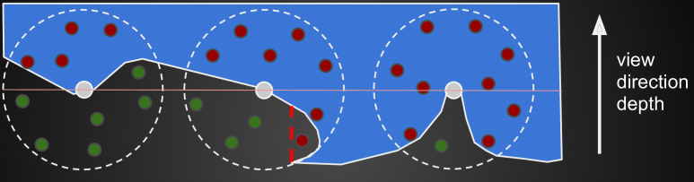

# SSDO存在的问题

由于SSDO和SSAO一样是屏幕空间的计算方法，所以它具有一切使用屏幕空间算法的弊端，如flase occlusion，信息丢失等

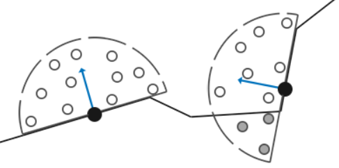.png)

就以图中的A点和B点为例，对于A点，理论上应该分别对直接光照和间接光照进行计算，但是SSDO将其判定为不可见，并错误的设置了虚拟光源，导致在A点处产生了flase occlusion；而对于B点，在计算其直接光照时，SSDO直接计算了PB连线上的光照信息而忽略了遮挡，导致B点发生漏光

更重要的是，SSDO对间接光的近似方法是通过计算附近遮挡物的反射，所以它无法做到像SSAO那样考虑来自远处的间接光（其实按道理讲SSAO与SSDO应该互相配合着一起使用，但现实如何我们无从得知）另外，屏幕空间的信息丢失对SSDO的影响也会更加明显，因为几何特征的丢失会伴随着颜色信息的丢失，如下图中的两个长方体，随着它们摆放角度的逐渐垂直，地面上的颜色信息也会逐渐消失

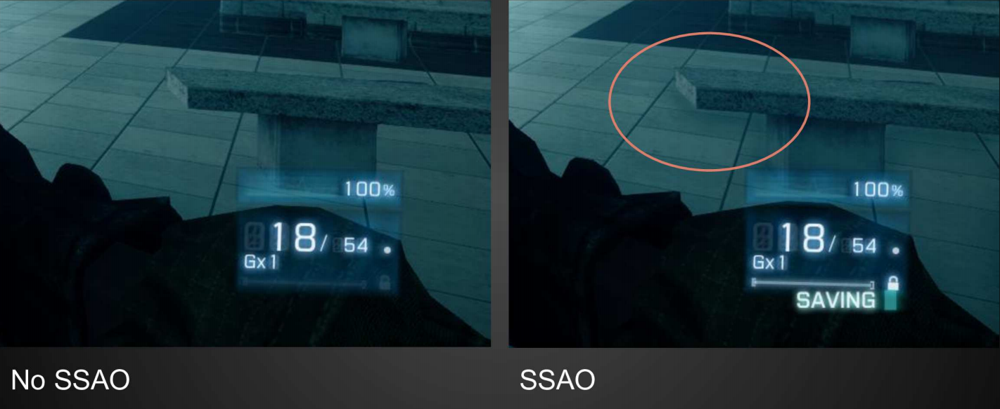.png)

## SSR

我们前面介绍的这三种方法，SSAO、HBAO与SSDO，都是基于屏幕空间的环境光遮蔽提出的GI近似算法，但它们对于间接光照的理解都没有触及到问题的本质。回顾一下我们一开始对于全局光照的定义，它的核心是如何通过模拟光线的==传播路径==来计算比直接光照==多一次bounce==的光照结果，也就是说，如果想要在屏幕空间得到一个更加真实的结果，还是得靠光线追踪才能实现。托 延迟渲染 的福，现在的屏幕空间已经基本具备了所有模拟光线弹射的条件（法线，深度，balabala），那么剩下的问题就是如何与物体求交做shading，也就是我们接下来要介绍的最后一种方法——SSR（屏幕空间反射，screen-space relfections）

# 再提Ray-Marching

因为在屏幕空间中只能获得场景几何最浅深度上的一些信息，所以我们无法再继续像3d空间那样用Möller-Trumbore等算法做Ray-casting了，那么为了计算光线与物体求交就必须转变一下思路，使用Ray-Marching来做判断

有关光线步进这个概念，我们已经在HBAO和之前的DFSS算法中多次提及，它无非就是让光线按一定步长向前迈进，同时判断是否与物体产生相交。由于这种计算方式适用于无法通过套公式进行求交的情况，所以在体渲染中得到了大量的应用，而对于SSR屏幕空间，只要再在此基础上多加一步空间转换，配合DDA画线算法，就可以完成这步操作了

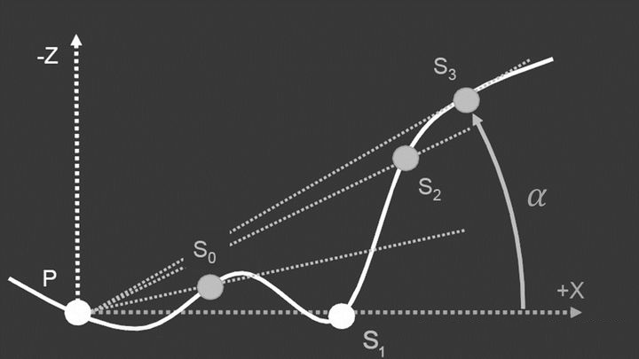

具体参考 [【论文复现】Efficient GPU Screen-Space Ray Tracing](https://zhuanlan.zhihu.com/p/386510829)，以及[Ray-tracing和Ray-marching的区别](https://www.zhihu.com/question/29863225)

# Hierarchical tracing加速结构

现在我们解决了屏幕空间的求交问题，但显然这种方法对实时渲染来说太慢了，虽然这种逐像素逐步长Ray-Marching非常稳妥，但中间的过程存在大量的性能浪费，这并不是我们所想看到的。那么有没有一种方法，既可以替代这种遍历式步进，又可以做到像三维的BVH / KD-Tree那样的加速效果呢？

于是有人就参照SDF，提出了一种基于动态步长的层级加速结构，这个结构有点类似Mipmap，会首先对深度缓存中的屏幕深度生成一个层级纹理，这个过程并不是像Mipmap那种做双线性插值，而是取四个像素的最小深度直接写入缓冲，如图

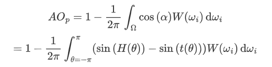

这时候我们再看下图的二维几何近似，可以发现这种层级结构刚好相当于对原场景生成了多个层级的包围盒，并且在级与级之间很自然的形成了一棵树形结构

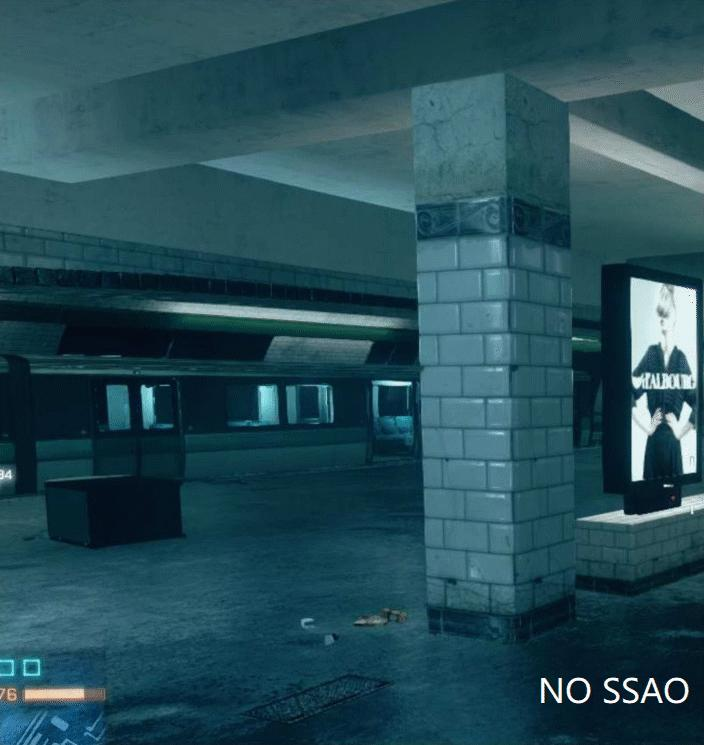

直接上伪代码：

```c
void intersect(int level)
{
	while(level>-1)
    {
        for(i=0; i<4; i++)
    	{
			if( hit level->node[i++] )
				level--;
                break;
		}
    }
}

int level = 0;
while(level>-1 && in screen)	//求交成功/失败->退出循环
{
    step through current cell;	//按当前level步长向前迈进
    if(above Z plane)
        level++;				//若没有交点，则加大步长
    if(below Z plane) 
    {
        level--;				//若有交点则遍历当前层级
		intersect(level);		//定位到相交的子节点，随后缩短步长，在子节点层级继续求交
    }
}
```

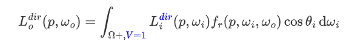

按paper的写法确实应该多一步增大步长，但这样会破坏树形结构，不太方便理解

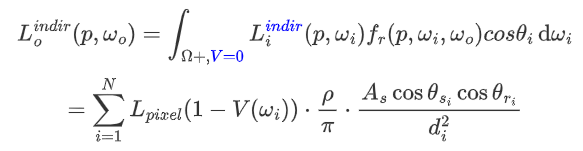

# 着色&采样方法

求到光线与物体的交点，剩下的工作就简单了。SSR计算着色的方法几乎与路径追踪一模一样，如果是specular材质则cast一次，是glossy材质就用蒙特卡洛重要性采样多次计算（这里需要假设次级反射物为diffuse），正因为这一点，SSR才具备了实现许多路径追踪自带高质量效果的能力，如下图中的接触锐化和各向同性拉伸：

|                       Glossy & Blurry                        |                Contact hardening（接触锐化）                 |
| :----------------------------------------------------------: | :----------------------------------------------------------: |
| 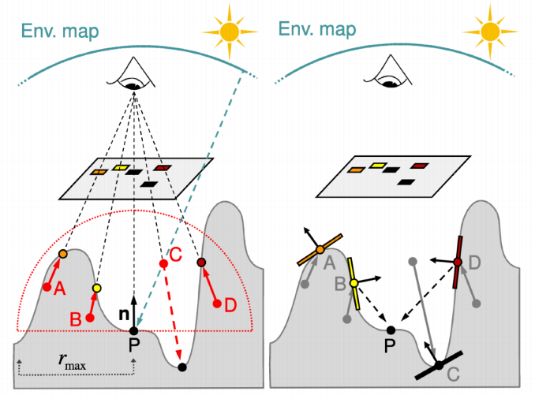 | 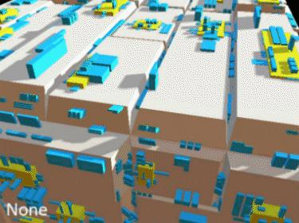 |
|           **Specular elongation（各向同性拉伸）**            |                     **Spacial Varying**                      |
| 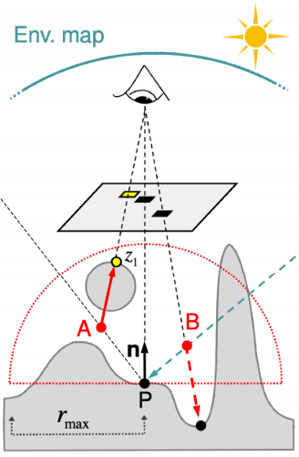 | 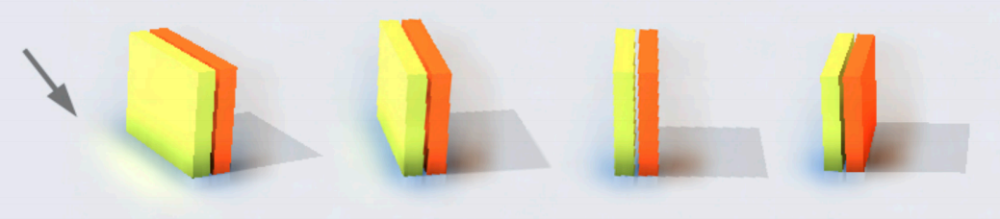 |

唯一的不同在于，SSR不用考虑光线的平方衰减，并且可以保证交点的可见性，这是因为SSR的采样对象是brdf本身，而只有在对光源采样的时候才要考虑衰减和遮挡...

至于对采样算法的优化，一方面我们可以采用之前的pre-filtering，通过提前对glossy反射波瓣的覆盖区域做滤波处理，来加快实际渲染速度。但这里有一点需要注意，屏幕空间的滤波操作还需要考虑深度值大小（原因如下图所示），在此我们不做深入讨论

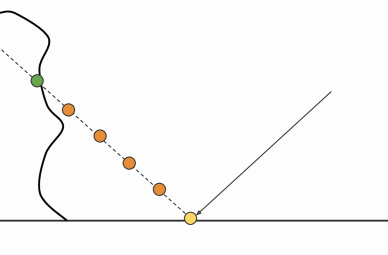

另外，因为反射平面上邻近的两个着色点很有可能会采样到同一个交点，所以我们还可以对交点进行复用，如图：

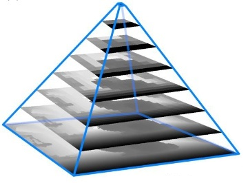

（p.s. 还有一些时间上的加速算法，留到后续的实时光线追踪中详细介绍）

# SSR总结

综合来看，SSR是一个极其优秀的屏幕空间算法，既能在实时的条件下根据不同材质得到不同的高质量结果，又能忽略前面AO算法中的各种遮挡问题，集各种优良性质于一身，属实nb

不过金无足赤，SSR也有自己不完美的地方，首先还是信息丢失的问题，这是屏幕空间算法的通病，无需多言

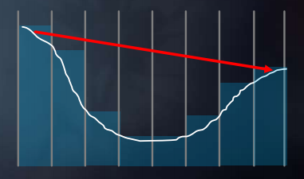.png)

另外还有就是它的硬边问题了，如果不做软化处理，结果会显得非常不自然，如图：

| 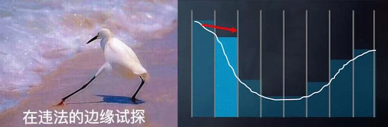.png) | 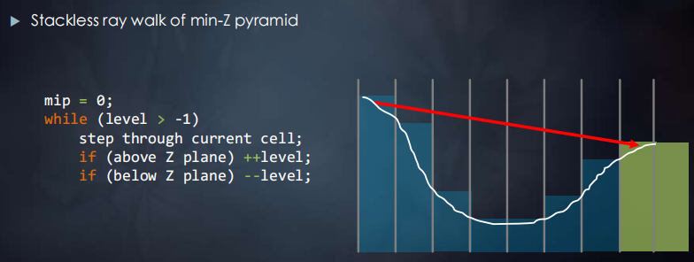.png) |
| ------------------------------------------------------------ | ------------------------------------------------------------ |
