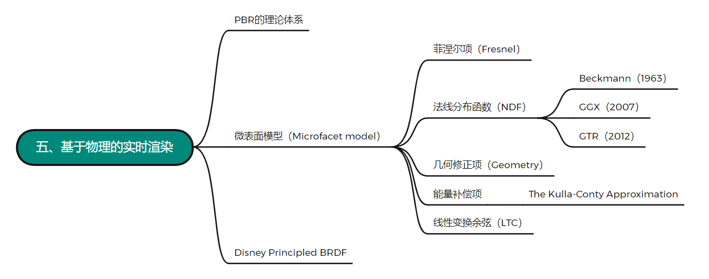

> 基于物理的渲染（Physically Based Rendering，PBR）是指使用基于物理原理和[微平面理论](https://zhida.zhihu.com/search?content_id=192433904&content_type=Article&match_order=1&q=%E5%BE%AE%E5%B9%B3%E9%9D%A2%E7%90%86%E8%AE%BA&zhida_source=entity)建模的着色/光照模型，以及使用从现实中测量的表面参数来准确表示真实世界材质的渲染理念

[链接](https://www.zhihu.com/collection/751205415)

*（我们不必拘泥过去，传承是最好的缅怀）*

## **PBR的理论体系**

很多人一提到PBR，就会联想到各种BRDF和各种计算模型，但是从严格意义上来讲，PBR的理论体系不应该仅限于材质，其他的一些渲染相关的话题，比如光照、相机、光线传播等，也都应该被囊括在内

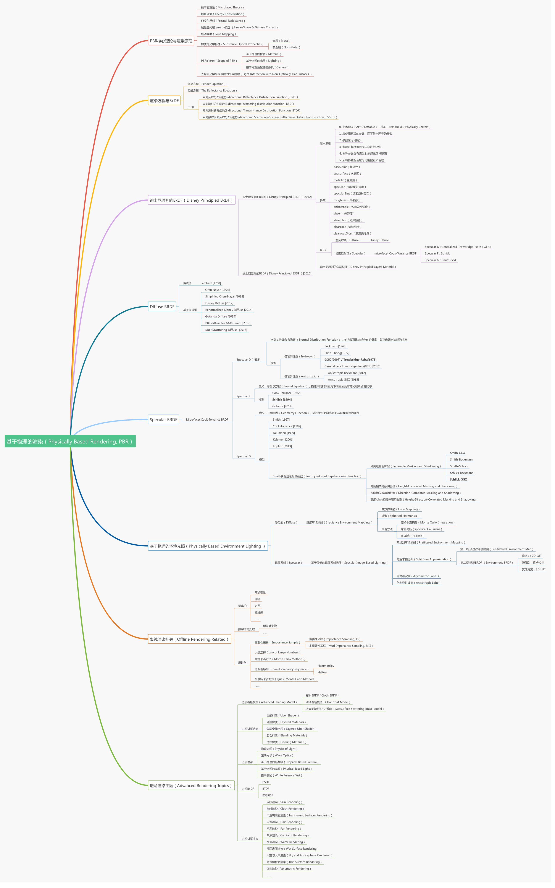

图源PBR白皮书

在PBR理论体系下的实时渲染，更多关注的是如何通过一些“Hack”的方法对原有模型做出一些简化，从而保证在一定速度的前提下尽可能的提高渲染质量，因此绝大多数在RTR范畴内实现的PBR都不是真正意义上的“Physically Based”，对于它们而言，性能才是第一优先级

本节所讨论的内容并不会覆盖到PBR的全部方面，也不会涉及体积雾或毛发这些复杂的材质，只是简单针对表面模型下的Microfacet model和Disney Principled BRDF做的一些概论性描述和理论探讨

## **[微表面模型](https://zhida.zhihu.com/search?content_id=192433904&content_type=Article&match_order=1&q=%E5%BE%AE%E8%A1%A8%E9%9D%A2%E6%A8%A1%E5%9E%8B&zhida_source=entity)**

在一般的渲染过程中，我们通常会忽略物体表面的微观几何形态，而直接以宏观平滑的假设对其进行渲染，然而事实上，这些微观的表面的确会对渲染结果造成一定的影响，如果不考虑它们，我们就永远无法精确的表示出BRDF。微表面模型（Microfacet model）就是这样一个**从宏观角度对微观进行建模**的一个理论，通过描述物体表面的微观法线的随机分布，从而达到表现更多材质细节的目的

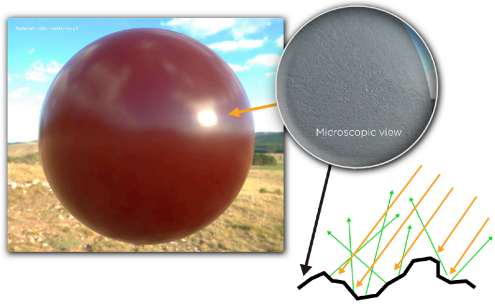

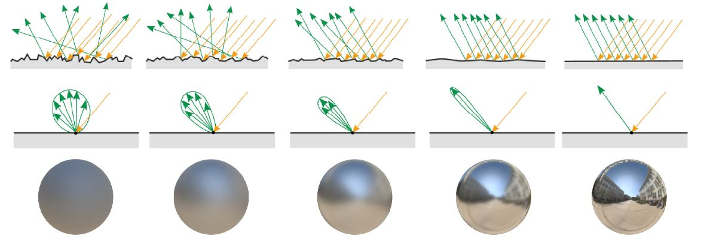

图源Moving Frostbite to PBR，SIGGRAPH 2014

在不考虑透明材质散射的情况下，我们可以由这些物理现象推导出一个一般情况下的BRDF[表达式](https://zhida.zhihu.com/search?content_id=192433904&content_type=Article&match_order=1&q=%E8%A1%A8%E8%BE%BE%E5%BC%8F&zhida_source=entity)

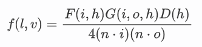

这就是著名的 *Microfacet Cook-Torrance BRDF*，它是目前应用最广、实现过程最为简单的微表面模型。其中，F是菲涅尔方程，D是[法线分布函数](https://zhida.zhihu.com/search?content_id=192433904&content_type=Article&match_order=1&q=%E6%B3%95%E7%BA%BF%E5%88%86%E5%B8%83%E5%87%BD%E6%95%B0&zhida_source=entity)，G是几何修正项，分母 $4(n·i)(n·o)$ 是宏观与微观之间转换的校正因子，接下来会对这几项做详细的说明

### **[菲涅尔项](https://zhida.zhihu.com/search?content_id=192433904&content_type=Article&match_order=1&q=%E8%8F%B2%E6%B6%85%E5%B0%94%E9%A1%B9&zhida_source=entity)（Fresnel）**

[菲涅尔现象](https://zhida.zhihu.com/search?content_id=192433904&content_type=Article&match_order=1&q=%E8%8F%B2%E6%B6%85%E5%B0%94%E7%8E%B0%E8%B1%A1&zhida_source=entity)在我们的生活中无处不在，最经典的一个例子就是湖面的倒影——近处的湖水清澈见底，而远处的湖面反射强烈

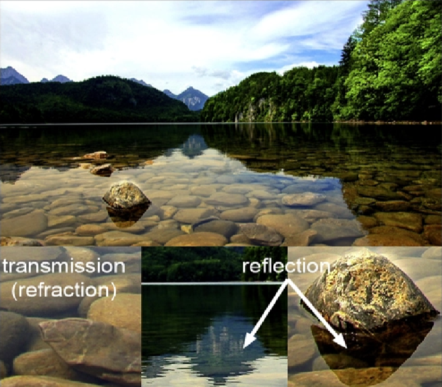

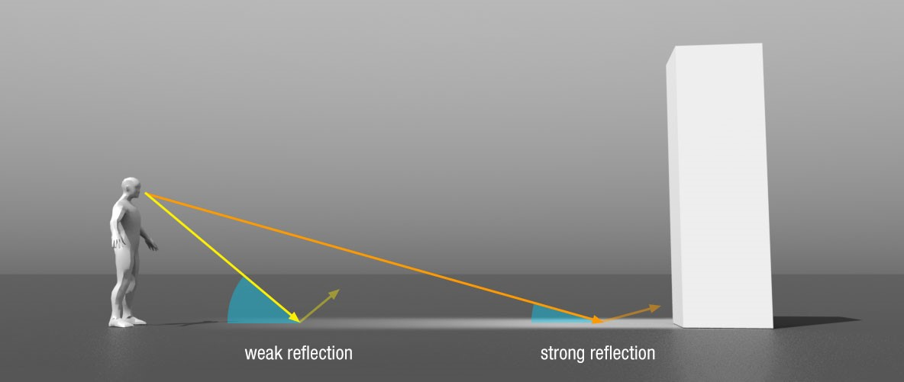

而菲涅尔方程就体现了这种观察角度与光线的[反射率](https://zhida.zhihu.com/search?content_id=192433904&content_type=Article&match_order=1&q=%E5%8F%8D%E5%B0%84%E7%8E%87&zhida_source=entity)之间的关系，观察角度越大，反射率就越大，而当观察角度接近[掠射角](https://zhida.zhihu.com/search?content_id=192433904&content_type=Article&match_order=1&q=%E6%8E%A0%E5%B0%84%E8%A7%92&zhida_source=entity)时（视线与法线接近90°），反射率会急剧增加，并且随着材质种类的变化，这种增长关系会有所不同

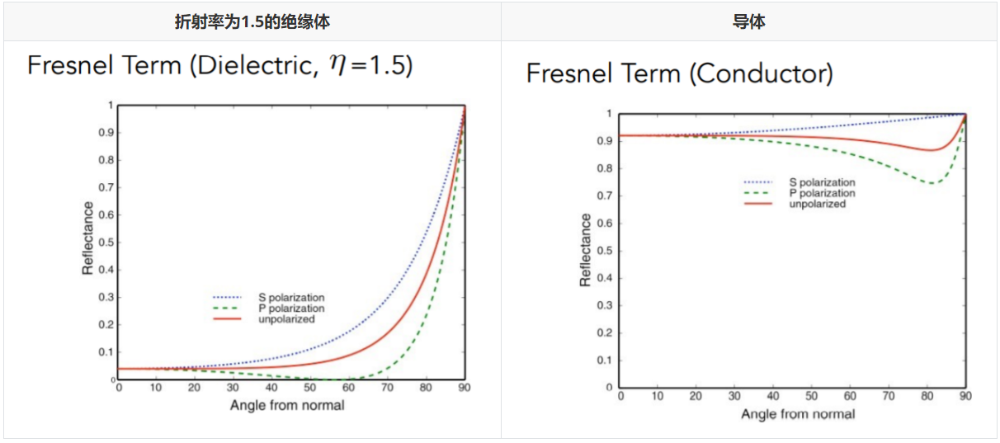

[计算理论](https://zhida.zhihu.com/search?content_id=192433904&content_type=Article&match_order=1&q=%E8%AE%A1%E7%AE%97%E7%90%86%E8%AE%BA&zhida_source=entity)的菲涅尔项需要考虑光线的[极化](https://zhida.zhihu.com/search?content_id=192433904&content_type=Article&match_order=1&q=%E6%9E%81%E5%8C%96&zhida_source=entity)（图中的蓝色和绿色虚线），公式非常复杂

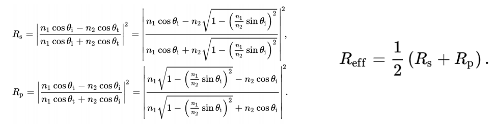

所以我们通常会使用Schlick方法对其进行近似：

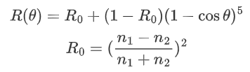

其中， $\theta$ 是法线与观察方向的夹角， $R_0$ 是0度角入射的[菲涅尔反射率](https://zhida.zhihu.com/search?content_id=192433904&content_type=Article&match_order=1&q=%E8%8F%B2%E6%B6%85%E5%B0%94%E5%8F%8D%E5%B0%84%E7%8E%87&zhida_source=entity)（即基础反射率），其值取决于物体的种类

可以看到，当 $ \theta=0°$ 时， $R(\theta)=0$ ，而当 $\theta=90°$ ， $R(\theta)=1$ ，整个函数呈现出单调增的形态，完美符合菲涅尔项的数据特征，且[计算成本](https://zhida.zhihu.com/search?content_id=192433904&content_type=Article&match_order=1&q=%E8%AE%A1%E7%AE%97%E6%88%90%E6%9C%AC&zhida_source=entity)也相对低廉了许多

### **法线分布函数（NDF）**

法线分布函数 （Normal Distribution Function）描述了微观表面的法线[概率分布](https://zhida.zhihu.com/search?content_id=192433904&content_type=Article&match_order=1&q=%E6%A6%82%E7%8E%87%E5%88%86%E5%B8%83&zhida_source=entity)，是微表面理论的核心。不同于其他光照模型的是，它更倾向于[从微观](https://zhida.zhihu.com/search?content_id=192433904&content_type=Article&match_order=1&q=%E4%BB%8E%E5%BE%AE%E8%A7%82&zhida_source=entity)的角度解释高光，即认为[微表面法线](https://zhida.zhihu.com/search?content_id=192433904&content_type=Article&match_order=1&q=%E5%BE%AE%E8%A1%A8%E9%9D%A2%E6%B3%95%E7%BA%BF&zhida_source=entity)越集中的物体 越容易表现出[specular](https://zhida.zhihu.com/search?content_id=192433904&content_type=Article&match_order=1&q=specular&zhida_source=entity)的性质，反之则越diffuse（另一种理解方式是，diffuse的微表面相当于是在glossy的表面高度场上做了一次缩放，加深了微表面之间的沟壑，打乱了原有的法线排布，从而使得物体看起来比原来更粗糙）

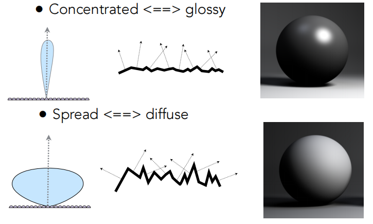

目前较为主流的（各向同性的）法线分布函数有Beckmann、GGX和GTR

**Beckmann**

Beckmann是一种定义在坡度空间上的类高斯分布模型，其表达式如下

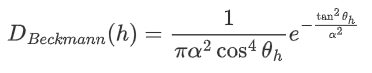

由于微表面的[法线](https://zhida.zhihu.com/search?content_id=192433904&content_type=Article&match_order=11&q=%E6%B3%95%E7%BA%BF&zhida_source=entity)很难像宏观的法线那样直接写出来，所以我们通常使用微观半程向量 $h$ 的一个函数代为表示，其中 $\alpha$ 是粗糙度系数， $\theta_h$ 是[半程向量](https://zhida.zhihu.com/search?content_id=192433904&content_type=Article&match_order=2&q=%E5%8D%8A%E7%A8%8B%E5%90%91%E9%87%8F&zhida_source=entity)与宏观法线的夹角。而之所以要在坡度空间上使用 $\tan^2{\theta_h}$ 来定义这个分布函数，是因为要满足[高斯分布](https://zhida.zhihu.com/search?content_id=192433904&content_type=Article&match_order=2&q=%E9%AB%98%E6%96%AF%E5%88%86%E5%B8%83&zhida_source=entity)的[定义域](https://zhida.zhihu.com/search?content_id=192433904&content_type=Article&match_order=1&q=%E5%AE%9A%E4%B9%89%E5%9F%9F&zhida_source=entity)无限大的性质，保证函数无论何时都具有对应的非负值，并且避免微表面出现法线朝下的问题（但无法避免反射光朝下）

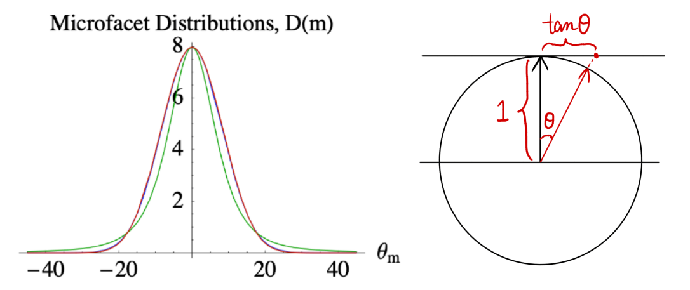

*（三维的情况对应的是[切平面](https://zhida.zhihu.com/search?content_id=192433904&content_type=Article&match_order=1&q=%E5%88%87%E5%B9%B3%E9%9D%A2&zhida_source=entity)）*

**GGX / TR**

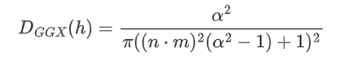

GGX相对于Beckmann在工业界得到了更为广泛的应用，因为它具有更好的高光拖尾（Long tail 性质，衰减更加柔和）

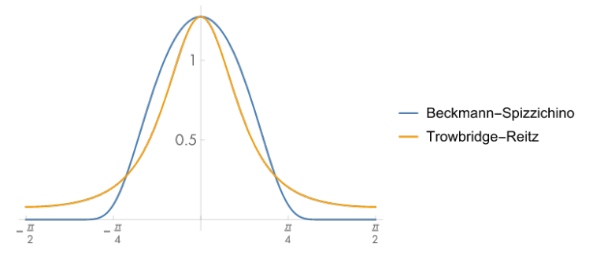

从下图可以看到，在相同粗糙度的情况下，GGX模型能表现出更好的光晕感，高光边缘也更加自然

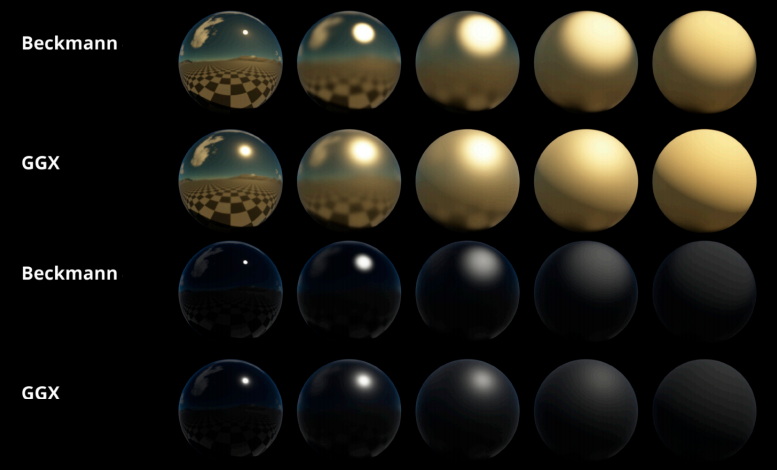

**GTR**

GTR（Generalized TR）模型是对GGX模型的扩展，它在GGX的基础上新增了一个 $\gamma$ 参数，用来调节高光拖尾的长度。当 $\gamma=2$ 时，该模型与GGX互相等价

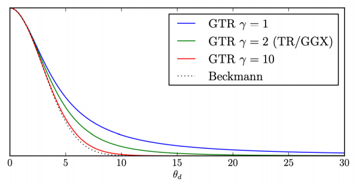

### **几何修正项（Geometry）**

> 几何函数（Geometry Function）是一个0到1之间的标量，描述了微平面自阴影的属性，表示了具有半矢量法线的微平面中，同时被入射方向和[反射方向](https://zhida.zhihu.com/search?content_id=192433904&content_type=Article&match_order=1&q=%E5%8F%8D%E5%B0%84%E6%96%B9%E5%90%91&zhida_source=entity)可见（没有被遮挡的）的比例，即未被遮挡的 m=h 微表面的**百分比**

我们回到一开始说的Cook-Torrance BRDF模型，假设此时还尚未考虑任何几何修正的问题

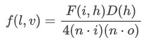

那么如果这时候当我们以一个掠射角度观察物体，分母的[校正因子](https://zhida.zhihu.com/search?content_id=192433904&content_type=Article&match_order=2&q=%E6%A0%A1%E6%AD%A3%E5%9B%A0%E5%AD%90&zhida_source=entity)就会变得非常小，而由于分子的菲涅尔项在grazing angle下具有接近100%的[能量反射](https://zhida.zhihu.com/search?content_id=192433904&content_type=Article&match_order=1&q=%E8%83%BD%E9%87%8F%E5%8F%8D%E5%B0%84&zhida_source=entity)，整个式子在最后就会得到一个非常大的值，从而导致物体周围产生一圈异常的高光描边，这显然是非常不合理的。在现实中，由于微表面的互相遮挡，一部分光线会在物体表面发生损耗而无法直接抵达摄影机，这种损耗在掠射情况下会变得尤为明显，因此为了表现这种自遮挡，引入几何修正项就显得非常必要了

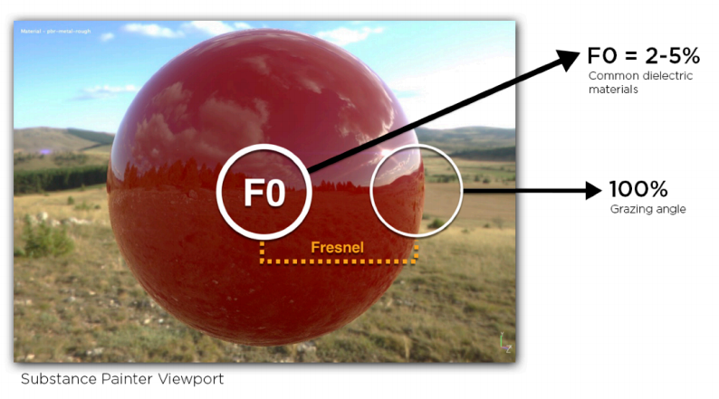

具体在公式中，几何修正项的作用主要体现在两方面（如图），一种是**入射光在物体表面产生的自阴影**（Shadowing），另一种是**微表面对出射光的遮挡**（Masking），而由于光路的[可逆性](https://zhida.zhihu.com/search?content_id=192433904&content_type=Article&match_order=1&q=%E5%8F%AF%E9%80%86%E6%80%A7&zhida_source=entity)，我们可以认为两种情况的几何遮蔽效果是近似等效的，因此可以对它们使用相同的几何函数，即：

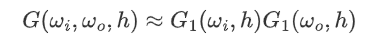

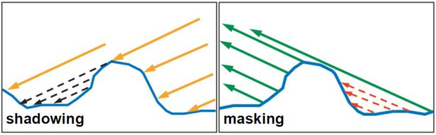

函数图像如下图所示，物体表面粗糙度越低，得到的函数越接近1：

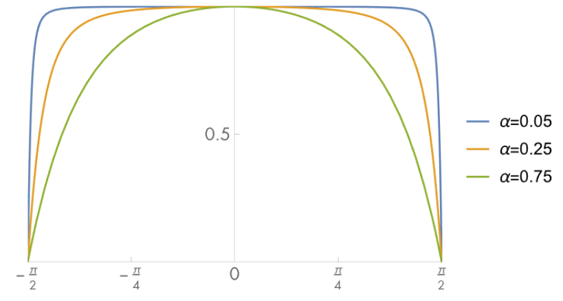

另外，不同的法线分布函数对应的几何函数也互不相同，二者具有很强的依赖关系，需要搭配着一起使用（下图红线是Beckmann，绿线是GGX）

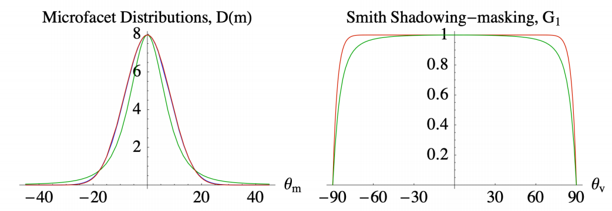

### **能量补偿项**

在正确的引入几何项后，我们就基本可以解决边缘高光的问题了，不过这样又会引入一个新的问题——能量丢失。从图中可以看到，虽然实验的小球没有出现任何grazing angle的问题，但随着[粗糙度](https://zhida.zhihu.com/search?content_id=192433904&content_type=Article&match_order=4&q=%E7%B2%97%E7%B3%99%E5%BA%A6&zhida_source=entity)的增加，其整体的色彩却发生了一定程度上的变暗；倘若我们对该小球的材质进行一次 *白炉测试* （即在假设 $F(i,h)\equiv 1$ 的情况下，使用 uniform irradiance=1 的天光，检测[材质反射](https://zhida.zhihu.com/search?content_id=192433904&content_type=Article&match_order=1&q=%E6%9D%90%E8%B4%A8%E5%8F%8D%E5%B0%84&zhida_source=entity)的能量是否为 1），这种现象会更加的明显

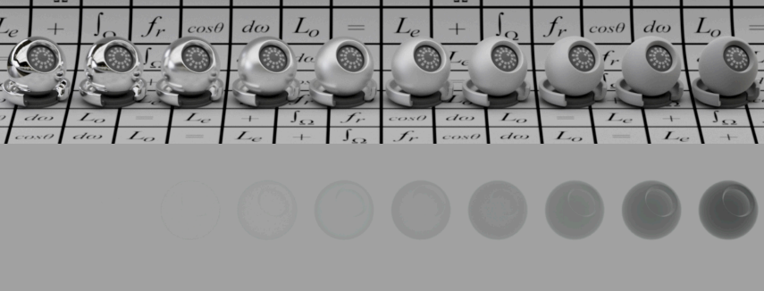

产生这种现象的原因是我们在考虑几何修正项的时候，并没有把微表面之间的相互反射考虑进去，所以对于那些在微观几何表面发生了遮挡的光线，它们的能量就直接被cut掉了

为了解决这个问题，我们当然可以尝试去计算多重散射的微平面BRDF，去做一个类似[光线追踪](https://zhida.zhihu.com/search?content_id=192433904&content_type=Article&match_order=1&q=%E5%85%89%E7%BA%BF%E8%BF%BD%E8%B8%AA&zhida_source=entity)的递归运算，但对于实时渲染来说，这显然不是一个可行的解决方案

对此，工业界常用的处理方法是对原先的模型添加一个能量补偿项，通过**创建一个额外的BRDF波瓣**来近似估计丢失的能量

**The Kulla-Conty Approximation**

首先我们还是假设 uniform irradiance=1（[渲染方程](https://zhida.zhihu.com/search?content_id=192433904&content_type=Article&match_order=1&q=%E6%B8%B2%E6%9F%93%E6%96%B9%E7%A8%8B&zhida_source=entity)中L=1），则微表面在经过一次bounce后出射的能量百分比可以表示为：

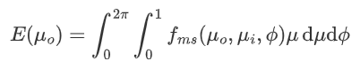

那么光线丢失的能量所占百分比就是 $1-E(\mu_o)$ ，推导过程如下：

（*相当于在求一个brdf的余弦加权半球积分，由于假设材质各向同性，* $\omega$ *可以直接用仰角* $\mu$ *替代）*

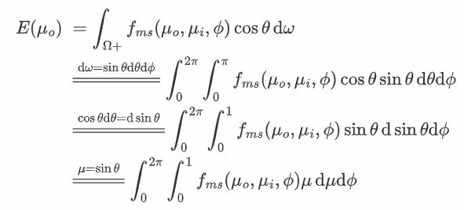

那么我们用来能量补偿的BRDF就必须满足：

①光照方向的对称性，即交换 $\mu_o$ 和 $\mu_i$ 不改变BRDF的值；

②余弦加权半球积分值等于缺失能量百分比，即； $E_{ms}(\mu_o)=1-E(\mu_o)$ ；

根据第一个条件，可以先待定系数 $c$ 写出 $f_{ms}$ 的表达式：

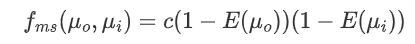

再将其代入计算半球积分

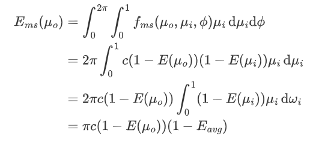

最后联立②，化简得

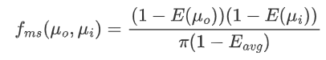

其中 $E_{avg}$ 是半球上E的余弦加权平均值，取值仅依赖于粗糙度 $\alpha$ ，**可以用一维纹理或者曲线进行储存**

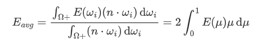

$E(\mu_o)$ 和 $E(\mu_i)$ 则同时依赖粗糙度$\alpha$ 和仰角 $\mu$ ，**需要利用一张2D纹理经过预计算才能完成储存**，不过由于它们的函数变化相对较为平缓，所以一般选用32×32分辨率就可以满足需求了

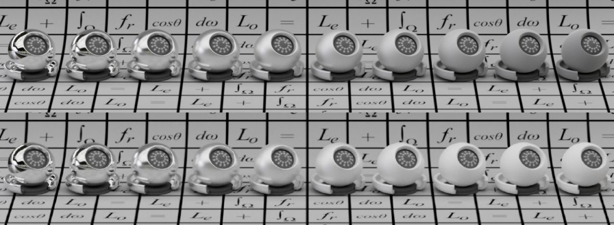

如果该Microfacet BRDF还带有颜色信息，则可以认为其表面本身就具备吸收（或放出）能量的性质，其额外的BRDF项为：

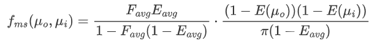

其中 ， $F_{avg}$ 为平均菲涅尔项（**宏观的菲涅尔效应是微观菲涅尔的均值**，所以还是半球上的余弦加权平均）：

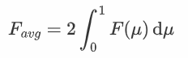

若使用原来的Schilick近似，则 $F_{avg}=\frac{20}{21}·F_0+\frac{1}{21}$ ，推导如下：

> 设入射光的总能量为1，微表面每次散射的能量均为diffuse，那么每当光线经过散射，原始的能量都要乘以 $F_{avg}$  
> 经过一次**直接反射**的能量为： $F_{avg}E_{avg}$  
> 经过一次**间接反射**（”损耗“的能量再经过微平面反射出来）的能量为 $F_{avg}(1-E_{avg})·F_{avg}E_{avg}$  
> ······  
> **k次间接反射**的能量为 $F_{avg}^k(1-E_{avg})^k·F_{avg}E_{avg}$ 将以上所有能量累加，得 $ \frac{F_{avg} E_{avg}}{1-F_{avg}(1-E_{avg})}$ ，再与无色 $f_{ms}$ 相乘，即可得到 有色的能量补偿项

最后，考虑了能量补偿的渲染方程将如下所示：

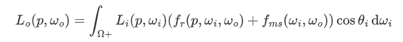

带有颜色信息的能量补偿结果

### **线性变换余弦（LTC）**

LTC（Linearly Transformed Cosines）是一种专门为了解决微表面模型下 **[多边形](https://zhida.zhihu.com/search?content_id=192433904&content_type=Article&match_order=1&q=%E5%A4%9A%E8%BE%B9%E5%BD%A2&zhida_source=entity)光源采样问题** 的一种（无阴影）着色方法，它通过将标准空间中的反射波瓣[线性映射](https://zhida.zhihu.com/search?content_id=192433904&content_type=Article&match_order=1&q=%E7%BA%BF%E6%80%A7%E6%98%A0%E5%B0%84&zhida_source=entity)到余弦空间，完成了对原BRDF分布的拟合，从而大大的提升了[面光源](https://zhida.zhihu.com/search?content_id=192433904&content_type=Article&match_order=1&q=%E9%9D%A2%E5%85%89%E6%BA%90&zhida_source=entity)积分的计算效率，是一个非常厉害的算法（目前主要用于GGX模型下的PBR渲染，但对其他模型也同样适用）

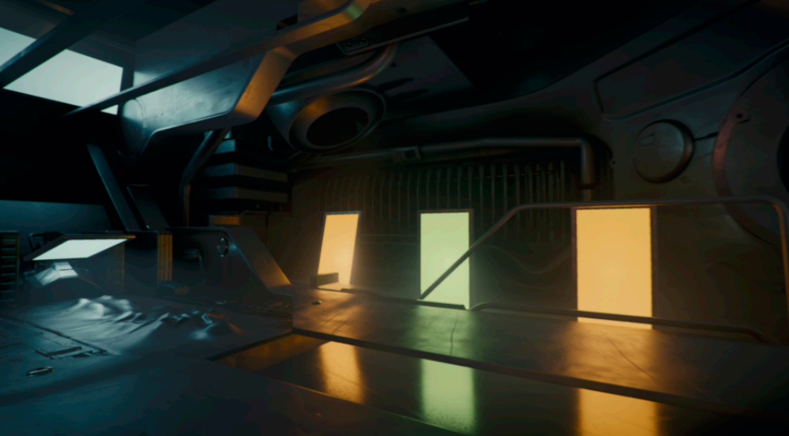

该方法的核心可以简单概括为三步：

-   首先假设面光源的L\_i是uniform的，求出标准空间内的BRDF表达式，并储存在一张二维纹理中

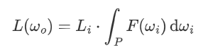

-   对任意观察方向预计算一个变化矩阵 $M$ ，将标准空间的BRDF转化到余弦空间（原paper是将余弦空间转化为标准空间，所以图中是乘以 $M^{-1}$ ）

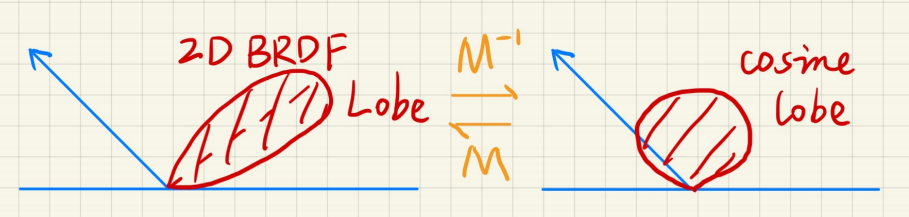

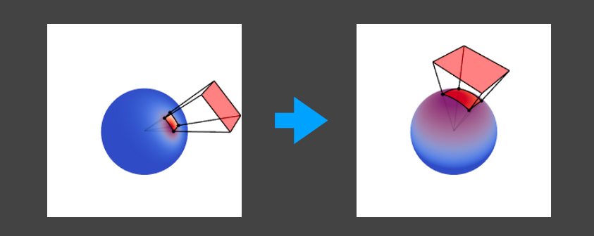

由于该变换过程作用于所有输入的输入 $\omega_i$ ，所以也就等价于将整个面光源也进行了线性变换

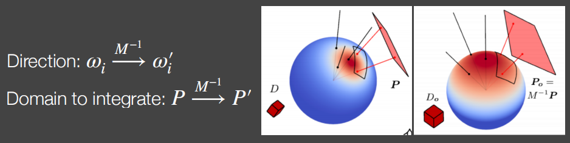

-   求出与 $M$ 相对应的雅克比项，保存为一张纹理，以此避免在后续[空间转换](https://zhida.zhihu.com/search?content_id=192433904&content_type=Article&match_order=1&q=%E7%A9%BA%E9%97%B4%E8%BD%AC%E6%8D%A2&zhida_source=entity)中面光源的面积发生变化  
    

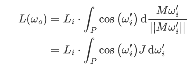

雅克比行列式复习：

[链接](https://zhuanlan.zhihu.com/p/111501020?utm_source=qq&utm_medium=social&utm_oi=1133123677968326656)

由于这块牵扯的内容过于复杂，所以这里就只讲了一下基本思路。更详细的信息可以参考原论文：

[链接](https://hal.archives-ouvertes.fr/hal-02155101/document)

或者

[@Monica的小甜甜](//www.zhihu.com/people/c4b57edf195b8cd505971daaa600fd60)

的论文复现：

[链接](https://zhuanlan.zhihu.com/p/360040187)

| Q：[离线渲染](https://zhida.zhihu.com/search?content_id=192433904&content_type=Article&match_order=1&q=%E7%A6%BB%E7%BA%BF%E6%B8%B2%E6%9F%93&zhida_source=entity)可不可以用LTC？ |
| --- |
| A：可以，但没必要 |
| Q：[各向异性](https://zhida.zhihu.com/search?content_id=192433904&content_type=Article&match_order=1&q=%E5%90%84%E5%90%91%E5%BC%82%E6%80%A7&zhida_source=entity)的表面能不能将BRDF转化到余弦空间？ |
| A：可以。给定任意观察方向 总能找到一个合适的[变换矩阵](https://zhida.zhihu.com/search?content_id=192433904&content_type=Article&match_order=1&q=%E5%8F%98%E6%8D%A2%E7%9F%A9%E9%98%B5&zhida_source=entity)M，使得映射的误差最小 |
| Q：cos不是一个一维的函数吗，这是怎么映射的？ |
| A：这里我们把cos(θs)理解为一个球面分布函数，两个球面分布函数之间的映射是可行的 |

总结：LTC就是一种将 **变化BRDF 和 变化光源** 的 shading问题，转化为 **固定BRDF** 和 **变化光源** 问题的一种解决方案

  

## **迪士尼原则的BRDF**

在2012年迪士尼原则的BRDF被正式提出之前，PBR并未在工业界得到广泛的关注，就算Microfacet模型在很多情况下可以做到非常接近真实的物理材质，它仍旧存在着如下的两个问题：

1° 易用性。微表面的整套理论体系充斥着大量的复杂而不直观的参数，还有诸如金属反射率的复数域计算等的复杂数学概念，这些对于[艺术家](https://zhida.zhihu.com/search?content_id=192433904&content_type=Article&match_order=1&q=%E8%89%BA%E6%9C%AF%E5%AE%B6&zhida_source=entity)们的调参工作是极其不友好的

2° 复合材质的局限性。现实中的材质常常不会单独出现，比如家装使用的清漆，还有玻璃上的塑料薄膜，这些都或多或少对diffuse和specular材质进行了一定组合，而微表面模型是无法解释这种多层材质的渲染的，因此具有一定的局限性

于是，迪士尼动画工作室就开发出了一种**艺术导向**的着色模型，大大改善了传统的PBR的工业流程，其核心理念如下

1.  应使用直观的参数，而不是物理类的晦涩参数
2.  参数应尽可能少
3.  调参范围应尽量保持在0到1范围内，最好有拖动条配合进行控制
4.  允许参数在必要的情况下超出正常的合理范围
5.  所有参数组合应尽可能可靠合理

以 上述五条理念为基础，最后得到了一个颜色参数（baseColor）和十个标量参数

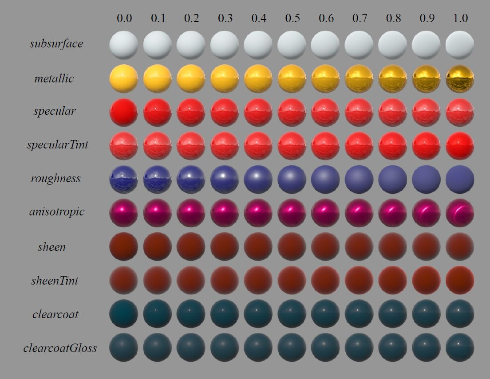

-   **baseColor（基础色）**：表面颜色，通常由纹理贴图提供
-   **subsurface（次表面）**：是一种比diffuse还要平的效果，可以用来近似的控制[漫反射](https://zhida.zhihu.com/search?content_id=192433904&content_type=Article&match_order=1&q=%E6%BC%AB%E5%8F%8D%E5%B0%84&zhida_source=entity)形状
-   **metallic（金属度）**：0表示电介质，1表示金属，是两种不同模型之间的线性混合。其中金属模型没有漫反射成分，并且还具有等于基础色的着色入射镜面反射
-   **specular（镜面反射强度）**：0表示电介质，1表示金属，控制材质镜面反射的反射量，可以用来取代[折射率](https://zhida.zhihu.com/search?content_id=192433904&content_type=Article&match_order=1&q=%E6%8A%98%E5%B0%84%E7%8E%87&zhida_source=entity)
-   **specularTint（镜面反射颜色）**：属于对美术控制的让步，用来控制镜面反射的颜色，0表示无色，1表示材质固有色，但掠射镜面反射不论何时都为无色
-   **roughness（粗糙度）**：0表示镜面反射，1表示漫反射
-   **anisotropic（各向异性强度）**：0表示最大各向同性，1表示最大各向异性
-   **sheen（光泽度）**：一种额外的掠射分量，控制物体的绒毛质感，主要用于布料
-   **sheenTint（光泽颜色）**：控制sheen的颜色，0表示无色，1表示材质固有色
-   **clearcoat（清漆强度）**：第二个镜面波瓣，控制透明涂层的明显程度
-   **clearcoatGloss（清漆光泽度）**：控制透明涂层的光泽度，0表示磨砂，1表示光滑

以上所有属性均可以混合使用

| Pros | Cons |
| --- | --- |
| 易于使用，方便理解，支持参数混叠，   且完全开源 | 巨大的[参数空间](https://zhida.zhihu.com/search?content_id=192433904&content_type=Article&match_order=1&q=%E5%8F%82%E6%95%B0%E7%A9%BA%E9%97%B4&zhida_source=entity)，可能会造成参数冗余 |

| Q：Disney模型是不是无所谓能量守恒？ |
| --- |
| A：是的，这个模型拟合的就是能量守恒的模型，如果不考虑拟合误差，那么它本身就是能量守恒的 |
| Q：[游戏引擎](https://zhida.zhihu.com/search?content_id=192433904&content_type=Article&match_order=1&q=%E6%B8%B8%E6%88%8F%E5%BC%95%E6%93%8E&zhida_source=entity)里用Disney吗？ |
| A：不用，Disney不太适合实时渲染，如果用Disney，那么整个一套算法都得改 |
| Q：Microfacet有没有能力表示diffuse表面？ |
| A：考虑能量补偿的情况下，只要材质粗糙度足够高就可以表示 |