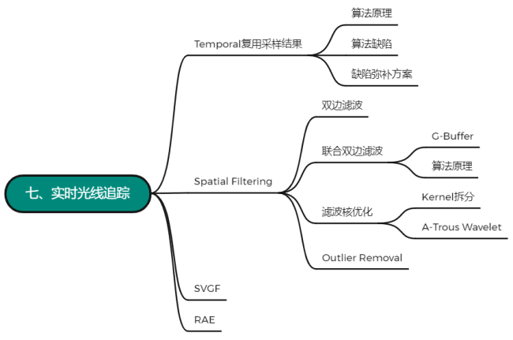

[光线追踪](https://zhida.zhihu.com/search?content_id=220499242&content_type=Article&match_order=1&q=%E5%85%89%E7%BA%BF%E8%BF%BD%E8%B8%AA&zhida_source=entity)在现在已经不是什么新鲜的话题了，由于其算法特性，它确实能够为我们带来各种各样非常真实非常牛逼的画面，理论上通过提高蒙特卡洛的采样数，再结合[PBR着色模型](https://zhida.zhihu.com/search?content_id=220499242&content_type=Article&match_order=1&q=PBR%E7%9D%80%E8%89%B2%E6%A8%A1%E5%9E%8B&zhida_source=entity)，我们就可以无限地逼近现实的物理光照结果，什么反射软阴影，AO，GI也都自然不在话下

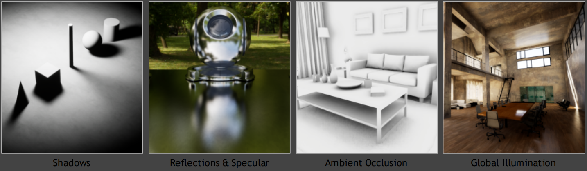

但这样的渲染方法，一旦涉及到实时渲染，就成了一个基本不可能完成的任务，如此庞大的计算量根本无法在毫秒级别完成计算，以至于在业界时常能够听到这样一句吐槽：

> Ray tracing is the future , **and ever will be**

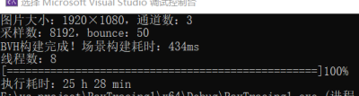

不过随着18年英伟达的[RTX架构](https://zhida.zhihu.com/search?content_id=220499242&content_type=Article&match_order=1&q=RTX%E6%9E%B6%E6%9E%84&zhida_source=entity)的横空出世，这项技术在实时领域的实现也变得不再是那么的不可能。

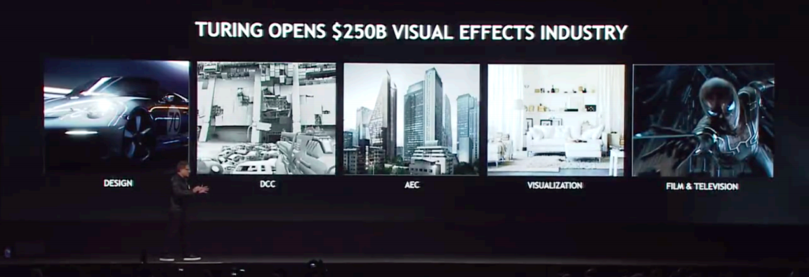

RTX这种硬件架构实际上就是特指显卡上加装的一系列光追部件，它们可以专门用来做光线与包围盒的求交以及加速结构的遍历，使得计算机能够在1s内处理100亿根光线，也就是每帧约1spp（1 sample per pixel）的计算量

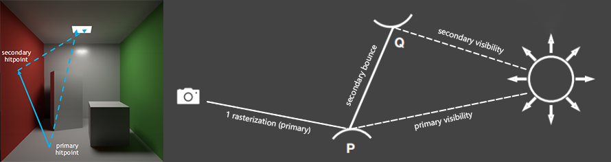

注意第一次bounce用光栅化替代

但做过101作业7的小伙伴应该都知道，1spp的结果通常都非常的noisy，因此撇开硬件加速，我们仍然需要做非常多的处理，而RTRT的一大目标就是如何通过实时的方法来为1spp的光追结果做**降噪**

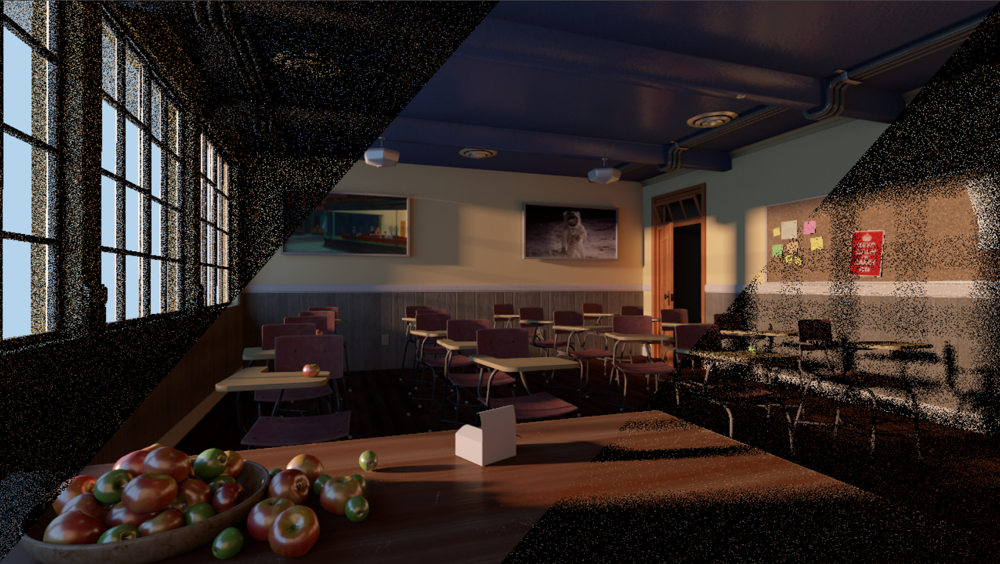

降噪前 vs. 降噪后，可以看到RTRT的效果还是非常惊人的

降噪的方法固然有很多，但既然我们这里的需求既要保证实时，又要保证Quality，那我们的选择面一下就变得非常窄了，像下图这些切变滤波，离线滤波还有一些深度学习CNN这类方法在这里就都不太适用了

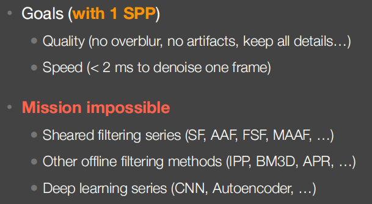

到这里，问题看似又开始变得棘手起来，但如果这时候我们稍微回归一下问题的本质，就会发现它其实并没有想象中的那么困难。我们知道，RTRT产生噪声的根本原因是因为采样率不足，而对于这一点，之前101在讲反走样技术的时候就从信号角度提出了两种解决思路，一种是（暴力）增加采样数，而另一种就是做低通滤波。所以我们接下来要介绍的两大思路，就是从这两个角度入手——[Temporal Accumulation](https://zhida.zhihu.com/search?content_id=220499242&content_type=Article&match_order=1&q=Temporal+Accumulation&zhida_source=entity)和Spatial Filtering

## Temporal复用采样结果

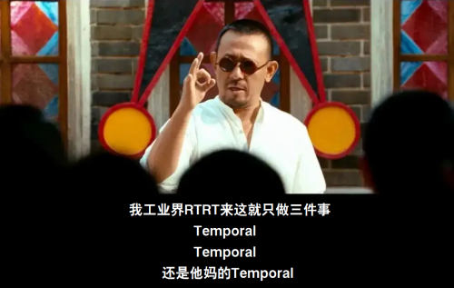

建议加快申遗

### 算法原理

Temporal的方法其实非常简单，既然我当前帧的采样频率不够，那我就把采样均摊到时间上进行，每帧复用上一帧的计算结果，然后在帧与帧之间做插值，这样就可以变相达到增加采样率的目的。考虑到我们的场景绝大多数情况下都是动态变化的，我们常常需要使用一种叫做Motion Vector的东西，来帮助我们寻找当前着色点在上一帧的屏幕坐标，这一技术在《入门精要》13.2运动模糊那一章有详细讲解，具体来说，就是

① 先从深度缓存中取到当前像素的深度值，与屏幕空间坐标组成一个三维坐标并映射到NDC

② 使用当前 $VP$ 矩阵的逆矩阵除以 $w$ 与NDC坐标相乘，重建出当前帧的世界坐标（为什么除 $w$ 原因如下）

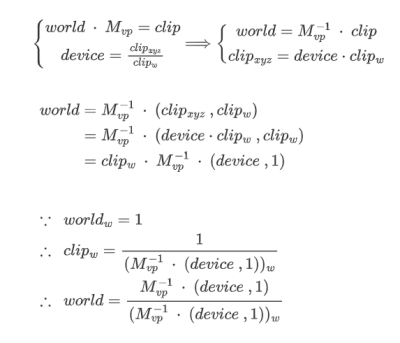

③ 用重建的世界坐标乘以上一帧的 $VP$ 矩阵，做齐次除法，得到上一帧对应的屏幕坐标

④ 将上一帧的渲染结果和这一帧一起代入插值公式，计算得到当前帧的结果

（p.s. 这里的算法过程与闫神可能存在部分出入，我是按我自己的理解做了一定修改，只用到了深度缓存而没用[G-Buffer](https://zhida.zhihu.com/search?content_id=220499242&content_type=Article&match_order=1&q=G-Buffer&zhida_source=entity)，所以G-Buffer的相关内容就放到后面再提吧）

假设我们现在做出如下约定

$C$ ：noise free

$\widetilde{C}$ ：unfiltered result

$\overline{C}$ ：filtered result

那么当前帧的计算结果就可以表示为：

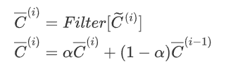

因此我们就可以看到，temporal 这套方法其实并不仅仅是在简单复用上一帧，而是呈现出一个递归的算法结构，每次插值都是将之前所有帧的插值结果与当前帧做blending。这就非常巧妙地利用了人眼的视觉暂留，大大提高了采样率，从而减少了渲染结果的噪声。

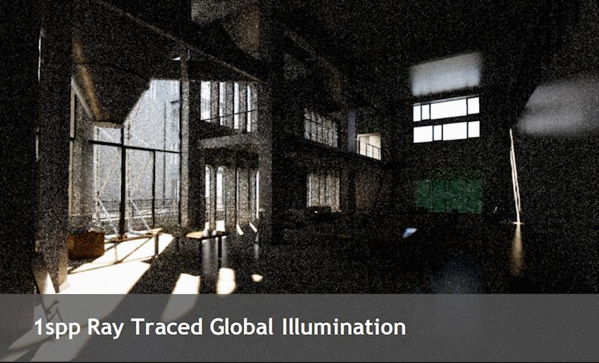

含噪声结果通常看起来会比较暗，是因为显示器对高动态范围的像素点的钳制作用，正常情况下temporal方法并不会改变场景的能量守恒

可以看到，虽然上图结果相比Ground Truth少了点AO，但在1spp这样的条件下已经非常不错了

| Q：物体运动之后原来的Sample还有效吗？ |
| --- |
| A：有效，上一帧的画面可以认为是已经Denoise好了的渲染结果，在这一帧找到对应关系之后可以直接拿来用 |

### 算法缺陷

Temporal对于时间上的复用固然在许多情况下能起到非常好的效果，但这个算法本身也伴随着一定的缺陷

其限制主要体现在以下四个方面

-   **Switching Scenes (Burn-in Period)**

由于Temporal方法是在帧与帧之间做插值，因此碰到诸如场景切换，灯光、镜头突变的情况，常常会发生信息的滞留

-   **Screen Space Issue**

由于Temporal对于上一帧结果的复用本质上是基于屏幕空间的，因此对于场景中不断更新增加的信息，它很难给出正确的处理（尤其针对镜头倒退这种情况）

-   **Disocclusion遮挡**

依然还是是Screen Space Issue，如果出现上一帧遮挡，当前帧突然出现的情况，Temporal也无法给出正确的结果

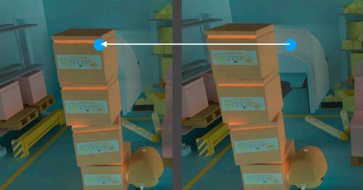

-   **Shading Failure**

对于静态物体动态shading的情况，temporal插值结果常常会出现鬼影

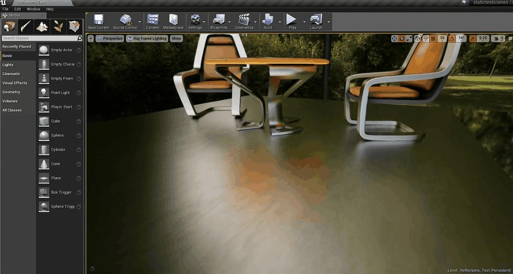

由于α值过小导致的静态物体shading响应延迟

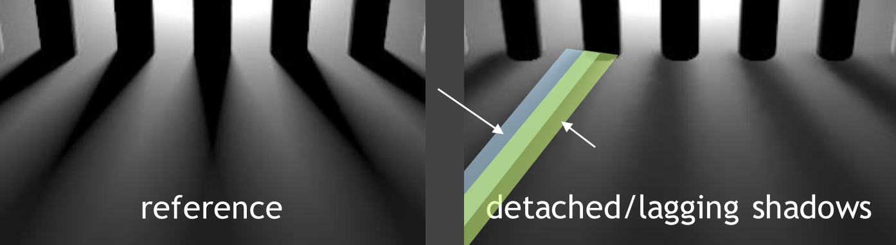

由于光源移动导致的阴影拖尾

### 缺陷弥补方案

解决上面提到的四个问题的方法非常有限，总体来说大致分为两种：

（1）Clamping

当前帧与上一帧相差过大时，将上一帧结果强制钳制到当前帧，再做混合，详见Outlier Removal

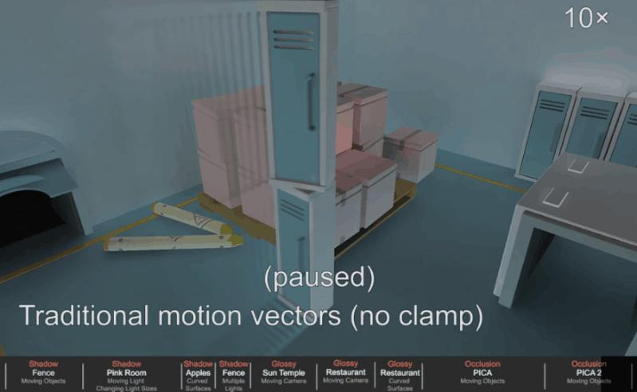

（2）Detection

记录场景中物体的Object ID，通过前后两帧的比较，如果发现ID出现突变，则可以判断发生了Temporal Failure，之后就可以调整 α 的取值（调的很大或者干脆取1），取消对上一帧的复用。当然了，这种方法可能会在一定程度上重新引入噪声，所以需要根据实际情况做出取舍

## Spatial Filtering

说完Temporal的方法，再来看看针对当前帧的滤波。对于RTRT降噪这种应用场景，滤波实际上就是对原图应用一次 Low-Pass Filter（滤除高频信息），一种可能的简单想法是直接用高斯滤波：

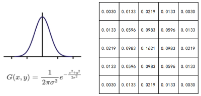

高斯核大小通常遵循3σ准则，具体算法见《入门精要》12.4

但这样一来，像纹理边界这种我们想要保留的高频信息也会被一起模糊：

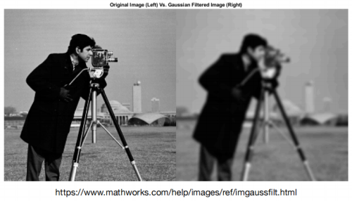

因此，我们就要在此基础上引入更加复杂的滤波核

### 双边滤波

双边滤波的核心思想是，使用欧氏距离的高斯分布和像素的色值差异，共同决定滤波核的权值，它并不是一种降噪的方法，而是只是在图像处理的角度对于高斯滤波的一种改进，具体公式如下：

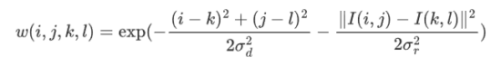

其中， $I(i,j)$ 和 $I(k,l)$ 就是像素的色值，通过这么简单的一个差值绝对值平方在指数上一减，那些纹理边缘的高斯权值就可以有效地减少，从而达到保留特定高频信息的目的

```cpp
for each pixel i
    sum_of_weights = sum_of_weighted_values = 0.0
    for each pixel j around i
        Calculate the weight w_ij   // 代公式计算权值
        sum_of_weighted_values += w_ij * C_input[j]
        sum_of_weights += w_ij
    // 注意最后统一做归一化
    C_output[i] = sum_of_weighted_values / sum_of_weights
```

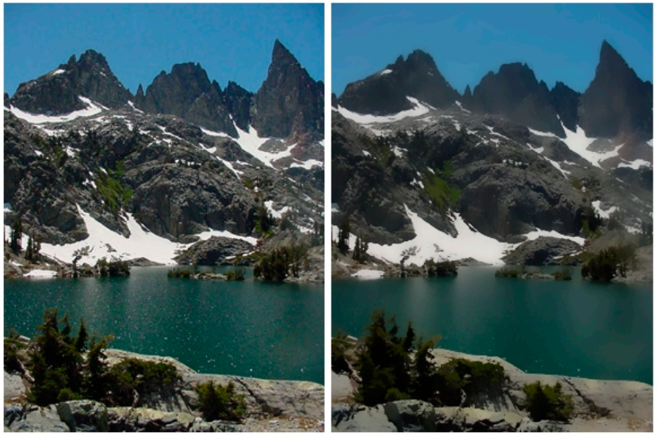

从上图结果来看，双边滤波确实可以很好的保持色块间的独立性，但光考虑像素颜色，显然是无法区分开噪声与纹理边界的，所以我们还需要做更进一步的改进

### [联合双边滤波](https://zhida.zhihu.com/search?content_id=220499242&content_type=Article&match_order=1&q=%E8%81%94%E5%90%88%E5%8F%8C%E8%BE%B9%E6%BB%A4%E6%B3%A2&zhida_source=entity)

如果说高斯滤波的计算公式只考虑了欧氏距离，双边滤波在此基础上增加了色值差异的边界判定，那么联合双边滤波就是在特征维度上进行了更多的扩展，因此，在正式介绍联合双边滤波的做法之前，我们还需要引入G-Buffer的概念

**G-Buffer**

这是一个在延迟渲染路径中涉及到的额外的缓冲区，通常用来储存了除了深度以外的几乎所有的Screen-Space基础信息

> G缓冲区储存了我们所关心的表面（通常指的是离摄像机最近的表面）的其他信息，例如该表面的法线、位置、用于光照计算的材质属性等。——《入门精要》P186

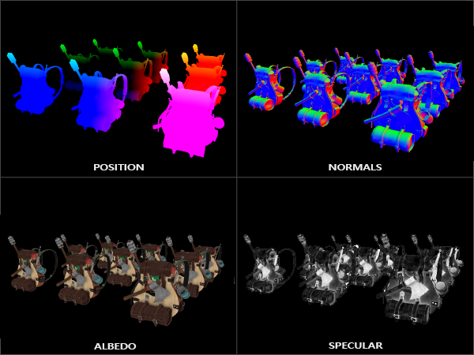

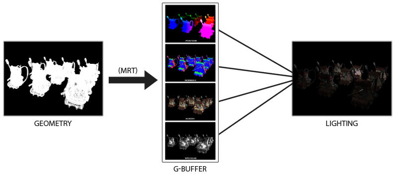

图源Learn OpenGL

使用G-Buffer有几个非常好的性质

① 由于实时光线追踪的第一次bounce是拿光栅化替代进行的，所以从G-Buffer获取信息的消耗基本可以忽略不计（但请不要忽略移动端的带宽瓶颈...）

② 由于G-Buffer本身不参与蒙特卡洛采样，所以从它这里拿到的信息可以被100%认为是noise free的，这对我们后面解除噪声和纹理边界之间的耦合性起到了至关重要的作用

| Q：G-Buffer是光栅化代替光追第一次bounce得到的么？ |
| --- |
| A：没问题，就是顺便得到的 |
| Q：G-Buffer中albedo和color的区别？ |
| A：color是一次bounce光栅化出来的那张带噪声的图的结果值，albedo是场景物体的漫反射系数，是不带噪声的 |

**算法原理**

那么接下来我们就来看看它具体是怎么做的，以下面这张Cornel Box为例

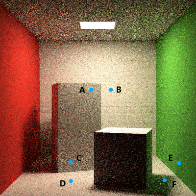

首先，联合双边滤波认为，权值计算时所使用平滑滤波并不一定要使用高斯核，任意的单峰偶函数都可以满足我们的要求：

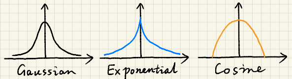

其次，因为我们可以从深度缓存和G-Buffer中“免费”拿到一些信息，所以对于图中各个着色点，我们可以在不同的特征维度对权重做减法，比如A和B就可以用深度，C和D可以用法线，E和F可以用albedo，等等等等，公式如下（假设还是使用高斯）：

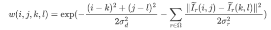

其中 $\widetilde{I}$ 就是我们从Buffer中拿到的各种信息，而 $\sigma_r$ 既可以是高斯核的方差，又可以用来当做维度间的重要性指标。因为指数求和等价于幂的乘积，所以在指数上对特征做线性组合可以很好的帮助我们将各个维度合并

| Q：如何衡量G-Buffer这些不同维度的信息在联合双边滤波中的重要性？ |
| --- |
| A：不同维度的重要性由各自的 σ 值来决定，也就是说这个方法我们需要进行一定的调参，不过相对于神经网络那块的超参数来说，这里的调参会简单直观很多，至少它在某种程度上并不算黑盒 |
| Q：联合双边滤波的filter选取是不是没有一个固定标准？ |
| A：确实因人而异，有时候还会要求研究者去探索是否能找到一个合理的指导维度 |
| Q：联合双边滤波有缺点吗？ |
| A：有...但都不是什么致命的大问题 |

### 滤波核优化

随着联合双边滤波考虑的特征维度的增加，我们滤波核的“感受野”也要随之增大，否则对于某些维度，特征的敏感性就会下降。但是，增大感受野这个操作又很容易让我们在性能上遭遇瓶颈，所以为了解决这个问题，我们需要对滤波核做一些优化

**Kernel拆分**

这是一个典型的空间换时间的优化方法，并且对于高斯核来说，这是数学可证的

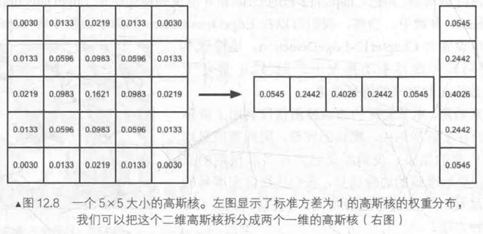

图源《入门精要》P254

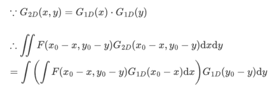

上面这个公式成立的前提条件是高斯函数的可分离性，然而对于G-Buffer取过来的这些normal，albedo信息，它们的分子是各自的绝对值范数的平方，并不是纯粹的高斯函数，这样放到积分号里就不能随意拆解。不过在实践中，就算我们使用32x32这种级别的Kernel，直接分pass强拆所带来的瑕疵也不怎么看得太出来，所以实际应用我们也是可以这么做的

**A-Trous Wavelet**

这个方法的思想还是把一个核拆成多个小核做多pass计算，只不过这些核是呈渐进式增长的[空洞卷积](https://zhida.zhihu.com/search?content_id=220499242&content_type=Article&match_order=1&q=%E7%A9%BA%E6%B4%9E%E5%8D%B7%E7%A7%AF&zhida_source=entity)：

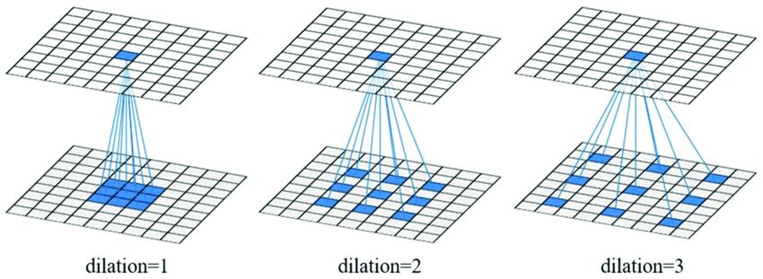

特别的，当 $dilation=2^i$ 时可以保证滤波结果不发生走样

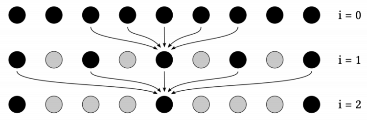

从信号的角度解释，渐进式增长的Kernel可以保证去除更多的高频信息，而另一方面，空洞卷积在本质上是在滤波前对Kernel进行二次采样，也就是将光栅化采样得到的离散信号视为连续信号，再做一次离散化，在频谱上看就是对感受野内的信号做周期延拓（也就是老师说的频谱搬移）

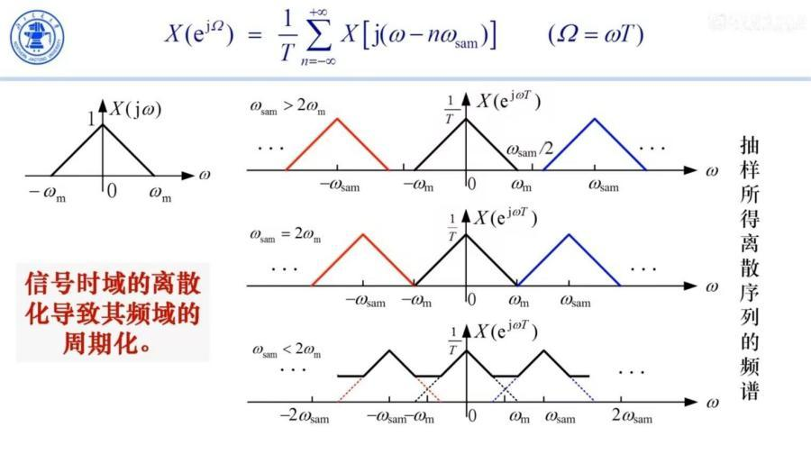

由奈奎斯特（Nyquist）采样定律，当我的采样频率大于等于原信号最大频率的两倍时，频谱不会发生交叠，所以，当空洞卷积的步长 $dilation=2^i$ 时，pass2的信号搬移就可以正好与pass1的高频滤除部分一一对应，从而避免发生信号走样。

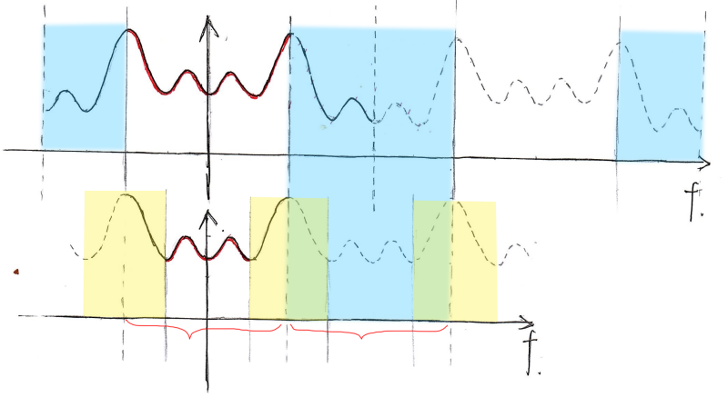

p.s. 因为笔者没学过信号与线性系统...所以这块还专门去查资料花了一些时间来理解，如有谬误还请指正

| Q：可不可以用快速傅里叶变换（FFT） |
| --- |
| A：理论上是可以的，但是在GPU上应用正向逆向两次傅里叶变换本身就存在一定消耗，因此从性能角度考虑并不如前面提到的滤波核拆分和空洞卷积这两种方法 |
| Q：Outlier Removal 会不会使得场景中点光源形成的高亮点也一起被clamp掉 |
| A：会，但可以先做一个无光照的RTRT再渲染有光照的结果（个人觉得这里有点问题，我的解释是自然界光源存在能量衰减，用7x7这么大的滤波核很少会将这种地方判定为异常值..） |
| Q：对于跨场景的几何边缘，Outlier会不会找错分布？ |
| A：会，像物体交界这种地方，确实会出现这种情况，不过工业界对此也肯定做了某些特殊处理的，不必担心 |

### Outlier Removal

在路径追踪算法中，采样率不足很容易导致一些超过正常显示范围的异常值，belike：

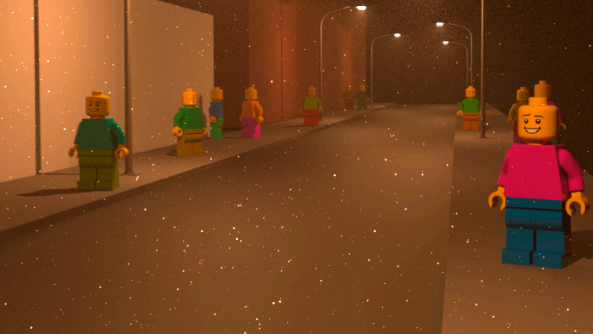

“火萤”现象

这些过亮的异常值在经过上述一系列滤波之后，很可能会发生权值的扩散，从而使得它周围一圈像素也随之变亮，这时候为了避免这种高亮像素对渲染结果产生影响，我们就要再次用到之前提到的钳制操作，对这些“Outliers”进行处理：

① 在进入卷积的循环之前单独做一次遍历，算出感受野内样本值的 $\mu$ 和 $\sigma$

② 将像素值在 $[\mu-k\sigma,\mu+k\sigma],k\in[1,3]$ 区间之外的样本认定为异常值（没错，就是置信区间的想法）

③ 将异常值钳制到上述区间内， $\widetilde{C}^{(i)}=clamp(\widetilde{C}^{(i)},\mu-k\sigma,\mu+k\sigma)$

同样的，对于Temporal Accumulation当中的clamping，我们也可以使用类似的判别方法，如果当前帧与上一帧差距超过某个特定阈值，那就将**上一帧的结果**强制钳制**当前帧**附近，即：

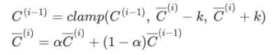

## SVGF

待补

## RAE

待补