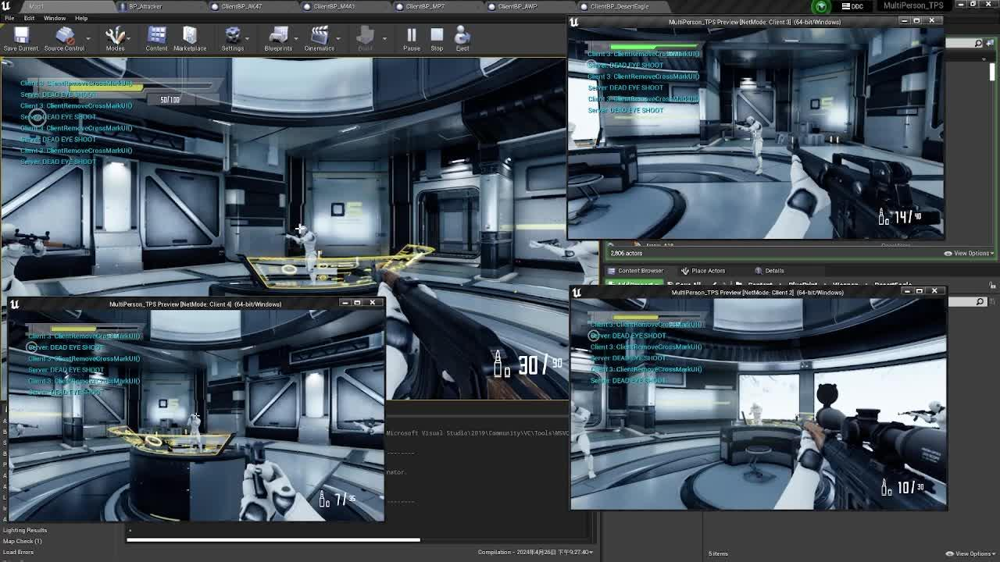
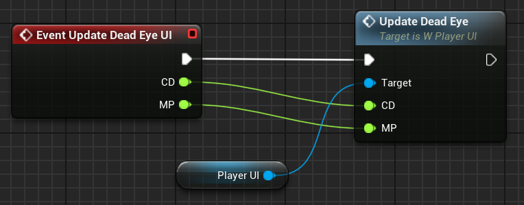
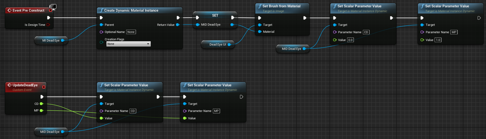
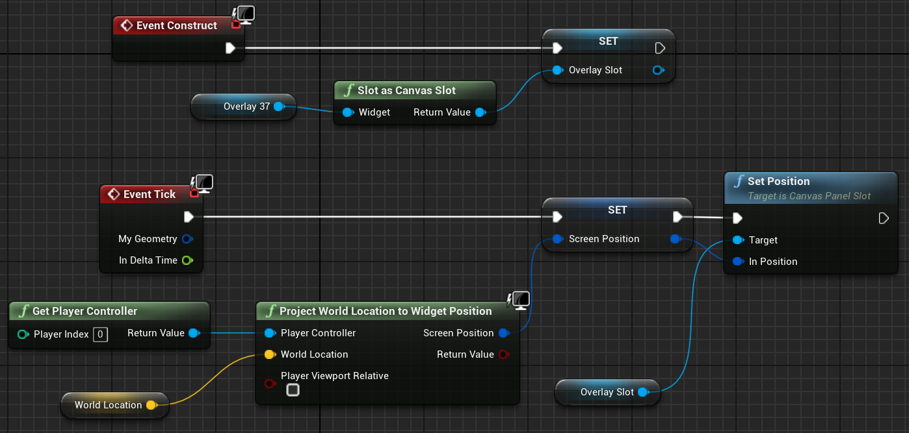
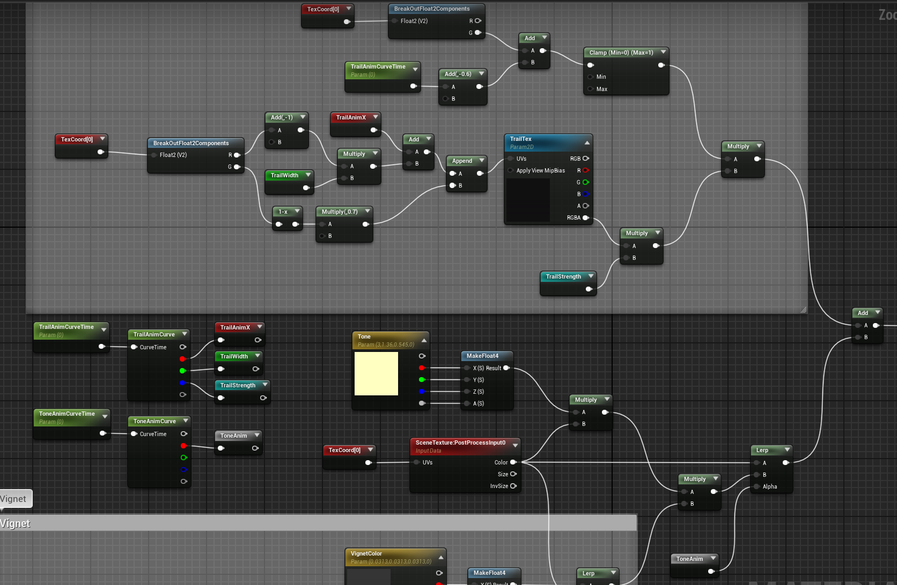
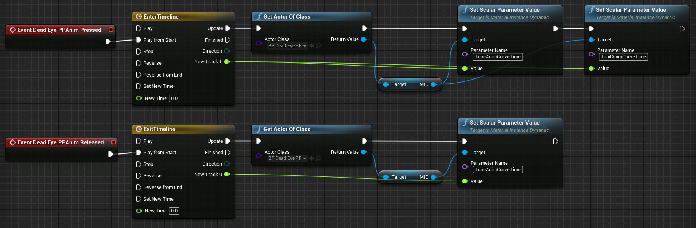

复试完终于有时间回来学点自己的东西了，趁着刚看完一套[U++网络同步](https://zhida.zhihu.com/search?content_id=242522416&content_type=Article&match_order=1&q=U%2B%2B%E7%BD%91%E7%BB%9C%E5%90%8C%E6%AD%A5&zhida_source=entity)，正好自己动手做点有意思的东西练习练习，尝试复刻一下大表哥的[死眼系统](https://zhida.zhihu.com/search?content_id=242522416&content_type=Article&match_order=1&q=%E6%AD%BB%E7%9C%BC%E7%B3%BB%E7%BB%9F&zhida_source=entity)

本来其实是一个很简单的效果，但加了网络同步难度瞬间翻倍 = =，最后实现的效果如下



因为整个代码加起来写了有将近1500+，很多都是效果外的基础逻辑，所以本文只会贴出技能相关的代码。文字部分也是写代码随手记的，可能多少会有点简略和凌乱，就权当是一个实现过程的记录吧

## 数值 & UI 更新

整个死眼执行过程可以被拆解成两部分，一个是标记，一个是依照标记顺序逐个射击，显然数值UI这部分和核心逻辑没多大关系，所以这部分就先把几个Input绑定一下 bool设置一下，把状态切换先给写出来，好给后面打个基础

InputDeadEyePressed()：Press时打开MP计时器，每帧更新数据和UI

InputDeadEyeReleased()：Release时释放MP计时器并打开CD计时器，每帧更新数据和UI 两个计时器在MP、CD归零时自动释放

```cpp
// TPSBaseCharacter.h
FTimerHandle DeadEyeMPTimerHandle;
FTimerHandle DeadEyeCDTimerHandle;
...
UFUNCTION(Client, Reliable)
void ClientUpdateDeadEyeUI(float CD, float MP);
...
float CurrentDeadEyeCD;
float CurrentDeadEyeMP;
bool IsDeadEyeCD;
bool IsDeadEye;
void DeadEyeAutoUpdateCD();
void DeadEyeAutoUpdateMP();
UPROPERTY(EditAnywhere, Category="DeadEye")
float DeadEyeCD;
UPROPERTY(EditAnywhere, Category="DeadEye")
float DeadEyeMP;

// TPSBaseCharacter.cpp
void ATPSBaseCharacter::InputDeadEyePressed()
{
    if(IsDeadEyeCD) return;
    GetWorldTimerManager().SetTimer(DeadEyeMPTimerHandle, this, &ATPSBaseCharacter::DeadEyeAutoUpdateMP,0.0333f, true, 0);
    ...
}

void ATPSBaseCharacter::InputDeadEyeReleased()
{
    if(IsDeadEyeCD) return;
    IsDeadEye = false;
    CurrentDeadEyeCD = DeadEyeCD;
    // 移除MP计时器
    GetWorldTimerManager().ClearTimer(DeadEyeMPTimerHandle);
    // CD, MP数据更新及UI更新
    IsDeadEyeCD = true;
    GetWorldTimerManager().SetTimer(DeadEyeCDTimerHandle, this, &ATPSBaseCharacter::DeadEyeAutoUpdateCD, 0.0333f, true, 0);
    ...
}

...

void ATPSBaseCharacter::ClientUpdateDeadEyeUI_Implementation(float CD, float MP)
{
    if(!FPSPlayerController){return;}
    FPSPlayerController->UpdateDeadEyeUI(CD, MP);
}

...

void ATPSBaseCharacter::DeadEyeAutoUpdateCD()
{
    CurrentDeadEyeCD -= 0.0333;
    float CurrentDeadEyeCDPercent = CurrentDeadEyeCD/DeadEyeCD;
    float CurrentDeadEyeMPPercent = CurrentDeadEyeMP/DeadEyeMP;
    ClientUpdateDeadEyeUI(CurrentDeadEyeCDPercent, CurrentDeadEyeMPPercent);
    if(CurrentDeadEyeCD <= 0.001)
    {
        GetWorldTimerManager().ClearTimer(DeadEyeCDTimerHandle);
        IsDeadEyeCD = false;
    }
}

void ATPSBaseCharacter::DeadEyeAutoUpdateMP()
{
    CurrentDeadEyeMP -= 0.0333;
    float CurrentDeadEyeCDPercent = CurrentDeadEyeCD/DeadEyeCD;
    float CurrentDeadEyeMPPercent = CurrentDeadEyeMP/DeadEyeMP;
    ClientUpdateDeadEyeUI(CurrentDeadEyeCDPercent, CurrentDeadEyeMPPercent);
    if(CurrentDeadEyeMP <= 0.001)
    {
        GetWorldTimerManager().ClearTimer(DeadEyeMPTimerHandle);
    }
}
```

UI 材质就不贴了，挺简单的

更新UI是在角色类里写的一个客户端方法`ClientUpdateDeadEyeUI(·)`，在里面调用`PlayerController`里声明的一个蓝图实现方法`UpdateDeadEyeUI(·)`进行传值和更新：



PlayerController蓝图



UMG蓝图

## 射线检测与标记 UI

然后来到射线检测。这部分的逻辑编写就很能体现C艹的优越性了，射线检测这个用蓝图实现起来确实非常简单，但这部分在后续加入自动连射的逻辑之后可读性肯定不会有代码这么清晰，而且array动态扩容不论空间还是性能上都不可能有在C艹里用TQueue实现来的优雅

关于网络同步的问题，因为`TQueue`不能直接被设置为可复制，把运行在客户端的UI和运行在服务端的射线检测结果维护在一个队列里一个不小心就会拿到空指针而导致引擎崩溃，所以我这里选择不用结构体，而是在服务器维护`FHitResult`的队列，在客户端单独维护`UUserWidegt*`的队列

首先我们先把UI的蓝图连好，留一个`World Location`变量等着射线检测传参。这里射线检测不在蓝图做也是因为涉及到网络同步，感觉连连看不太好弄



W\_MarkUI

然后在C++实现两个客户端方法，一个用来创建UI，一个用来清空

```cpp
// TPSBaseCharacter.h
TQueue<FHitResult> ServerDeadEyeHitResultQueue;
TQueue<UUserWidget*> ClientDeadEyeCrossMarkWidgetQueue;
...
UPROPERTY(EditAnywhere, Category="UI")
TSubclassOf<UUserWidget> DeadEyeCrossMarkBPClass;
...
UFUNCTION(Client, Reliable)
void ClientDeadEyeCreateCrossMarkUI(FVector HitResultLocation);
UFUNCTION(Client, Reliable)
void ClientDeadEyeCleanCrossMarkUI();

// TPSBaseCharacter.cpp
void ATPSBaseCharacter::ClientDeadEyeCreateCrossMarkUI_Implementation(FVector HitResultLocation)
{
    UUserWidget* CurrentCrossMarkWidget = CreateWidget<UUserWidget>(GetWorld(), DeadEyeCrossMarkBPClass);
    CurrentCrossMarkWidget->AddToViewport();

    // 修改UI控件蓝图的参数
    FStructProperty* WorldLocationProperty = FindFieldChecked<FStructProperty>(CurrentCrossMarkWidget->GetClass(), TEXT("World Location"));
    if(WorldLocationProperty)
    {
        *WorldLocationProperty->ContainerPtrToValuePtr<FVector>(CurrentCrossMarkWidget) = HitResultLocation;
    }

    ClientDeadEyeCrossMarkWidgetQueue.Enqueue(CurrentCrossMarkWidget);
    UKismetSystemLibrary::PrintString(GetWorld(),FString::Printf(TEXT("ClientCreateCrossMarkUI()")));
}

void ATPSBaseCharacter::ClientDeadEyeCleanCrossMarkUI_Implementation()
{
    while(!ClientDeadEyeCrossMarkWidgetQueue.IsEmpty())
    {
        UUserWidget* CrossMarkWidget;
        ClientDeadEyeCrossMarkWidgetQueue.Dequeue(CrossMarkWidget);
        CrossMarkWidget->RemoveFromParent();
    }
}
```

创建UI这里需要动态地找UI控件的蓝图参数并对其进行修改，然而网上大部分关于这一块的资料都是教怎么改float那种常规变量，很少有说怎么改Vector，事实上在UE里FVector、FLinearColor这类变量都是以结构体储存的，我们要实现同样的功能只能先拿到FStructProperty，再用ContainerPtrToValuePtr返回容器内值的指针去做修改，这里就贴几个我当时参考的链接吧

[UE4 C++与蓝图深度交互](https://zhuanlan.zhihu.com/p/423601637)

[\[UE5\]使用C++借助反射批量获取/修改蓝图参数](https://link.zhihu.com/?target=https%3A//www.bilibili.com/read/cv26036003/)

[How to access blueprint vars in c++?](https://link.zhihu.com/?target=https%3A//forums.unrealengine.com/t/how-to-access-blueprint-vars-in-c/275331)

然后写输入绑定和服务端的射线检测，Hit成功后两个队列一个在客户端更新一个在服务器更新，Hit的世界坐标通过形参传给客户端，交给UI自己去Tick计算屏幕坐标

```cpp
// TPSBaseCharacter.h
void InputMultiMark();
...
UFUNCTION(Server, Reliable, WithValidation)
void ServerDeadEyeLineTrace(FVector CameraLocation, FRotator CameraRotation);
void ServerDeadEyeLineTrace_Implementation(FVector CameraLocation, FRotator CameraRotation);
bool ServerDeadEyeLineTrace_Validate(FVector CameraLocation, FRotator CameraRotation);

// TPSBaseCharacter.cpp
void ATPSBaseCharacter::InputMultiMark()
{
    if(!IsDeadEye) return;
    ServerDeadEyeLineTrace(PlayerCamera->GetComponentLocation(), PlayerCamera->GetComponentRotation());
}
...
void ATPSBaseCharacter::ServerDeadEyeLineTrace_Implementation(FVector CameraLocation, FRotator CameraRotation)
{
    FVector CameraForwardVector = UKismetMathLibrary::GetForwardVector(CameraRotation);
    FVector EndLocation = CameraLocation + CameraForwardVector * 15000;;
    TArray<AActor*> IgnoreArray;
    IgnoreArray.Add(this);
    FHitResult HitResult;

    bool HitSuccess = UKismetSystemLibrary::LineTraceSingle(GetWorld(), CameraLocation, EndLocation,
        ETraceTypeQuery::TraceTypeQuery1, false, IgnoreArray, EDrawDebugTrace::None,
        HitResult, true, FLinearColor::Red, FLinearColor::Green, 3.f);

    ATPSBaseCharacter*  IsCharacter = Cast<ATPSBaseCharacter>(HitResult.Actor);
    if(HitSuccess && IsCharacter)
    {
        ServerDeadEyeHitResultQueue.Enqueue(HitResult);
        ClientDeadEyeCreateCrossMarkUI(HitResult.Location);
        ClientDeadEyePlaySound(DeadEyeMarkSound);
    }
}
```

## 射击逻辑

这部分的逻辑最复杂也最难写，我也花了很久在这部分打印调试。首先在进入死眼之后鼠标左键按下要执行不同的自动射击逻辑，其次遇到MP不足、弹夹射空等情况都需要两个队列做置空操作，不然开下一轮技能会出问题，所以得先把计时器句柄的位置给写明白。这里尤其值得引起注意的是服务端和客户端的计时器句柄是两个东西，Set和Clear要保持统一，否则会造成一端的执行变成死循环

我们先在普通Fire输入函数的前面开启计时器

```cpp
// TPSBaseCharacter.h
FTimerHandle DeadEyeShootTimerHandle;
...
UFUNCTION(Server, Reliable, WithValidation)
void ServerDeadEyeSetTimer();
void ServerDeadEyeSetTimer_Implementation();
bool ServerDeadEyeSetTimer_Validate();

// TPSBaseCharacter.cpp
void ATPSBaseCharacter::InputFirePressed()
{
    if(IsDeadEye && !ClientDeadEyeCrossMarkWidgetQueue.IsEmpty())
    {
        ServerDeadEyeSetTimer();
        return;
    }
    ...
}
...
void ATPSBaseCharacter::ServerDeadEyeSetTimer_Implementation()
{
    AWeaponBaseClient* CurrentClientWeapon = GetCurrentClientFPArmsWeaponActor();
    if(!CurrentClientWeapon->ClientArmsFireAnimMontage) return;
    // 开启计时器，射完一枪等动画播完重新射
    GetWorldTimerManager().SetTimer(DeadEyeShootTimerHandle, this, &ATPSBaseCharacter::ServerDeadEyeFire,
        CurrentClientWeapon->ClientArmsFireAnimMontage->GetPlayLength() / CurrentClientWeapon->DeadEyeFireSpeed,
        true, 0.0f);
}
```

然后在`ServerDeadEyeFire`里自动根据队列里面还有没有东西决定是否清除句柄，把框架给搭出来

```cpp
// TPSBaseCharacter.h
UFUNCTION(Server, Reliable, WithValidation)
void ServerDeadEyeFire();
void ServerDeadEyeFire_Implementation();
bool ServerDeadEyeFire_Validate();
UFUNCTION(Server, Reliable, WithValidation)
void ServerDeadEyeCleanHitResultQueue();
void ServerDeadEyeCleanHitResultQueue_Implementation();
bool ServerDeadEyeCleanHitResultQueue_Validate();

// TPSBaseCharacter.cpp
void ATPSBaseCharacter::ServerDeadEyeFire_Implementation()
{
    IsDeadEyeShoot = true;
    AWeaponBaseServer* CurrentServerWeapon = GetCurrentServerTPBodysWeaponActor();
    AWeaponBaseClient* CurrentClientWeapon = GetCurrentClientFPArmsWeaponActor();
    if(!CurrentServerWeapon || !CurrentClientWeapon) return;
    if(ServerDeadEyeHitResultQueue.IsEmpty())
    {
        GetWorldTimerManager().ClearTimer(DeadEyeShootTimerHandle);
        IsDeadEyeShoot = false;
        ...
        return;
    }
    if(CurrentServerWeapon->ClipCurrentAmmo <= 0 && CurrentServerWeapon->GunCurrentAmmo <= 0)
    {
        // 完全没子弹但还有目标，则忽略剩下的目标，队列清空
        ...
        return;
    }
    if(CurrentServerWeapon->ClipCurrentAmmo <= 0 && !ServerDeadEyeHitResultQueue.IsEmpty())
    {
        // 弹夹没子弹但换弹后还能打，则自动触发换弹继续打
        ...
        // Reload时阻塞代码执行
        GetWorldTimerManager().SetTimer(DeadEyeReloadTimerHandle, CurrentClientWeapon->ClientArmsReloadAnimMontage->GetPlayLength() / 1.5f, false);
    }

    // 数据准备
    ...
    // 服务器: 多播射击效果和第三人称动画，应用伤害
    ...
    // 客户端: 相机自动旋转，弹药数据更新
    ...
}

void ATPSBaseCharacter::ServerDeadEyeCleanHitResultQueue_Implementation()
{
    while(!ServerDeadEyeHitResultQueue.IsEmpty())
    {
        ServerDeadEyeHitResultQueue.Pop();
    }
}
```

然后挨个慢慢填，大部分都可以复用正常射击换弹的代码

```cpp
// TPSBaseCharacter.h
UFUNCTION(Client, Reliable)
void ClientDeadEyeFire();
UFUNCTION(Client, Reliable)
void ClientDeadEyeCameraShifting(FVector CurrentCameraLocation, FVector CurrentHitLocation);

// TPSBaseCharacter.cpp
void ATPSBaseCharacter::ServerDeadEyeFire_Implementation()
{
    ...
    if(CurrentServerWeapon->ClipCurrentAmmo <= 0 && CurrentServerWeapon->GunCurrentAmmo <= 0)
    {
        // 完全没子弹但还有目标，则忽略剩下的目标，队列清空
        ClientDeadEyeCleanCrossMarkUI();
        ServerDeadEyeCleanHitResultQueue();
        return;
    }
    if(CurrentServerWeapon->ClipCurrentAmmo <= 0 && !ServerDeadEyeHitResultQueue.IsEmpty())
    {
        // 弹夹没子弹但换弹后还能打，则自动触发换弹继续打
        ServerReload();
        // Reload时阻塞代码执行（有bug
        GetWorldTimerManager().SetTimer(DeadEyeReloadTimerHandle, CurrentClientWeapon->ClientArmsReloadAnimMontage->GetPlayLength() / 1.5f, false);
    }

    // 数据准备
    FHitResult CurrentHitResult;
    ServerDeadEyeHitResultQueue.Dequeue(CurrentHitResult);
    FVector CurrentCameraLocation = PlayerCamera->GetComponentLocation();
    FVector CurrentHitLocation = CurrentHitResult.Location;

    // 服务器
    // 多播射击效果和第三人称动画
    CurrentServerWeapon->MultiShootingEffect();
    MultiShooting();
    // 应用伤害
    DamagePlayer(CurrentHitResult.PhysMaterial.Get(), CurrentHitResult.Actor.Get(), CurrentCameraLocation, CurrentHitResult);

    // 客户端
    ClientDeadEyeFire();
    // 相机旋转
    ClientDeadEyeCameraShifting(CurrentCameraLocation, CurrentHitLocation);
    // 弹药数据更新
    CurrentServerWeapon->ClipCurrentAmmo-=1;
    ClientUpdateAmmoUI(CurrentServerWeapon->ClipCurrentAmmo, CurrentServerWeapon->GunCurrentAmmo);  // 更新
}
...
void ATPSBaseCharacter::ClientDeadEyeFire_Implementation()
{
    // 包括枪体射击动画、手臂动画、射击声音、相机抖动、准星UI扩散等非死眼独占效果
    ClientFire();
    // 移除标记UI
    UUserWidget* CurrentCrossMarkWidget;
    ClientDeadEyeCrossMarkWidgetQueue.Dequeue(CurrentCrossMarkWidget);
    CurrentCrossMarkWidget->RemoveFromParent();
    ...
}

void ATPSBaseCharacter::ClientDeadEyeCameraShifting_Implementation(FVector CurrentCameraLocation, FVector CurrentHitLocation)
{
    FVector CurrentShootingVector = CurrentHitLocation - CurrentCameraLocation;
    FPSPlayerController->SetControlRotation(CurrentShootingVector.Rotation());
}
```

最后再把输入Release的逻辑完善一下

```cpp
void ATPSBaseCharacter::InputDeadEyeReleased()
{
    ...
    if(IsDeadEyeShoot) return; // 如果死眼开始自动射了那就等目标逐个dequeue就行
    // 如果标了没射那就全部dequeue
    ClientDeadEyeCleanCrossMarkUI();
    ServerDeadEyeCleanHitResultQueue();
    ...
}
```

## 后处理动画 & 死眼音效

这部分主要是连连看，没啥好多说的

```cpp
UFUNCTION(BlueprintImplementableEvent)
void DeadEyePPAnimPressed();
UFUNCTION(BlueprintImplementableEvent)
void DeadEyePPAnimReleased();
```

材质：



Tone和Trail分两个曲线控制，Tone只有一个通道一个参数所以也可以直接在蓝图里k Timeline

在关卡里丢个PP Actor，然后一样C++声明，用蓝图实现方法：



蓝图持有的函数始终运行在客户端，不必担心被其他玩家同步

音效部分，分成三个音效asset，主音效因为要在Release的时候暂停播放，所以挂给角色当做Component，剩下两个一个标记音效一个退出音效，都是一次性在客户端播放，干脆提一个客户端方法出来

```text
void ATPSBaseCharacter::ClientDeadEyePlaySound_Implementation(USoundBase* Sound)
{
	UGameplayStatics::PlaySound2D(GetWorld(), Sound);
}
```

## 时间膨胀

最后是一个类似子弹时刻的效果，总体而言没什么难度，唯一需要注意时间缩放得在服务器设置，不然客户端改dilation服务端上没改，经由UE自带的网络同步修复会引起画面的卡顿

```cpp
UFUNCTION(Server, Reliable, WithValidation)
void ServerSetTimeDilationWithoutSelf(float DialationFactor);
void ServerSetTimeDilationWithoutSelf_Implementation(float DialationFactor);
bool ServerSetTimeDilationWithoutSelf_Validate(float DialationFactor);

void ATPSBaseCharacter::ServerSetTimeDilationWithoutSelf_Implementation(float DialationFactor)
{
    UGameplayStatics::SetGlobalTimeDilation(GetWorld(), DialationFactor);
    this->CustomTimeDilation = 1.0f / DialationFactor;
}
```

至此整个效果就实现的差不多了，后处理动画、音效、时间缩放这三个函数同属于进入和退出的效果，到对应位置加上就行

```cpp
void ATPSBaseCharacter::InputDeadEyeReleased()
{
    // 正常退出时播放，提前结束不在这里播
    if(DeadEyeMP>0.001)
    {
        ServerSetTimeDilationWithoutSelf(1);
        DeadEyePPAnimReleased();
        ClientDeadEyeStopSoundEffect();
    }
}

void ATPSBaseCharacter::DeadEyeAutoUpdateMP()
{
    ...
    if(CurrentDeadEyeMP <= 0.001)
    {
        // MP耗尽提前结束，强制退出
        ...
        ServerSetTimeDilationWithoutSelf(1);
        DeadEyePPAnimReleased();
        ClientDeadEyeStopSoundEffect();
    }
}
...
void ATPSBaseCharacter::ServerDeadEyeFire_Implementation()
{
    ...
    if(ServerDeadEyeHitResultQueue.IsEmpty())
    {
        ...
        ServerSetTimeDilationWithoutSelf(1);
        return;
    }
    ...
}

void ATPSBaseCharacter::ClientDeadEyeFire_Implementation()
{
    ...
    if(ClientDeadEyeCrossMarkWidgetQueue.IsEmpty() && DeadEyeMP>0.001)
    {
        DeadEyePPAnimReleased();
        ClientDeadEyeStopSoundEffect();
    }
}
```

\[END\]